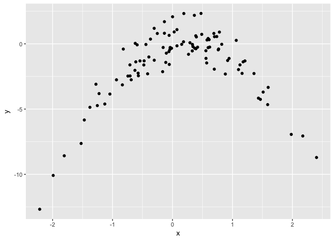

# Chapter 5
Julin N Maloof  
2/5/2018  


## Chapter 5

### Q3


_3. We now review k-fold cross-validation._

_(a) Explain how k-fold cross-validation is implemented._

Split the samples into K groups.  Designate one group as the validation group.  Train on the other groups and predict on the validation group.  Circle around such that each group has its turn as being the validation group once.

_(b) What are the advantages and disadvantages of k-fold cross-validation relative to:_
_i. The validation set approach?_
K-fold advantave: using more of the samples, so the training set is closer to all of the data that you have.  Can't think of a disadvantage

ii. LOOCV?_

K-fold disadvantage: slower.  Advantage: less bias.

### Q5

_In Chapter 4, we used logistic regression to predict the probability of default using income and balance on the Default data set. We will now estimate the test error of this logistic regression model using the validation set approach. Do not forget to set a random seed before beginning your analysis._

_(a) Fit a logistic regression model that uses income and balance to predict default._


```r
library(ISLR)
```

```
## Warning: package 'ISLR' was built under R version 3.4.2
```

```r
library(MASS)
library(tidyverse)
```

```
## Loading tidyverse: ggplot2
## Loading tidyverse: tibble
## Loading tidyverse: tidyr
## Loading tidyverse: readr
## Loading tidyverse: purrr
## Loading tidyverse: dplyr
```

```
## Warning: package 'tidyr' was built under R version 3.4.2
```

```
## Warning: package 'purrr' was built under R version 3.4.2
```

```
## Warning: package 'dplyr' was built under R version 3.4.2
```

```
## Conflicts with tidy packages ----------------------------------------------
```

```
## filter(): dplyr, stats
## lag():    dplyr, stats
## select(): dplyr, MASS
```

```r
data(Default)
head(Default)
```

```
##   default student   balance    income
## 1      No      No  729.5265 44361.625
## 2      No     Yes  817.1804 12106.135
## 3      No      No 1073.5492 31767.139
## 4      No      No  529.2506 35704.494
## 5      No      No  785.6559 38463.496
## 6      No     Yes  919.5885  7491.559
```

```r
set.seed(123)
```


```r
glm5a <- glm(default ~ balance + income, family=binomial, data=Default)
summary(glm5a)
```

```
## 
## Call:
## glm(formula = default ~ balance + income, family = binomial, 
##     data = Default)
## 
## Deviance Residuals: 
##     Min       1Q   Median       3Q      Max  
## -2.4725  -0.1444  -0.0574  -0.0211   3.7245  
## 
## Coefficients:
##               Estimate Std. Error z value Pr(>|z|)    
## (Intercept) -1.154e+01  4.348e-01 -26.545  < 2e-16 ***
## balance      5.647e-03  2.274e-04  24.836  < 2e-16 ***
## income       2.081e-05  4.985e-06   4.174 2.99e-05 ***
## ---
## Signif. codes:  0 '***' 0.001 '**' 0.01 '*' 0.05 '.' 0.1 ' ' 1
## 
## (Dispersion parameter for binomial family taken to be 1)
## 
##     Null deviance: 2920.6  on 9999  degrees of freedom
## Residual deviance: 1579.0  on 9997  degrees of freedom
## AIC: 1585
## 
## Number of Fisher Scoring iterations: 8
```


_(b) Using the validation set approach, estimate the test error of this model. In order to do this, you must perform the following steps:_
_i. Split the sample set into a training set and a validation set._


```r
train <- sample(nrow(Default),size = ceiling(nrow(Default)/2))
```

     
_ii. Fit a multiple logistic regression model using only the training observations._


```r
glm5b <- update(glm5a,subset=train)
summary(glm5b)
```

```
## 
## Call:
## glm(formula = default ~ balance + income, family = binomial, 
##     data = Default, subset = train)
## 
## Deviance Residuals: 
##     Min       1Q   Median       3Q      Max  
## -2.5958  -0.1323  -0.0512  -0.0178   3.8055  
## 
## Coefficients:
##               Estimate Std. Error z value Pr(>|z|)    
## (Intercept) -1.224e+01  6.461e-01 -18.949  < 2e-16 ***
## balance      5.958e-03  3.360e-04  17.734  < 2e-16 ***
## income       2.645e-05  7.013e-06   3.772 0.000162 ***
## ---
## Signif. codes:  0 '***' 0.001 '**' 0.01 '*' 0.05 '.' 0.1 ' ' 1
## 
## (Dispersion parameter for binomial family taken to be 1)
## 
##     Null deviance: 1510.51  on 4999  degrees of freedom
## Residual deviance:  768.03  on 4997  degrees of freedom
## AIC: 774.03
## 
## Number of Fisher Scoring iterations: 8
```

_iii. Obtain a prediction of default status for each individual in the validation set by computing the posterior probability of default for that individual, and classifying the individual to the default category if the posterior probability is greater than 0.5._


```r
summary(Default$default)
```

```
##   No  Yes 
## 9667  333
```

```r
glm5b.predict <- predict(glm5b, newdata=Default[-train,],type="response")
glm5b.predict <- ifelse(glm5b.predict<.5,"No","Yes")
```

_iv. Compute the validation set error, which is the fraction of the observations in the validation set that are misclassified._


```r
table(glm5b.predict,obs=Default$default[-train])
```

```
##              obs
## glm5b.predict   No  Yes
##           No  4815  117
##           Yes   26   42
```

```r
(validation.error <- mean(glm5b.predict!=Default$default[-train]))
```

```
## [1] 0.0286
```

_(c) Repeat the process in (b) three times, using three different splits of the observations into a training set and a validation set. Comment on the results obtained._


```r
validation.errors5c <- sapply(1:10, function(x) {
  train_test <- sample(c("train","validate"),size = nrow(Default), replace = TRUE)
  default.train <- Default[train_test=="train",]
  default.validate <- Default[train_test=="validate",]
  glm5c <- glm(default ~ balance + income,data=default.train,family=binomial)
  glm5c.predict <- predict(glm5c,newdata = default.validate, type="response")
  glm5c.predict <- ifelse(glm5c.predict<.5,"No","Yes")
  mean(glm5c.predict!=default.validate$default)
}
)

validation.errors5c
```

```
##  [1] 0.02688939 0.02664514 0.02866503 0.02669075 0.02834171 0.02970098
##  [7] 0.02770528 0.02988048 0.02738916 0.02573823
```

The results are pretty consistent across splits

_(d) Now consider a logistic regression model that predicts the probability of default using income, balance, and a dummy variable for student. Estimate the test error for this model using the validation set approach. Comment on whether or not including a dummy variable for student leads to a reduction in the test error rate._


```r
Default$student01 <- as.numeric(Default$student)
validation.errors5d <- sapply(1:10, function(x) {
  train_test <- sample(c("train","validate"),size = nrow(Default), replace = TRUE)
  default.train <- Default[train_test=="train",]
  default.validate <- Default[train_test=="validate",]
  glm5d <- glm(default ~ balance + income + student01,data=default.train,family=binomial)
  glm5d.predict <- predict(glm5d,newdata = default.validate, type="response")
  glm5d.predict <- ifelse(glm5d.predict<.5,"No","Yes")
  mean(glm5d.predict!=default.validate$default)
}
)

validation.errors5d
```

```
##  [1] 0.02677134 0.02740548 0.02721494 0.02598691 0.02696225 0.02841812
##  [7] 0.02571258 0.02494377 0.02622623 0.02938808
```


```r
t.test(validation.errors5c, validation.errors5d)
```

```
## 
## 	Welch Two Sample t-test
## 
## data:  validation.errors5c and validation.errors5d
## t = 1.4408, df = 17.966, p-value = 0.1668
## alternative hypothesis: true difference in means is not equal to 0
## 95 percent confidence interval:
##  -0.0003949517  0.0021182394
## sample estimates:
##  mean of x  mean of y 
## 0.02776461 0.02690297
```

No significant difference (Although if I run it with 100 splits then it is just barely significant with the 5d model being worse)

### Q7

_In Sections 5.3.2 and 5.3.3, we saw that the cv.glm() function can be used in order to compute the LOOCV test error estimate. Alterna- tively, one could compute those quantities using just the glm() and predict.glm() functions, and a for loop. You will now take this ap- proach in order to compute the LOOCV error for a simple logistic regression model on the Weekly data set. Recall that in the context of classification problems, the LOOCV error is given in (5.4)._
_(a) Fit a logistic regression model that predicts Direction using Lag1 and Lag2._


```r
data("Weekly")
head(Weekly)
```

```
##   Year   Lag1   Lag2   Lag3   Lag4   Lag5    Volume  Today Direction
## 1 1990  0.816  1.572 -3.936 -0.229 -3.484 0.1549760 -0.270      Down
## 2 1990 -0.270  0.816  1.572 -3.936 -0.229 0.1485740 -2.576      Down
## 3 1990 -2.576 -0.270  0.816  1.572 -3.936 0.1598375  3.514        Up
## 4 1990  3.514 -2.576 -0.270  0.816  1.572 0.1616300  0.712        Up
## 5 1990  0.712  3.514 -2.576 -0.270  0.816 0.1537280  1.178        Up
## 6 1990  1.178  0.712  3.514 -2.576 -0.270 0.1544440 -1.372      Down
```

```r
glm7a <- glm(Direction ~ Lag1 + Lag2, data=Weekly, family=binomial)
summary(glm7a)
```

```
## 
## Call:
## glm(formula = Direction ~ Lag1 + Lag2, family = binomial, data = Weekly)
## 
## Deviance Residuals: 
##    Min      1Q  Median      3Q     Max  
## -1.623  -1.261   1.001   1.083   1.506  
## 
## Coefficients:
##             Estimate Std. Error z value Pr(>|z|)    
## (Intercept)  0.22122    0.06147   3.599 0.000319 ***
## Lag1        -0.03872    0.02622  -1.477 0.139672    
## Lag2         0.06025    0.02655   2.270 0.023232 *  
## ---
## Signif. codes:  0 '***' 0.001 '**' 0.01 '*' 0.05 '.' 0.1 ' ' 1
## 
## (Dispersion parameter for binomial family taken to be 1)
## 
##     Null deviance: 1496.2  on 1088  degrees of freedom
## Residual deviance: 1488.2  on 1086  degrees of freedom
## AIC: 1494.2
## 
## Number of Fisher Scoring iterations: 4
```

_(b) Fit a logistic regression model that predicts Direction using Lag1 and Lag2 using all but the first observation._


```r
glm7b <- glm(Direction ~ Lag1 + Lag2, data=Weekly[-1,], family=binomial)
summary(glm7b)
```

```
## 
## Call:
## glm(formula = Direction ~ Lag1 + Lag2, family = binomial, data = Weekly[-1, 
##     ])
## 
## Deviance Residuals: 
##     Min       1Q   Median       3Q      Max  
## -1.6258  -1.2617   0.9999   1.0819   1.5071  
## 
## Coefficients:
##             Estimate Std. Error z value Pr(>|z|)    
## (Intercept)  0.22324    0.06150   3.630 0.000283 ***
## Lag1        -0.03843    0.02622  -1.466 0.142683    
## Lag2         0.06085    0.02656   2.291 0.021971 *  
## ---
## Signif. codes:  0 '***' 0.001 '**' 0.01 '*' 0.05 '.' 0.1 ' ' 1
## 
## (Dispersion parameter for binomial family taken to be 1)
## 
##     Null deviance: 1494.6  on 1087  degrees of freedom
## Residual deviance: 1486.5  on 1085  degrees of freedom
## AIC: 1492.5
## 
## Number of Fisher Scoring iterations: 4
```

_(c) Use the model from (b) to predict the direction of the first observation. You can do this by predicting that the first observation will go up if P(Direction="Up"|Lag1, Lag2) > 0.5. Was this observation correctly classified?_


```r
predict(glm7b, newdata=Weekly[1,],type="response")
```

```
##         1 
## 0.5713923
```

```r
Weekly[1,]$Direction
```

```
## [1] Down
## Levels: Down Up
```

No, incorrectly predicted

_(d) Write a for loop from i=1 to i=n, where n is the number of observations in the data set, that performs each of the following steps:
i. Fit a logistic regression model using all but the ith obser- vation to predict Direction using Lag1 and Lag2.
ii. Compute the posterior probability of the market moving up for the ith observation.
iii. Use the posterior probability for the ith observation in order to predict whether or not the market moves up.
iv. Determine whether or not an error was made in predicting the direction for the ith observation. If an error was made, then indicate this as a 1, and otherwise indicate it as a 0.


```r
loocv.errors <- sapply(1:nrow(Weekly), function(i) {
  glm7d <- glm(Direction ~ Lag1 + Lag2, data=Weekly[-i,], family=binomial)
  prediction.7d <- predict(glm7d, newdata=Weekly[i,],type="response")
  prediction.7d <- ifelse(prediction.7d==0,"Down","Up")
  as.numeric(prediction.7d != Weekly[i,]$Direction)
}
)
```


(e) Take the average of the n numbers obtained in (d)iv in order to obtain the LOOCV estimate for the test error. Comment on the results.


```r
mean(loocv.errors)
```

```
## [1] 0.4444444
```

The error rate is 44%, so not much better than random.

### Q8

_We will now perform cross-validation on a simulated data set._
_(a) Generate a simulated data set as follows:_


```r
set.seed(1)
x=rnorm(100)
y=x-2*x^2+rnorm(100)
```

_In this data set, what is n and what is p? Write out the model used to generate the data in equation form._

n = 100, p = 1? 2?

_(b) Create a scatterplot of X against Y . Comment on what you find._


```r
qplot(x,y)
```

<!-- -->

relationship is non-linear

_(c) Set a random seed, and then compute the LOOCV errors that result from fitting the following four models using least squares:_
         
i. Y = β0 + β1X + ε
ii. Y = β0 + β1X + β2X2 + ε
iii. Y = β0 +β1X +β2X2 +β3X3 +ε
iv. Y = β0 +β1X +β2X2 +β3X3 +β4X4 +ε.
Note you may find it helpful to use the data.frame() function
to create a single data set containing both X and Y .


```r
data.8c <- tibble(x=x,y=y)
data.8c
```

```
## # A tibble: 100 x 2
##             x          y
##         <dbl>      <dbl>
##  1 -0.6264538 -2.0317092
##  2  0.1836433  0.1583095
##  3 -0.8356286 -3.1431006
##  4  1.5952808 -3.3365321
##  5  0.3295078 -0.5422276
##  6 -0.8204684 -0.3995179
##  7  0.4874291  0.7289624
##  8  0.7383247  0.5582522
##  9  0.5757814  0.2969184
## 10 -0.3053884  1.1902636
## # ... with 90 more rows
```


```r
library(boot)
set.seed(123)
sapply(1:4, function(i) {
  glm.tmp <- glm(y~poly(x,i),data=data.8c)
  cv.glm(data.8c,glm.tmp)$delta
}
)
```

```
##          [,1]      [,2]      [,3]      [,4]
## [1,] 7.288162 0.9374236 0.9566218 0.9539049
## [2,] 7.284744 0.9371789 0.9562538 0.9534453
```


_(d) Repeat (c) using another random seed, and report your results._


```r
set.seed(456)
sapply(1:4, function(i) {
  glm.tmp <- glm(y~poly(x,i),data=data.8c)
  cv.glm(data.8c,glm.tmp)$delta
}
)
```

```
##          [,1]      [,2]      [,3]      [,4]
## [1,] 7.288162 0.9374236 0.9566218 0.9539049
## [2,] 7.284744 0.9371789 0.9562538 0.9534453
```


_Are your results the same as what you got in (c)? Why?_

Results are the same.  With LOOCV I don't see that there is any random selection.

_(e) Which of the models in (c) had the smallest LOOCV error? Is this what you expected? Explain your answer._

The quadratic model has the smallest LOOCV.  This is as expected since a quadratic model was used to generate the data.

_(f) Comment on the statistical significance of the coefficient estimates that results from fitting each of the models in (c) using least squares. Do these results agree with the conclusions drawn based on the cross-validation results?_


```r
glm.results <- lapply(1:4, function(i) {
  glm(y~poly(x,i),data=data.8c)
}
)
for(i in glm.results) print(summary(i))
```

```
## 
## Call:
## glm(formula = y ~ poly(x, i), data = data.8c)
## 
## Deviance Residuals: 
##     Min       1Q   Median       3Q      Max  
## -9.5161  -0.6800   0.6812   1.5491   3.8183  
## 
## Coefficients:
##             Estimate Std. Error t value Pr(>|t|)    
## (Intercept)   -1.550      0.260  -5.961 3.95e-08 ***
## poly(x, i)     6.189      2.600   2.380   0.0192 *  
## ---
## Signif. codes:  0 '***' 0.001 '**' 0.01 '*' 0.05 '.' 0.1 ' ' 1
## 
## (Dispersion parameter for gaussian family taken to be 6.760719)
## 
##     Null deviance: 700.85  on 99  degrees of freedom
## Residual deviance: 662.55  on 98  degrees of freedom
## AIC: 478.88
## 
## Number of Fisher Scoring iterations: 2
## 
## 
## Call:
## glm(formula = y ~ poly(x, i), data = data.8c)
## 
## Deviance Residuals: 
##     Min       1Q   Median       3Q      Max  
## -1.9650  -0.6254  -0.1288   0.5803   2.2700  
## 
## Coefficients:
##             Estimate Std. Error t value Pr(>|t|)    
## (Intercept)  -1.5500     0.0958  -16.18  < 2e-16 ***
## poly(x, i)1   6.1888     0.9580    6.46 4.18e-09 ***
## poly(x, i)2 -23.9483     0.9580  -25.00  < 2e-16 ***
## ---
## Signif. codes:  0 '***' 0.001 '**' 0.01 '*' 0.05 '.' 0.1 ' ' 1
## 
## (Dispersion parameter for gaussian family taken to be 0.9178258)
## 
##     Null deviance: 700.852  on 99  degrees of freedom
## Residual deviance:  89.029  on 97  degrees of freedom
## AIC: 280.17
## 
## Number of Fisher Scoring iterations: 2
## 
## 
## Call:
## glm(formula = y ~ poly(x, i), data = data.8c)
## 
## Deviance Residuals: 
##     Min       1Q   Median       3Q      Max  
## -1.9765  -0.6302  -0.1227   0.5545   2.2843  
## 
## Coefficients:
##              Estimate Std. Error t value Pr(>|t|)    
## (Intercept)  -1.55002    0.09626 -16.102  < 2e-16 ***
## poly(x, i)1   6.18883    0.96263   6.429 4.97e-09 ***
## poly(x, i)2 -23.94830    0.96263 -24.878  < 2e-16 ***
## poly(x, i)3   0.26411    0.96263   0.274    0.784    
## ---
## Signif. codes:  0 '***' 0.001 '**' 0.01 '*' 0.05 '.' 0.1 ' ' 1
## 
## (Dispersion parameter for gaussian family taken to be 0.9266599)
## 
##     Null deviance: 700.852  on 99  degrees of freedom
## Residual deviance:  88.959  on 96  degrees of freedom
## AIC: 282.09
## 
## Number of Fisher Scoring iterations: 2
## 
## 
## Call:
## glm(formula = y ~ poly(x, i), data = data.8c)
## 
## Deviance Residuals: 
##     Min       1Q   Median       3Q      Max  
## -2.0550  -0.6212  -0.1567   0.5952   2.2267  
## 
## Coefficients:
##              Estimate Std. Error t value Pr(>|t|)    
## (Intercept)  -1.55002    0.09591 -16.162  < 2e-16 ***
## poly(x, i)1   6.18883    0.95905   6.453 4.59e-09 ***
## poly(x, i)2 -23.94830    0.95905 -24.971  < 2e-16 ***
## poly(x, i)3   0.26411    0.95905   0.275    0.784    
## poly(x, i)4   1.25710    0.95905   1.311    0.193    
## ---
## Signif. codes:  0 '***' 0.001 '**' 0.01 '*' 0.05 '.' 0.1 ' ' 1
## 
## (Dispersion parameter for gaussian family taken to be 0.9197797)
## 
##     Null deviance: 700.852  on 99  degrees of freedom
## Residual deviance:  87.379  on 95  degrees of freedom
## AIC: 282.3
## 
## Number of Fisher Scoring iterations: 2
```

Yes, these results are consistent; the first two terms are significant.
