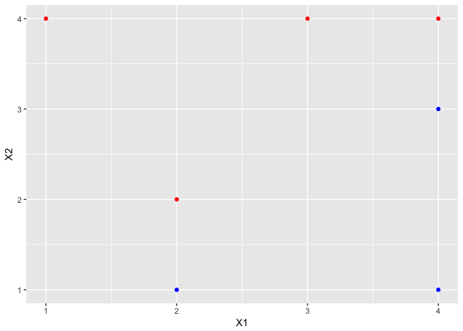
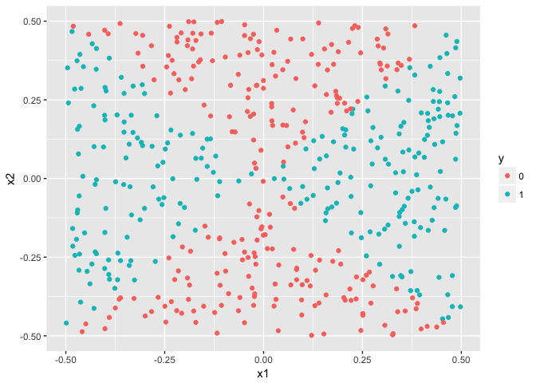
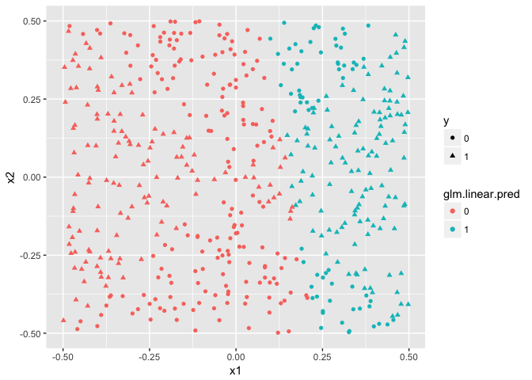
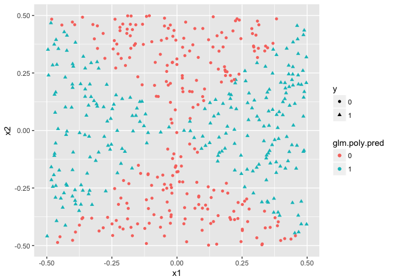
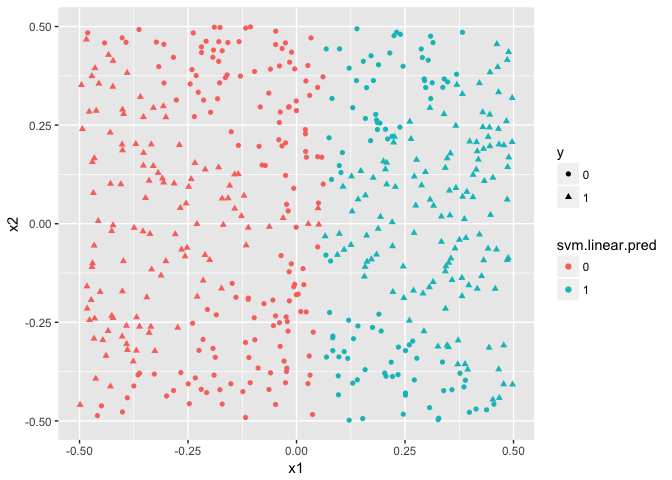
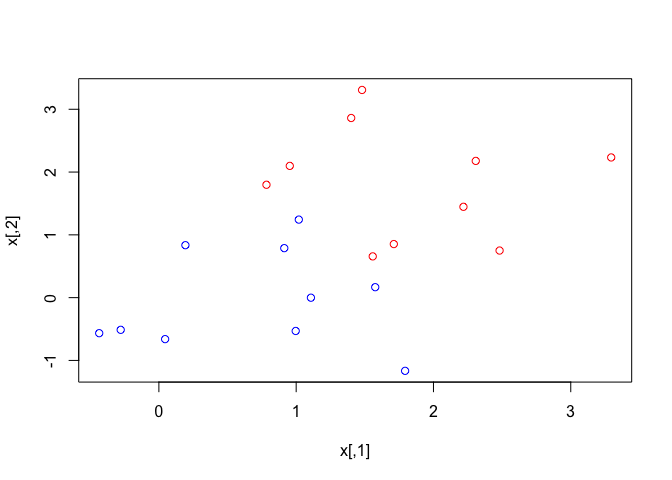

## 9.6.1


```r
set.seed(1)
x=matrix(rnorm(20*2), ncol=2)
y=c(rep(-1,10), rep(1,10))
x[y==1,]=x[y==1,] + 1
plot(x, col=(3-y))
```

<!-- -->


```r
dat=data.frame(x=x, y=as.factor(y))
svmfit=svm(y ~ ., data=dat, kernel="linear", cost=10, scale=FALSE)
plot(svmfit , dat)
```

<!-- -->

```r
summary(svmfit)
```

```
## 
## Call:
## svm(formula = y ~ ., data = dat, kernel = "linear", cost = 10, 
##     scale = FALSE)
## 
## 
## Parameters:
##    SVM-Type:  C-classification 
##  SVM-Kernel:  linear 
##        cost:  10 
##       gamma:  0.5 
## 
## Number of Support Vectors:  7
## 
##  ( 4 3 )
## 
## 
## Number of Classes:  2 
## 
## Levels: 
##  -1 1
```


4
5
remainder of 7
remainder of 8

## Q1

Sketch the hyperplane 1 + 3X1 − X2 = 0. Indicate the set of points for which 1+3X1 −X2 > 0, as well as the set of points for which 1 + 3X1 − X2 < 0.

X2 = 3X1 + 1


```r
hyperplane <- tibble(
  X1=seq(-10,10,.1),
  X2=3*X1 + 1)

grid <- expand.grid(X1=-10:10,X2=seq(-25,25,5)) %>% as_tibble() %>%
  mutate(position=ifelse(1+3*X1-X2>0,"above",ifelse(1+3*X1-X2<0,"below","on")))
```


```r
pl <- hyperplane %>% ggplot(aes(x=X1,y=X2)) +
  geom_line() +
  geom_point(aes(color=position),data=grid)

pl
```

<!-- -->


## Q3

Here we explore the maximal margin classifier on a toy data set.

(a) We are given n = 7 observations in p = 2 dimensions. For each observation, there is an associated class label.


```r
dataq3 <- tribble(
  ~X1, ~X2, ~Y,
  3, 4, "red",
  2, 2, "red",
  4, 4, "red",
  1, 4, "red",
  2, 1, "blue",
  4, 3, "blue",
  4, 1, "blue"
)
```

sketch the observations


```r
pl <- dataq3 %>%
  ggplot(aes(x=X1,y=X2,color=Y)) +
  scale_color_identity() +
  geom_point()
pl
```

<!-- -->

(b) Sketch the optimal separating hyperplane, and provide the equa- tion for this hyperplane (of the form (9.1)).

The hyperplane goes through  2, 1.5; 3, 2.5; 4,3.5etc,

X2 = X1 - 0.5

Or X1 - X2 -.5 = 0


```r
hyperplane <- tibble(X1=1:4,X2=X1-0.5)
pl <- pl + geom_line(data=hyperplane,color="black")
pl
```

<!-- -->


(C) Describe the classification rule for the maximal margin classifier. It should be something along the lines of “Classify to Red if β0 + β1X1 + β2X2 > 0, and classify to Blue otherwise.” Provide the values for β0, β1, and β2.

Classify to red if X1 - X2 -.5 > 0; otherwise to blue

(D)On your sketch, indicate the margin for the maximal margin hyperplane.


```r
upper_margin <- hyperplane %>% mutate(X2=X2 + .5)
lower_margin <- hyperplane %>% mutate(X2=X2 - .5)
pl <- pl +
  geom_line(data=upper_margin, color="gray30", lty=2) +
  geom_line(data=lower_margin, color="gray30", lty=2)
pl
```

<!-- -->

(E) Indicate the support vectors for the maximal margin classifier.  

These are the points touching the dotted lines

(f) Argue that a slight movement of the seventh observation would not affect the maximal margin hyperplane.

The seventh observation is far from the margins and this would not affect their placement.

(g) Sketch a hyperplane that is not the optimal separating hyper- plane, and provide the equation for this hyperplane.

1.1?*X1 - X2 -.5 = 0


```r
pl + geom_abline(intercept=-.5, slope=1.1, lty=3)
```

<!-- -->


(h) Draw an additional observation on the plot so that the two classes are no longer separable by a hyperplane.


```r
pl + geom_point(x=3,y=1,color="red")
```

<!-- -->
## Q4
_Generate a simulated two-class data set with 100 observations and two features in which there is a visible but non-linear separation between the two classes. Show that in this setting, a support vector machine with a polynomial kernel (with degree greater than 1) or a radial kernel will outperform a support vector classifier on the training data. Which technique performs best on the test data? Make plots and report training and test error rates in order to back up your assertions._


```r
set.seed(5454)
dataq4 <- tibble(
  x1=rnorm(100,sd=5),
  x2=rnorm(100,sd=5),
  y=as.factor(ifelse(3*x1-x2^2>0,1,-1)))
ggplot(dataq4,aes(x=x1,y=x2,color=y)) + geom_point()
```

<!-- -->

```r
dataq4.train <- dataq4[1:50,]
dataq4.test <- dataq4[51:100,]
```

linear

```r
svm41 <- tune(svm,y~.,data=dataq4.train,kernel="linear",
  ranges=list(cost=c(0.01,0.1,1,5,10,50,100)))
summary(svm41)
```

```
## 
## Parameter tuning of 'svm':
## 
## - sampling method: 10-fold cross validation 
## 
## - best parameters:
##  cost
##    50
## 
## - best performance: 0.14 
## 
## - Detailed performance results:
##    cost error dispersion
## 1 1e-02  0.18  0.1475730
## 2 1e-01  0.18  0.1475730
## 3 1e+00  0.16  0.1577621
## 4 5e+00  0.16  0.1577621
## 5 1e+01  0.16  0.1577621
## 6 5e+01  0.14  0.1349897
## 7 1e+02  0.14  0.1349897
```

poly

```r
svm42 <- tune(svm,y~.,data=dataq4.train,kernel="polynomial",
             ranges=list(cost=c(0.01,0.1,1,5,10,50),degree=2:5))
summary(svm42)
```

```
## 
## Parameter tuning of 'svm':
## 
## - sampling method: 10-fold cross validation 
## 
## - best parameters:
##  cost degree
##     1      3
## 
## - best performance: 0.12 
## 
## - Detailed performance results:
##     cost degree error dispersion
## 1   0.01      2  0.18  0.1751190
## 2   0.10      2  0.18  0.1751190
## 3   1.00      2  0.18  0.1751190
## 4   5.00      2  0.24  0.1837873
## 5  10.00      2  0.22  0.1751190
## 6  50.00      2  0.20  0.1632993
## 7   0.01      3  0.18  0.1751190
## 8   0.10      3  0.14  0.1349897
## 9   1.00      3  0.12  0.1398412
## 10  5.00      3  0.12  0.1398412
## 11 10.00      3  0.12  0.1398412
## 12 50.00      3  0.14  0.1349897
## 13  0.01      4  0.18  0.1751190
## 14  0.10      4  0.18  0.1751190
## 15  1.00      4  0.20  0.1632993
## 16  5.00      4  0.20  0.1632993
## 17 10.00      4  0.20  0.1632993
## 18 50.00      4  0.22  0.1475730
## 19  0.01      5  0.18  0.1751190
## 20  0.10      5  0.12  0.1398412
## 21  1.00      5  0.12  0.1398412
## 22  5.00      5  0.14  0.1646545
## 23 10.00      5  0.12  0.1686548
## 24 50.00      5  0.12  0.1686548
```

radial

```r
svm43 <- tune(svm,y~.,data=dataq4.train,kernel="radial",
             ranges=list(cost=c(0.01,0.1,1,5,10,50,100),gamma=c(0.01,0.05,0.1,0.2,0.5,1,2)))
summary(svm43)
```

```
## 
## Parameter tuning of 'svm':
## 
## - sampling method: 10-fold cross validation 
## 
## - best parameters:
##  cost gamma
##   100   0.2
## 
## - best performance: 0.02 
## 
## - Detailed performance results:
##     cost gamma error dispersion
## 1  1e-02  0.01  0.18 0.14757296
## 2  1e-01  0.01  0.18 0.14757296
## 3  1e+00  0.01  0.18 0.14757296
## 4  5e+00  0.01  0.18 0.14757296
## 5  1e+01  0.01  0.18 0.14757296
## 6  5e+01  0.01  0.16 0.12649111
## 7  1e+02  0.01  0.12 0.10327956
## 8  1e-02  0.05  0.18 0.14757296
## 9  1e-01  0.05  0.18 0.14757296
## 10 1e+00  0.05  0.18 0.14757296
## 11 5e+00  0.05  0.16 0.15776213
## 12 1e+01  0.05  0.10 0.10540926
## 13 5e+01  0.05  0.10 0.10540926
## 14 1e+02  0.05  0.12 0.13984118
## 15 1e-02  0.10  0.18 0.14757296
## 16 1e-01  0.10  0.18 0.14757296
## 17 1e+00  0.10  0.18 0.14757296
## 18 5e+00  0.10  0.10 0.10540926
## 19 1e+01  0.10  0.10 0.10540926
## 20 5e+01  0.10  0.10 0.14142136
## 21 1e+02  0.10  0.06 0.13498971
## 22 1e-02  0.20  0.18 0.14757296
## 23 1e-01  0.20  0.18 0.14757296
## 24 1e+00  0.20  0.16 0.15776213
## 25 5e+00  0.20  0.10 0.10540926
## 26 1e+01  0.20  0.06 0.09660918
## 27 5e+01  0.20  0.04 0.08432740
## 28 1e+02  0.20  0.02 0.06324555
## 29 1e-02  0.50  0.18 0.14757296
## 30 1e-01  0.50  0.18 0.14757296
## 31 1e+00  0.50  0.10 0.10540926
## 32 5e+00  0.50  0.06 0.09660918
## 33 1e+01  0.50  0.04 0.08432740
## 34 5e+01  0.50  0.04 0.08432740
## 35 1e+02  0.50  0.04 0.08432740
## 36 1e-02  1.00  0.18 0.14757296
## 37 1e-01  1.00  0.18 0.14757296
## 38 1e+00  1.00  0.06 0.09660918
## 39 5e+00  1.00  0.04 0.08432740
## 40 1e+01  1.00  0.04 0.08432740
## 41 5e+01  1.00  0.04 0.08432740
## 42 1e+02  1.00  0.04 0.08432740
## 43 1e-02  2.00  0.18 0.14757296
## 44 1e-01  2.00  0.18 0.14757296
## 45 1e+00  2.00  0.04 0.08432740
## 46 5e+00  2.00  0.04 0.08432740
## 47 1e+01  2.00  0.04 0.08432740
## 48 5e+01  2.00  0.04 0.08432740
## 49 1e+02  2.00  0.04 0.08432740
```

training error

```r
tribble(
  ~model, ~error,
  "linear", mean(dataq4.train$y!=predict(svm41$best.model)),
  "polynomial", mean(dataq4.train$y!=predict(svm42$best.model)),
  "radial", mean(dataq4.train$y!=predict(svm43$best.model))
)
```

```
## # A tibble: 3 x 2
##   model      error
##   <chr>      <dbl>
## 1 linear     0.120
## 2 polynomial 0.120
## 3 radial     0.
```

test error
training error

```r
tribble(
  ~model, ~error,
  "linear", mean(dataq4.test$y!=predict(svm41$best.model,newdata=dataq4.test)),
  "polynomial", mean(dataq4.test$y!=predict(svm42$best.model,newdata=dataq4.test)),
  "radial", mean(dataq4.test$y!=predict(svm43$best.model,newdata=dataq4.test))
)
```

```
## # A tibble: 3 x 2
##   model      error
##   <chr>      <dbl>
## 1 linear     0.240
## 2 polynomial 0.280
## 3 radial     0.100
```

Radial outperforms in training and WAY outperforms in test

## Q5

_We have seen that we can fit an SVM with a non-linear kernel in order to perform classification using a non-linear decision boundary. We will now see that we can also obtain a non-linear decision boundary by performing logistic regression using non-linear transformations of the features._

_(a) Generate a data set with n = 500 and p = 2, such that the obser- vations belong to two classes with a quadratic decision boundary between them. For instance, you can do this as follows_


```r
set.seed(2323)
q5.data <- tibble(
  x1=runif(500)-0.5,
 x2=runif(500)-0.5,
 y=as.factor(1*(x1^2-x2^2 > 0))
)
head(q5.data)
```

```
## # A tibble: 6 x 3
##       x1     x2 y    
##    <dbl>  <dbl> <fct>
## 1  0.407  0.124 1    
## 2  0.445  0.244 1    
## 3 -0.360  0.322 1    
## 4 -0.307  0.298 1    
## 5  0.156 -0.134 1    
## 6  0.343 -0.215 1
```


_(b) Plot the observations, colored according to their class labels. Your plot should display X1 on the x-axis, and X2 on the y- axis._


```r
q5.data %>% ggplot(aes(x=x1,y=x2,color=y)) + geom_point()
```

<!-- -->

(c) Fit a logistic regression model to the data, using X1 and X2 as predictors.


```r
q5.glm1 <- glm(y~x1+x2,family="binomial",data=q5.data)
summary(q5.glm1)
```

```
## 
## Call:
## glm(formula = y ~ x1 + x2, family = "binomial", data = q5.data)
## 
## Deviance Residuals: 
##    Min      1Q  Median      3Q     Max  
## -1.208  -1.163  -1.117   1.178   1.251  
## 
## Coefficients:
##             Estimate Std. Error z value Pr(>|z|)
## (Intercept) -0.03698    0.08981  -0.412    0.681
## x1           0.23944    0.31033   0.772    0.440
## x2           0.03302    0.30637   0.108    0.914
## 
## (Dispersion parameter for binomial family taken to be 1)
## 
##     Null deviance: 693.02  on 499  degrees of freedom
## Residual deviance: 692.41  on 497  degrees of freedom
## AIC: 698.41
## 
## Number of Fisher Scoring iterations: 3
```

(d) Apply this model to the training data in order to obtain a predicted class label for each training observation. Plot the observations, colored according to the predicted class labels. The decision boundary should be linear.


```r
q5.data %>% mutate(glm.linear.pred = ifelse(predict(q5.glm1,type="response")>0.5,"1","0")) %>%
  ggplot(aes(x=x1,y=x2,color=glm.linear.pred,shape=y)) + geom_point()
```

<!-- -->


_(e) Now fit a logistic regression model to the data using non-linear functions of X1 and X2 as predictors (e.g. X12, X1 ×X2, log(X2), and so forth)._


```r
q5.glm2 <- glm(y~poly(x1,2)+poly(x2,2),family=binomial,data=q5.data)
```

```
## Warning: glm.fit: algorithm did not converge
```

```
## Warning: glm.fit: fitted probabilities numerically 0 or 1 occurred
```

```r
summary(q5.glm2)
```

```
## 
## Call:
## glm(formula = y ~ poly(x1, 2) + poly(x2, 2), family = binomial, 
##     data = q5.data)
## 
## Deviance Residuals: 
##        Min          1Q      Median          3Q         Max  
## -1.912e-03  -2.000e-08  -2.000e-08   2.000e-08   1.855e-03  
## 
## Coefficients:
##                Estimate Std. Error z value Pr(>|z|)
## (Intercept)      -98.79    5405.27  -0.018    0.985
## poly(x1, 2)1    2133.15   91442.55   0.023    0.981
## poly(x1, 2)2   53778.83 1093553.90   0.049    0.961
## poly(x2, 2)1   -2212.51  101147.15  -0.022    0.983
## poly(x2, 2)2  -53140.06 1081786.68  -0.049    0.961
## 
## (Dispersion parameter for binomial family taken to be 1)
## 
##     Null deviance: 6.9302e+02  on 499  degrees of freedom
## Residual deviance: 9.8226e-06  on 495  degrees of freedom
## AIC: 10
## 
## Number of Fisher Scoring iterations: 25
```

(f) Apply this model to the training data in order to obtain a predicted class label for each training observation. Plot the observations, colored according to the predicted class labels. The decision boundary should be obviously non-linear. If it is not, then repeat (a)-(e) until you come up with an example in which the predicted class labels are obviously non-linear.


```r
q5.data %>% mutate(glm.poly.pred = ifelse(predict(q5.glm2,type="response")>0.5,"1","0")) %>%
  ggplot(aes(x=x1,y=x2,color=glm.poly.pred,shape=y)) + geom_point()
```

<!-- -->

(g) Fit a support vector classifier to the data with X1 and X2 as predictors. Obtain a class prediction for each training observation. Plot the observations, colored according to the predicted class labels.svm


```r
svm51 <- tune(svm,y~x1+x2,ranges=list(cost=c(0.01,0.05,0.1,0.5,1,5,10)), data = q5.data,kernel="linear")
svm51
```

```
## 
## Parameter tuning of 'svm':
## 
## - sampling method: 10-fold cross validation 
## 
## - best parameters:
##  cost
##   0.5
## 
## - best performance: 0.5
```

```r
q5.data %>% mutate(svm.linear.pred = predict(svm51$best.model)) %>%
  ggplot(aes(x=x1,y=x2,color=svm.linear.pred,shape=y)) + geom_point()
```

<!-- -->

(h) Fit a SVM using a non-linear kernel to the data. Obtain a class prediction for each training observation. Plot the observations, colored according to the predicted class labels.


```r
svm52 <- tune(svm,y~x1+x2,ranges=list(cost=c(0.01,0.05,0.1,0.5,1,5,10)), data = q5.data,kernel="radial")
svm52
```

```
## 
## Parameter tuning of 'svm':
## 
## - sampling method: 10-fold cross validation 
## 
## - best parameters:
##  cost
##    10
## 
## - best performance: 0.032
```

```r
q5.data %>% mutate(svm.linear.pred = predict(svm52$best.model)) %>%
  ggplot(aes(x=x1,y=x2,color=svm.linear.pred,shape=y)) + geom_point()
```

<!-- -->

(i) Comment on your results.

svm radial and glm poly look good.

## Q6

_At the end of Section 9.6.1, it is claimed that in the case of data that is just barely linearly separable, a support vector classifier with a small value of cost that misclassifies a couple of training observations may perform better on test data than one with a huge value of cost that does not misclassify any training observations. You will now investigate this claim._

_(a) Generate two-class data with p = 2 in such a way that the classes are just barely linearly separable._


```r
set.seed(23)
x <- matrix(rnorm(20*2),ncol=2)
y <- c(rep(-1,10), rep(1,10))
x[y==1,]=x[y==1,] + 2.0
plot(x, col=(3-y))
```

<!-- -->

_(b) Compute the cross-validation error rates for support vector classifiers with a range of cost values. How many training errors are misclassified for each value of cost considered, and how does this relate to the cross-validation errors obtained?_


```r
dat <- data.frame(x,y=factor(y))
tune.out <- tune(svm,y~., data=dat,kernel="linear",ranges=list(cost=c(0.001,0.01,0.1,1,5,10,100)))

summary(tune.out)
```

```
## 
## Parameter tuning of 'svm':
## 
## - sampling method: 10-fold cross validation 
## 
## - best parameters:
##  cost
##   0.1
## 
## - best performance: 0.1 
## 
## - Detailed performance results:
##    cost error dispersion
## 1 1e-03  0.65  0.4743416
## 2 1e-02  0.65  0.4743416
## 3 1e-01  0.10  0.2108185
## 4 1e+00  0.10  0.2108185
## 5 5e+00  0.10  0.2108185
## 6 1e+01  0.10  0.2108185
## 7 1e+02  0.15  0.2415229
```

Is the error rate just the proportion of observations mis-classified?


```r
svm.models <- map(c(0.001,0.01,0.1,1,5,10,100), function(cost) {
  svm(y ~ ., data=dat, kernel = "linear", cost=cost) 
})

map(svm.models,summary)
```

```
## [[1]]
## 
## Call:
## svm(formula = y ~ ., data = dat, kernel = "linear", cost = cost)
## 
## 
## Parameters:
##    SVM-Type:  C-classification 
##  SVM-Kernel:  linear 
##        cost:  0.001 
##       gamma:  0.5 
## 
## Number of Support Vectors:  20
## 
##  ( 10 10 )
## 
## 
## Number of Classes:  2 
## 
## Levels: 
##  -1 1
## 
## 
## 
## 
## [[2]]
## 
## Call:
## svm(formula = y ~ ., data = dat, kernel = "linear", cost = cost)
## 
## 
## Parameters:
##    SVM-Type:  C-classification 
##  SVM-Kernel:  linear 
##        cost:  0.01 
##       gamma:  0.5 
## 
## Number of Support Vectors:  20
## 
##  ( 10 10 )
## 
## 
## Number of Classes:  2 
## 
## Levels: 
##  -1 1
## 
## 
## 
## 
## [[3]]
## 
## Call:
## svm(formula = y ~ ., data = dat, kernel = "linear", cost = cost)
## 
## 
## Parameters:
##    SVM-Type:  C-classification 
##  SVM-Kernel:  linear 
##        cost:  0.1 
##       gamma:  0.5 
## 
## Number of Support Vectors:  15
## 
##  ( 7 8 )
## 
## 
## Number of Classes:  2 
## 
## Levels: 
##  -1 1
## 
## 
## 
## 
## [[4]]
## 
## Call:
## svm(formula = y ~ ., data = dat, kernel = "linear", cost = cost)
## 
## 
## Parameters:
##    SVM-Type:  C-classification 
##  SVM-Kernel:  linear 
##        cost:  1 
##       gamma:  0.5 
## 
## Number of Support Vectors:  9
## 
##  ( 5 4 )
## 
## 
## Number of Classes:  2 
## 
## Levels: 
##  -1 1
## 
## 
## 
## 
## [[5]]
## 
## Call:
## svm(formula = y ~ ., data = dat, kernel = "linear", cost = cost)
## 
## 
## Parameters:
##    SVM-Type:  C-classification 
##  SVM-Kernel:  linear 
##        cost:  5 
##       gamma:  0.5 
## 
## Number of Support Vectors:  6
## 
##  ( 3 3 )
## 
## 
## Number of Classes:  2 
## 
## Levels: 
##  -1 1
## 
## 
## 
## 
## [[6]]
## 
## Call:
## svm(formula = y ~ ., data = dat, kernel = "linear", cost = cost)
## 
## 
## Parameters:
##    SVM-Type:  C-classification 
##  SVM-Kernel:  linear 
##        cost:  10 
##       gamma:  0.5 
## 
## Number of Support Vectors:  5
## 
##  ( 2 3 )
## 
## 
## Number of Classes:  2 
## 
## Levels: 
##  -1 1
## 
## 
## 
## 
## [[7]]
## 
## Call:
## svm(formula = y ~ ., data = dat, kernel = "linear", cost = cost)
## 
## 
## Parameters:
##    SVM-Type:  C-classification 
##  SVM-Kernel:  linear 
##        cost:  100 
##       gamma:  0.5 
## 
## Number of Support Vectors:  3
## 
##  ( 1 2 )
## 
## 
## Number of Classes:  2 
## 
## Levels: 
##  -1 1
```

```r
map(svm.models,function(m) {
  table(predict=predict(m), truth=dat$y)  
})
```

```
## [[1]]
##        truth
## predict -1  1
##      -1 10  1
##      1   0  9
## 
## [[2]]
##        truth
## predict -1  1
##      -1 10  1
##      1   0  9
## 
## [[3]]
##        truth
## predict -1  1
##      -1 10  1
##      1   0  9
## 
## [[4]]
##        truth
## predict -1  1
##      -1  9  0
##      1   1 10
## 
## [[5]]
##        truth
## predict -1  1
##      -1  9  0
##      1   1 10
## 
## [[6]]
##        truth
## predict -1  1
##      -1  9  0
##      1   1 10
## 
## [[7]]
##        truth
## predict -1  1
##      -1 10  0
##      1   0 10
```

Only the model with the highest cost correctly classifies everything

_(c) Generate an appropriate test data set, and compute the test errors corresponding to each of the values of cost considered. Which value of cost leads to the fewest test errors, and how does this compare to the values of cost that yield the fewest training errors and the fewest cross-validation errors?_


```r
set.seed(45)
x.test <- matrix(rnorm(20*2),ncol=2)
y.test <- c(rep(-1,10), rep(1,10))
x.test[y.test==1,]=x.test[y.test==1,] + 2
dat.test <- data.frame(x.test,y=factor(y.test))
```


```r
map(svm.models,function(m) {
  table(predict=predict(m,newdata=dat.test), truth=dat.test$y)  
})
```

```
## [[1]]
##        truth
## predict -1  1
##      -1  9  0
##      1   1 10
## 
## [[2]]
##        truth
## predict -1  1
##      -1  9  0
##      1   1 10
## 
## [[3]]
##        truth
## predict -1  1
##      -1  9  0
##      1   1 10
## 
## [[4]]
##        truth
## predict -1  1
##      -1  9  0
##      1   1 10
## 
## [[5]]
##        truth
## predict -1  1
##      -1  9  0
##      1   1 10
## 
## [[6]]
##        truth
## predict -1  1
##      -1  9  0
##      1   1 10
## 
## [[7]]
##        truth
## predict -1 1
##      -1  9 1
##      1   1 9
```

(D)

The model with the highest cost (best on the training data) mis-classified 2 items in the test set, whereas all others only misclassified one.

## Q7

_7. In this problem, you will use support vector approaches in order to predict whether a given car gets high or low gas mileage based on the Auto data set._

_(a) Create a binary variable that takes on a 1 for cars with gas mileage above the median, and a 0 for cars with gas mileage below the median._


```r
library(ISLR)
data(Auto)
Auto <- Auto %>% mutate(mpg.class = as.numeric(mpg > median(mpg)))
```


_(b) Fit a support vector classifier to the data with various values of cost, in order to predict whether a car gets high or low gas mileage. Report the cross-validation errors associated with different values of this parameter. Comment on your results._


```r
tune.out <- tune(svm, mpg.class ~ . - mpg, data=Auto, kernel="linear",range = list (cost=c(0.001,0.01,0.1,1,5,10,50,100,500,1000)))
summary(tune.out)
```

```
## 
## Parameter tuning of 'svm':
## 
## - sampling method: 10-fold cross validation 
## 
## - best parameters:
##  cost
##     1
## 
## - best performance: 0.09655508 
## 
## - Detailed performance results:
##     cost      error dispersion
## 1  1e-03 0.10831324 0.02859408
## 2  1e-02 0.10422169 0.05048248
## 3  1e-01 0.10164698 0.06206748
## 4  1e+00 0.09655508 0.04787524
## 5  5e+00 0.10130885 0.04859540
## 6  1e+01 0.10648734 0.04727492
## 7  5e+01 0.11988401 0.04463357
## 8  1e+02 0.12313158 0.04692865
## 9  5e+02 0.12845088 0.04681615
## 10 1e+03 0.12878658 0.04606842
```

Best is cost = 1, with a ~ 10% CV error rate

_(c) Now repeat (b), this time using SVMs with radial and polynomial basis kernels, with different values of gamma and degree and cost. Comment on your results._


```r
tune.out.poly <- tune(svm, mpg.class ~ . - mpg, data=Auto, kernel="polynomial",range = list (cost=c(0.001,0.01,0.1,1,5,10,50,100,500,1000),degree=2:5))
summary(tune.out.poly)
```

```
## 
## Parameter tuning of 'svm':
## 
## - sampling method: 10-fold cross validation 
## 
## - best parameters:
##  cost degree
##  1000      2
## 
## - best performance: 0.1664868 
## 
## - Detailed performance results:
##     cost degree     error dispersion
## 1  1e-03      2 0.5121172 0.03863788
## 2  1e-02      2 0.5118534 0.03875948
## 3  1e-01      2 0.5092004 0.03995971
## 4  1e+00      2 0.4835510 0.05152394
## 5  5e+00      2 0.3921799 0.08663378
## 6  1e+01      2 0.3297508 0.08664943
## 7  5e+01      2 0.2860956 0.05899617
## 8  1e+02      2 0.2550481 0.05794290
## 9  5e+02      2 0.1910451 0.05604356
## 10 1e+03      2 0.1664868 0.04692979
## 11 1e-03      3 0.5121394 0.03862653
## 12 1e-02      3 0.5120755 0.03864596
## 13 1e-01      3 0.5114365 0.03884047
## 14 1e+00      3 0.5050672 0.04077950
## 15 5e+00      3 0.4777735 0.04942471
## 16 1e+01      3 0.4459781 0.05944761
## 17 5e+01      3 0.2826396 0.07317590
## 18 1e+02      3 0.2455899 0.04734177
## 19 5e+02      3 0.1863150 0.03551264
## 20 1e+03      3 0.1683718 0.03407955
## 21 1e-03      4 0.5121463 0.03862449
## 22 1e-02      4 0.5121446 0.03862556
## 23 1e-01      4 0.5121278 0.03863630
## 24 1e+00      4 0.5119593 0.03874370
## 25 5e+00      4 0.5112115 0.03922150
## 26 1e+01      4 0.5102793 0.03981969
## 27 5e+01      4 0.5028792 0.04456205
## 28 1e+02      4 0.4938926 0.05047174
## 29 5e+02      4 0.4322796 0.08966757
## 30 1e+03      4 0.3812001 0.11244425
## 31 1e-03      5 0.5121465 0.03862438
## 32 1e-02      5 0.5121463 0.03862448
## 33 1e-01      5 0.5121445 0.03862554
## 34 1e+00      5 0.5121267 0.03863605
## 35 5e+00      5 0.5120475 0.03868277
## 36 1e+01      5 0.5119485 0.03874119
## 37 5e+01      5 0.5111575 0.03920896
## 38 1e+02      5 0.5101716 0.03979464
## 39 5e+02      5 0.5023679 0.04447687
## 40 1e+03      5 0.4928864 0.05028881
```

not as good, best = 15.7% CV error rate


```r
tune.out.radial <- tune(svm, mpg.class ~ . - mpg, data=Auto, kernel="radial",range = list (cost=c(0.001,0.01,0.1,1,5,10,50,100,500,1000),gamma=c(0.01,0.1,0.5,1,2,3)))
summary(tune.out.radial)
```

```
## 
## Parameter tuning of 'svm':
## 
## - sampling method: 10-fold cross validation 
## 
## - best parameters:
##  cost gamma
##    10   0.1
## 
## - best performance: 0.06328009 
## 
## - Detailed performance results:
##     cost gamma      error dispersion
## 1  1e-03  0.01 0.47120138 0.08773523
## 2  1e-02  0.01 0.29526479 0.05249021
## 3  1e-01  0.01 0.09896499 0.01978287
## 4  1e+00  0.01 0.08668794 0.02675545
## 5  5e+00  0.01 0.08413384 0.02877535
## 6  1e+01  0.01 0.08362687 0.02783730
## 7  5e+01  0.01 0.07832233 0.02217494
## 8  1e+02  0.01 0.07823121 0.02120599
## 9  5e+02  0.01 0.08527172 0.01626748
## 10 1e+03  0.01 0.09331117 0.01400122
## 11 1e-03  0.10 0.44546616 0.08233438
## 12 1e-02  0.10 0.14813313 0.02507528
## 13 1e-01  0.10 0.07274421 0.02327383
## 14 1e+00  0.10 0.07216334 0.02524770
## 15 5e+00  0.10 0.06384840 0.02246272
## 16 1e+01  0.10 0.06328009 0.02343578
## 17 5e+01  0.10 0.07582273 0.02624141
## 18 1e+02  0.10 0.08206693 0.03054318
## 19 5e+02  0.10 0.09795625 0.05616902
## 20 1e+03  0.10 0.10502122 0.05393941
## 21 1e-03  0.50 0.48402297 0.09060090
## 22 1e-02  0.50 0.39665167 0.07190262
## 23 1e-01  0.50 0.08518121 0.01803405
## 24 1e+00  0.50 0.06473099 0.02485885
## 25 5e+00  0.50 0.06952411 0.02610243
## 26 1e+01  0.50 0.07208669 0.03155169
## 27 5e+01  0.50 0.07646412 0.04038315
## 28 1e+02  0.50 0.07646412 0.04038315
## 29 5e+02  0.50 0.07646412 0.04038315
## 30 1e+03  0.50 0.07646412 0.04038315
## 31 1e-03  1.00 0.49191971 0.09229768
## 32 1e-02  1.00 0.46988529 0.08718836
## 33 1e-01  1.00 0.28568491 0.04738504
## 34 1e+00  1.00 0.09948811 0.01736277
## 35 5e+00  1.00 0.10457259 0.02150234
## 36 1e+01  1.00 0.10568085 0.02434080
## 37 5e+01  1.00 0.10567753 0.02434386
## 38 1e+02  1.00 0.10567753 0.02434386
## 39 5e+02  1.00 0.10567753 0.02434386
## 40 1e+03  1.00 0.10567753 0.02434386
## 41 1e-03  2.00 0.49373457 0.09268408
## 42 1e-02  2.00 0.48749689 0.09085839
## 43 1e-01  2.00 0.42875238 0.07410500
## 44 1e+00  2.00 0.20636276 0.01138326
## 45 5e+00  2.00 0.20745258 0.01291015
## 46 1e+01  2.00 0.20745258 0.01291015
## 47 5e+01  2.00 0.20745258 0.01291015
## 48 1e+02  2.00 0.20745258 0.01291015
## 49 5e+02  2.00 0.20745258 0.01291015
## 50 1e+03  2.00 0.20745258 0.01291015
## 51 1e-03  3.00 0.49390023 0.09272871
## 52 1e-02  3.00 0.48892781 0.09115760
## 53 1e-01  3.00 0.44184108 0.07638952
## 54 1e+00  3.00 0.23322911 0.01046936
## 55 5e+00  3.00 0.23346285 0.01081149
## 56 1e+01  3.00 0.23346285 0.01081149
## 57 5e+01  3.00 0.23346285 0.01081149
## 58 1e+02  3.00 0.23346285 0.01081149
## 59 5e+02  3.00 0.23346285 0.01081149
## 60 1e+03  3.00 0.23346285 0.01081149
```
Best...6.5% CV error

(d) Make some plots to back up your assertions in (b) and (c).

## Q8

_8. This problem involves the OJ data set which is part of the ISLR package._

_(a) Create a training set containing a random sample of 800 observations, and a test set containing the remaining observations._


```r
set.seed(050418)
data(OJ)
train <- sample(1:nrow(OJ),size=800)
OJ.train <- OJ[train,]
OJ.test <- OJ[-train,]
```

_(b) Fit a support vector classifier to the training data using cost=0.01, with Purchase as the response and the other variables as predictors. Use the summary() function to produce summary statistics, and describe the results obtained._


```r
svm8.1 <- svm(Purchase ~ ., data=OJ.train, cost=0.01, kernel="linear")
summary(svm8.1)
```

```
## 
## Call:
## svm(formula = Purchase ~ ., data = OJ.train, cost = 0.01, kernel = "linear")
## 
## 
## Parameters:
##    SVM-Type:  C-classification 
##  SVM-Kernel:  linear 
##        cost:  0.01 
##       gamma:  0.05555556 
## 
## Number of Support Vectors:  437
## 
##  ( 218 219 )
## 
## 
## Number of Classes:  2 
## 
## Levels: 
##  CH MM
```


_(c) What are the training and test error rates?_

training:

```r
table(predict=predict(svm8.1),observed=OJ.train$Purchase)
```

```
##        observed
## predict  CH  MM
##      CH 431  76
##      MM  55 238
```

```r
mean(predict(svm8.1)!=OJ.train$Purchase)
```

```
## [1] 0.16375
```

16% traiing error rate

test:


```r
table(predict=predict(svm8.1,newdata = OJ.test),observed=OJ.test$Purchase)
```

```
##        observed
## predict  CH  MM
##      CH 144  24
##      MM  23  79
```

```r
mean(predict(svm8.1,newdata = OJ.test)!=OJ.test$Purchase)
```

```
## [1] 0.1740741
```

Test error 17.4 %.

_(d) Use the tune() function to select an optimal cost. Consider values in the range 0.01 to 10._


```r
tune.out <- tune(svm,Purchase ~ ., data=OJ.train, kernel="linear", ranges=list(cost=c(0.01,0.02,0.05,1,5,10)))
summary(tune.out)
```

```
## 
## Parameter tuning of 'svm':
## 
## - sampling method: 10-fold cross validation 
## 
## - best parameters:
##  cost
##    10
## 
## - best performance: 0.16875 
## 
## - Detailed performance results:
##    cost   error dispersion
## 1  0.01 0.17000 0.04216370
## 2  0.02 0.17000 0.04090979
## 3  0.05 0.17250 0.04281744
## 4  1.00 0.17375 0.03606033
## 5  5.00 0.17500 0.03996526
## 6 10.00 0.16875 0.04177070
```


_(e) Compute the training and test error rates using this new value for cost._


```r
predict.train <- predict(tune.out$best.model)
table(predict.train,OJ.train$Purchase)
```

```
##              
## predict.train  CH  MM
##            CH 433  70
##            MM  53 244
```

```r
mean(predict.train!=OJ.train$Purchase)
```

```
## [1] 0.15375
```


```r
predict.test <- predict(tune.out$best.model,newdata = OJ.test)
table(predict.test,OJ.test$Purchase)
```

```
##             
## predict.test  CH  MM
##           CH 141  23
##           MM  26  80
```

```r
mean(predict.test!=OJ.test$Purchase)
```

```
## [1] 0.1814815
```

slightly worse; presumably within the error range on this.

_(f) Repeat parts (b) through (e) using a support vector machine
with a radial kernel. Use the default value for gamma._


```r
svm8.2 <- svm(Purchase ~ ., data=OJ.train, cost=0.01, kernel="radial")
summary(svm8.2)
```

```
## 
## Call:
## svm(formula = Purchase ~ ., data = OJ.train, cost = 0.01, kernel = "radial")
## 
## 
## Parameters:
##    SVM-Type:  C-classification 
##  SVM-Kernel:  radial 
##        cost:  0.01 
##       gamma:  0.05555556 
## 
## Number of Support Vectors:  630
## 
##  ( 314 316 )
## 
## 
## Number of Classes:  2 
## 
## Levels: 
##  CH MM
```

training:

```r
table(predict=predict(svm8.2),observed=OJ.train$Purchase)
```

```
##        observed
## predict  CH  MM
##      CH 486 314
##      MM   0   0
```

```r
mean(predict(svm8.2)!=OJ.train$Purchase)
```

```
## [1] 0.3925
```

39% traiing error rate

test:


```r
table(predict=predict(svm8.2,newdata = OJ.test),observed=OJ.test$Purchase)
```

```
##        observed
## predict  CH  MM
##      CH 167 103
##      MM   0   0
```

```r
mean(predict(svm8.2,newdata = OJ.test)!=OJ.test$Purchase)
```

```
## [1] 0.3814815
```

Test error 38.1 %.

_(d) Use the tune() function to select an optimal cost. Consider values in the range 0.01 to 10._


```r
tune.out.radial <- tune(svm,Purchase ~ ., data=OJ.train, kernel="radial", ranges=list(cost=c(0.01,0.02,0.05,1,5,10)))
summary(tune.out.radial)
```

```
## 
## Parameter tuning of 'svm':
## 
## - sampling method: 10-fold cross validation 
## 
## - best parameters:
##  cost
##     1
## 
## - best performance: 0.18 
## 
## - Detailed performance results:
##    cost   error dispersion
## 1  0.01 0.39250 0.04937104
## 2  0.02 0.39250 0.04937104
## 3  0.05 0.21375 0.03839216
## 4  1.00 0.18000 0.04090979
## 5  5.00 0.18500 0.03425801
## 6 10.00 0.18750 0.04409586
```


```r
predict.train <- predict(tune.out.radial$best.model)
table(predict.train,OJ.train$Purchase)
```

```
##              
## predict.train  CH  MM
##            CH 439  74
##            MM  47 240
```

```r
mean(predict.train!=OJ.train$Purchase)
```

```
## [1] 0.15125
```
15%


```r
predict.test <- predict(tune.out.radial$best.model,newdata = OJ.test)
table(predict.test,OJ.test$Purchase)
```

```
##             
## predict.test  CH  MM
##           CH 145  24
##           MM  22  79
```

```r
mean(predict.test!=OJ.test$Purchase)
```

```
## [1] 0.1703704
```

17%

(g) Repeat parts (b) through (e) using a support vector machine
with a polynomial kernel. Set degree=2.


```r
svm8.3 <- svm(Purchase ~ ., data=OJ.train, cost=0.01, kernel="polynomial", degree=2)
summary(svm8.3)
```

```
## 
## Call:
## svm(formula = Purchase ~ ., data = OJ.train, cost = 0.01, kernel = "polynomial", 
##     degree = 2)
## 
## 
## Parameters:
##    SVM-Type:  C-classification 
##  SVM-Kernel:  polynomial 
##        cost:  0.01 
##      degree:  2 
##       gamma:  0.05555556 
##      coef.0:  0 
## 
## Number of Support Vectors:  634
## 
##  ( 314 320 )
## 
## 
## Number of Classes:  2 
## 
## Levels: 
##  CH MM
```

training:

```r
table(predict=predict(svm8.3),observed=OJ.train$Purchase)
```

```
##        observed
## predict  CH  MM
##      CH 485 293
##      MM   1  21
```

```r
mean(predict(svm8.3)!=OJ.train$Purchase)
```

```
## [1] 0.3675
```

37% traiing error rate

test:


```r
table(predict=predict(svm8.3,newdata = OJ.test),observed=OJ.test$Purchase)
```

```
##        observed
## predict  CH  MM
##      CH 166  98
##      MM   1   5
```

```r
mean(predict(svm8.3,newdata = OJ.test)!=OJ.test$Purchase)
```

```
## [1] 0.3666667
```

Test error 37# %.


```r
tune.out.poly <- tune(svm,Purchase ~ ., data=OJ.train, kernel="polynomial", degree=2,ranges=list(cost=c(0.01,0.02,0.05,1,5,10)))
summary(tune.out.poly)
```

```
## 
## Parameter tuning of 'svm':
## 
## - sampling method: 10-fold cross validation 
## 
## - best parameters:
##  cost
##    10
## 
## - best performance: 0.1875 
## 
## - Detailed performance results:
##    cost   error dispersion
## 1  0.01 0.38750 0.06535161
## 2  0.02 0.36625 0.06237487
## 3  0.05 0.33500 0.05163978
## 4  1.00 0.19250 0.04133199
## 5  5.00 0.18750 0.03584302
## 6 10.00 0.18750 0.04677072
```


```r
predict.train <- predict(tune.out.poly$best.model)
table(predict.train,OJ.train$Purchase)
```

```
##              
## predict.train  CH  MM
##            CH 443  80
##            MM  43 234
```

```r
mean(predict.train!=OJ.train$Purchase)
```

```
## [1] 0.15375
```
15%


```r
predict.test <- predict(tune.out.poly$best.model,newdata = OJ.test)
table(predict.test,OJ.test$Purchase)
```

```
##             
## predict.test  CH  MM
##           CH 145  30
##           MM  22  73
```

```r
mean(predict.test!=OJ.test$Purchase)
```

```
## [1] 0.1925926
```

19%

(h) Overall, which approach seems to give the best results on this data?

all about the same; slight edge to radial.  should try optimizing gamma and degree...
