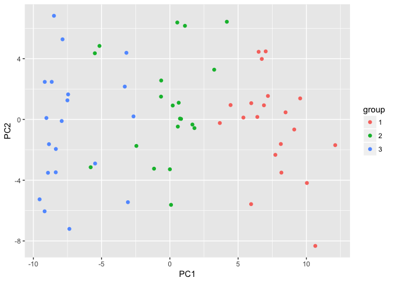
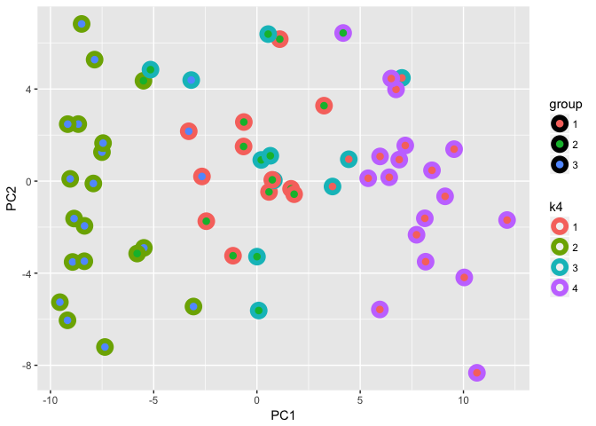
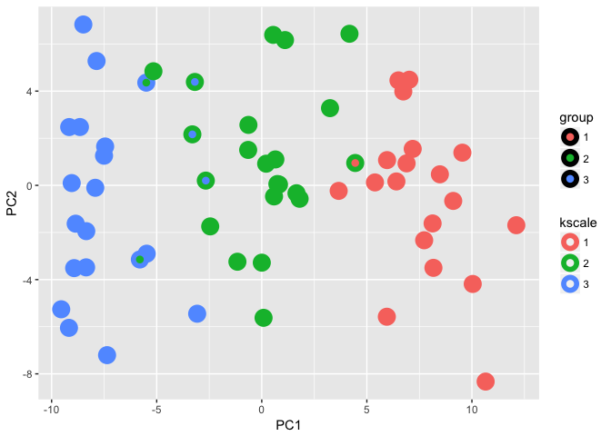
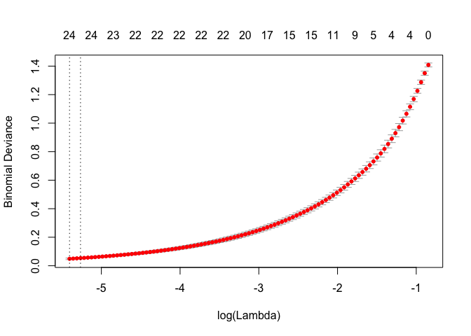

## Q6

### a.  _explain what is meant by explains 10% of the variation_

The total variance is the sum of the variance present in each tissue sample.  Variance along the first principal component is 1/10 of this sum.

### b. 

The first PC may not perfectly map to the machine type.  For example, if by random chance more T (or C) were run on machine A or B that could be a problem.

Better to me seems to do do a regression that include T vs C and A vs B

### c _simulation_


```r
library(tidyverse)
```

```
## ── Attaching packages ─────────────────────── tidyverse 1.2.1 ──
```

```
## ✔ ggplot2 2.2.1     ✔ purrr   0.2.4
## ✔ tibble  1.3.4     ✔ dplyr   0.7.4
## ✔ tidyr   0.7.2     ✔ stringr 1.3.0
## ✔ readr   1.1.1     ✔ forcats 0.2.0
```

```
## Warning: package 'stringr' was built under R version 3.4.3
```

```
## ── Conflicts ────────────────────────── tidyverse_conflicts() ──
## ✖ dplyr::filter() masks stats::filter()
## ✖ dplyr::lag()    masks stats::lag()
```

```r
genes <- 1000
samples <- 100
data <- rnorm(genes*samples) %>% matrix(nrow=genes)
```


```r
machine <- c(sample(c("A","B"),50,replace = TRUE, prob = c(.8,.2)),
             sample(c("A","B"),50,replace = TRUE, prob = c(.2,.8)))
```


Q8

## Q9
_Consider the USArrests data. We will now perform hierarchical clustering on the states._

_(a) Using hierarchical clustering with complete linkage and Euclidean distance, cluster the states._

```r
library(tidyverse)
library(ISLR)
library(ggdendro)
data("USArrests")

head(USArrests)
```

```
##            Murder Assault UrbanPop Rape
## Alabama      13.2     236       58 21.2
## Alaska       10.0     263       48 44.5
## Arizona       8.1     294       80 31.0
## Arkansas      8.8     190       50 19.5
## California    9.0     276       91 40.6
## Colorado      7.9     204       78 38.7
```

```r
summary(USArrests)
```

```
##      Murder          Assault         UrbanPop          Rape      
##  Min.   : 0.800   Min.   : 45.0   Min.   :32.00   Min.   : 7.30  
##  1st Qu.: 4.075   1st Qu.:109.0   1st Qu.:54.50   1st Qu.:15.07  
##  Median : 7.250   Median :159.0   Median :66.00   Median :20.10  
##  Mean   : 7.788   Mean   :170.8   Mean   :65.54   Mean   :21.23  
##  3rd Qu.:11.250   3rd Qu.:249.0   3rd Qu.:77.75   3rd Qu.:26.18  
##  Max.   :17.400   Max.   :337.0   Max.   :91.00   Max.   :46.00
```

```r
hcl.complete.euc <- hclust(dist(USArrests))

ggdendrogram(hcl.complete.euc) + ggtitle("Complete Linkage, Euclidian Distance (unscaled)")
```

<!-- -->


_(b) Cut the dendrogram at a height that results in three distinct clusters. Which states belong to which clusters?_


```r
clusters.complete.euc <- tibble(
  label=names(cutree(hcl.complete.euc,3)),
  cluster=as.character(cutree(hcl.complete.euc,3)))
clusters.complete.euc
```

```
## # A tibble: 50 x 2
##          label cluster
##          <chr>   <chr>
##  1     Alabama       1
##  2      Alaska       1
##  3     Arizona       1
##  4    Arkansas       2
##  5  California       1
##  6    Colorado       2
##  7 Connecticut       3
##  8    Delaware       1
##  9     Florida       1
## 10     Georgia       2
## # ... with 40 more rows
```


```r
hclust.data <- dendro_data(hcl.complete.euc)
lab <- left_join(label(hclust.data),clusters.complete.euc)
```

```
## Joining, by = "label"
```

```
## Warning: Column `label` joining factor and character vector, coercing into
## character vector
```

```r
lab
```

```
##     x y          label cluster
## 1   1 0        Florida       1
## 2   2 0 North Carolina       1
## 3   3 0       Delaware       1
## 4   4 0        Alabama       1
## 5   5 0      Louisiana       1
## 6   6 0         Alaska       1
## 7   7 0    Mississippi       1
## 8   8 0 South Carolina       1
## 9   9 0       Maryland       1
## 10 10 0        Arizona       1
## 11 11 0     New Mexico       1
## 12 12 0     California       1
## 13 13 0       Illinois       1
## 14 14 0       New York       1
## 15 15 0       Michigan       1
## 16 16 0         Nevada       1
## 17 17 0       Missouri       2
## 18 18 0       Arkansas       2
## 19 19 0      Tennessee       2
## 20 20 0        Georgia       2
## 21 21 0       Colorado       2
## 22 22 0          Texas       2
## 23 23 0   Rhode Island       2
## 24 24 0        Wyoming       2
## 25 25 0         Oregon       2
## 26 26 0       Oklahoma       2
## 27 27 0       Virginia       2
## 28 28 0     Washington       2
## 29 29 0  Massachusetts       2
## 30 30 0     New Jersey       2
## 31 31 0           Ohio       3
## 32 32 0           Utah       3
## 33 33 0    Connecticut       3
## 34 34 0   Pennsylvania       3
## 35 35 0       Nebraska       3
## 36 36 0       Kentucky       3
## 37 37 0        Montana       3
## 38 38 0          Idaho       3
## 39 39 0        Indiana       3
## 40 40 0         Kansas       3
## 41 41 0         Hawaii       3
## 42 42 0      Minnesota       3
## 43 43 0      Wisconsin       3
## 44 44 0           Iowa       3
## 45 45 0  New Hampshire       3
## 46 46 0  West Virginia       3
## 47 47 0          Maine       3
## 48 48 0   South Dakota       3
## 49 49 0   North Dakota       3
## 50 50 0        Vermont       3
```

```r
hclust.data <- dendro_data(hcl.complete.euc)
pl <- ggdendrogram(hcl.complete.euc)
pl + geom_point(aes(x=x,y=y-10,color=cluster),data=lab) +
  scale_color_brewer(type="qual",palette = 3)
```

<!-- -->


_(c) Hierarchically cluster the states using complete linkage and Euclidean distance, after scaling the variables to have standard deviation one._


```r
hcl.complete.euc.scale <- USArrests %>% scale() %>% dist() %>% hclust()

hclust.data.scale <- dendro_data(hcl.complete.euc.scale)

clusters.complete.euc.scale <- tibble(
  label=names(cutree(hcl.complete.euc.scale,3)),
  cluster=as.character(cutree(hcl.complete.euc.scale,3)))
clusters.complete.euc.scale
```

```
## # A tibble: 50 x 2
##          label cluster
##          <chr>   <chr>
##  1     Alabama       1
##  2      Alaska       1
##  3     Arizona       2
##  4    Arkansas       3
##  5  California       2
##  6    Colorado       2
##  7 Connecticut       3
##  8    Delaware       3
##  9     Florida       2
## 10     Georgia       1
## # ... with 40 more rows
```


```r
lab <- left_join(label(hclust.data.scale),clusters.complete.euc.scale)
```

```
## Joining, by = "label"
```

```
## Warning: Column `label` joining factor and character vector, coercing into
## character vector
```

```r
lab
```

```
##     x y          label cluster
## 1   1 0   South Dakota       3
## 2   2 0  West Virginia       3
## 3   3 0   North Dakota       3
## 4   4 0        Vermont       3
## 5   5 0          Maine       3
## 6   6 0           Iowa       3
## 7   7 0  New Hampshire       3
## 8   8 0          Idaho       3
## 9   9 0        Montana       3
## 10 10 0       Nebraska       3
## 11 11 0       Kentucky       3
## 12 12 0       Arkansas       3
## 13 13 0       Virginia       3
## 14 14 0        Wyoming       3
## 15 15 0       Missouri       3
## 16 16 0         Oregon       3
## 17 17 0     Washington       3
## 18 18 0       Delaware       3
## 19 19 0   Rhode Island       3
## 20 20 0  Massachusetts       3
## 21 21 0     New Jersey       3
## 22 22 0    Connecticut       3
## 23 23 0      Minnesota       3
## 24 24 0      Wisconsin       3
## 25 25 0       Oklahoma       3
## 26 26 0        Indiana       3
## 27 27 0         Kansas       3
## 28 28 0           Ohio       3
## 29 29 0   Pennsylvania       3
## 30 30 0         Hawaii       3
## 31 31 0           Utah       3
## 32 32 0       Colorado       2
## 33 33 0     California       2
## 34 34 0         Nevada       2
## 35 35 0        Florida       2
## 36 36 0          Texas       2
## 37 37 0       Illinois       2
## 38 38 0       New York       2
## 39 39 0        Arizona       2
## 40 40 0       Michigan       2
## 41 41 0       Maryland       2
## 42 42 0     New Mexico       2
## 43 43 0         Alaska       1
## 44 44 0        Alabama       1
## 45 45 0      Louisiana       1
## 46 46 0        Georgia       1
## 47 47 0      Tennessee       1
## 48 48 0 North Carolina       1
## 49 49 0    Mississippi       1
## 50 50 0 South Carolina       1
```

```r
hclust.data <- dendro_data(hcl.complete.euc.scale)
pl <- ggdendrogram(hcl.complete.euc.scale)
pl + geom_point(aes(x=x,y=y-.1,color=cluster),data=lab) +
  scale_color_brewer(type="qual",palette = 3)
```

<!-- -->

_(d) What effect does scaling the variables have on the hierarchical clustering obtained? In your opinion, should the variables be scaled before the inter-observation dissimilarities are computed? Provide a justification for your answer._

Unscaled, the states are split into three pretty equal groups and these are clearly separated.  Scaled one group dominates with two smaller groups, and the distinctions are less clear.  A heat map may help...


## Q10

_In this problem, you will generate simulated data, and then perform PCA and K-means clustering on the data._

(a) Generate a simulated data set with 20 observations in each of three classes (i.e. 60 observations total), and 50 variables.
Hint: There are a number of functions in R that you can use to generate data. One example is the rnorm() function; runif() is another option. Be sure to add a mean shift to the observations in each class so that there are three distinct classes.


```r
data10 <- matrix(rnorm(20*3*50, mean=c(10:12),sd=2),nrow=60,byrow = FALSE)
rowMeans(data10)
```

```
##  [1]  9.613244 10.944579 12.245357 10.428692 11.027600 12.086344 10.007546
##  [8] 11.250475 12.207995 10.250072 11.140500 12.264741  9.436429 10.448984
## [15] 11.411794 10.131069 10.908681 12.010677 10.066950 10.755492 12.255940
## [22] 10.155162 10.746524 11.429040  9.580165 10.972279 12.061457 10.119966
## [29] 10.635442 12.076602  9.762945 10.889738 12.114782 10.013195 11.671004
## [36] 12.121918  9.931678 11.555050 12.287228 10.162595 10.996264 12.244997
## [43]  9.585665 11.221149 11.760278  9.764283 10.869036 11.457917 10.157347
## [50] 10.771460 12.055390 10.355728 10.833554 12.344527 10.123282 11.040635
## [57] 12.248427  9.944270 11.702646 11.481796
```

_(b) Perform PCA on the 60 observations and plot the first two principal component score vectors. Use a different color to indicate the observations in each of the three classes. If the three classes appear separated in this plot, then continue on to part (c). If not, then return to part (a) and modify the simulation so that there is greater separation between the three classes. Do not continue to part (c) until the three classes show at least some separation in the first two principal component score vectors._


```r
pc10 <- prcomp(data10)
str(pc10)
```

```
## List of 5
##  $ sdev    : num [1:50] 6.5 3.58 3.43 3.39 3.24 ...
##  $ rotation: num [1:50, 1:50] -0.159 -0.127 -0.183 -0.156 -0.118 ...
##   ..- attr(*, "dimnames")=List of 2
##   .. ..$ : NULL
##   .. ..$ : chr [1:50] "PC1" "PC2" "PC3" "PC4" ...
##  $ center  : num [1:50] 10.9 10.5 11.4 11.3 11.3 ...
##  $ scale   : logi FALSE
##  $ x       : num [1:60, 1:50] 9.5457 0.0854 -8.9276 4.447 0.5839 ...
##   ..- attr(*, "dimnames")=List of 2
##   .. ..$ : NULL
##   .. ..$ : chr [1:50] "PC1" "PC2" "PC3" "PC4" ...
##  - attr(*, "class")= chr "prcomp"
```

```r
dim(pc10$x)
```

```
## [1] 60 50
```

```r
x <- pc10$x %>% as.tibble() %>% mutate(group=as.character(rep(1:3,20)))
ggplot(x,aes(x=PC1,y=PC2,color=group)) +
  geom_point(shape=16,size=2)
```

<!-- -->


(c) Perform K-means clustering of the observations with K = 3. How well do the clusters that you obtained in K-means clustering compare to the true class labels?
Hint: You can use the table() function in R to compare the true class labels to the class labels obtained by clustering. Be careful how you interpret the results: K-means clustering will arbitrarily number the clusters, so you cannot simply check whether the true class labels and clustering labels are the same.


```r
kc10.3 <- kmeans(data10,3,nstart=15)
x <- x %>% mutate(k3=as.character(kc10.3$cluster))
ggplot(x,aes(x=PC1,y=PC2)) +
  geom_point(aes(color=k3,fill=group),shape=21,size=3,stroke=3) 
```

<!-- -->


```r
table(x$group,x$k3)
```

```
##    
##      1  2  3
##   1  0  1 19
##   2  2 16  2
##   3 17  3  0
```

```r
(17+15+19) / 60
```

```
## [1] 0.85
```

worked pretty, well, 85% success

(d) Perform K-means clustering with K = 2. Describe your results.


```r
kc10.2 <- kmeans(data10,2,nstart=15)
x <- x %>% mutate(k2=as.character(kc10.2$cluster))
ggplot(x,aes(x=PC1,y=PC2)) +
  geom_point(aes(color=k2,fill=group),shape=21,size=3,stroke=3) 
```

<!-- -->

```r
table(x$group,x$k2)
```

```
##    
##      1  2
##   1 20  0
##   2 13  7
##   3  0 20
```
split the middle group ~ 50/50 between the two k groups.

(e) Now perform K-means clustering with K = 4, and describe your
results.


```r
kc10.4 <- kmeans(data10,4,nstart=15)
x <- x %>% mutate(k4=as.character(kc10.4$cluster))
ggplot(x,aes(x=PC1,y=PC2)) +
  geom_point(aes(color=k4,fill=group),shape=21,size=3,stroke=3) 
```

<!-- -->

```r
table(x$group,x$k4)
```

```
##    
##      1  2  3  4
##   1  0  0  3 17
##   2 10  2  7  1
##   3  2 17  1  0
```

split the middle group into two


(f) Now perform K-means clustering with K = 3 on the first two principal component score vectors, rather than on the raw data. That is, perform K-means clustering on the 60 × 2 matrix of which the first column is the first principal component score vector, and the second column is the second principal component score vector. Comment on the results.


```r
kc10.pc <- x %>% select(PC1,PC2) %>% kmeans(3,nstart=15)
x <- x %>% mutate(kpc=as.character(kc10.pc$cluster))
ggplot(x,aes(x=PC1,y=PC2)) +
  geom_point(aes(color=kpc,fill=group),shape=21,size=3,stroke=3) 
```

<!-- -->

```r
table(true=x$group,predicted=x$kpc)
```

```
##     predicted
## true  1  2  3
##    1  0  1 19
##    2  3 17  0
##    3 17  3  0
```

didn't do very well; messed up cluster 2

_(g) Using the scale() function, perform K-means clustering with K = 3 on the data after scaling each variable to have standard deviation one. How do these results compare to those obtained in (b)? Explain._

Since everything is almost on the same scale in the firt place I expect no difference.


```r
kc10.scale <- data10 %>% scale() %>% kmeans(3,nstart=15)
x <- x %>% mutate(kscale=as.character(kc10.scale$cluster))
ggplot(x,aes(x=PC1,y=PC2)) +
  geom_point(aes(color=kscale,fill=group),shape=21,size=3,stroke=3) 
```

<!-- -->

```r
table(true=x$group,predicted=x$kscale)
```

```
##     predicted
## true  1  2  3
##    1 19  1  0
##    2  0 18  2
##    3  0  3 17
```

```r
(15+18+19)/60
```

```
## [1] 0.8666667
```

slightly better.  Random chance?

## Q11
_On the book website, www.StatLearning.com, there is a gene expression data set (Ch10Ex11.csv) that consists of 40 tissue samples with measurements on 1,000 genes. The first 20 samples are from healthy patients, while the second 20 are from a diseased group._


_(a) Load in the data using read.csv(). You will need to select header=F._


```r
con <- curl::curl("http://www-bcf.usc.edu/~gareth/ISL/Ch10Ex11.csv")
data.exp <- read_csv(con,col_names = FALSE)
```

```
## Parsed with column specification:
## cols(
##   .default = col_double()
## )
```

```
## See spec(...) for full column specifications.
```

```r
head(data.exp)
```

```
## # A tibble: 6 x 40
##            X1         X2         X3         X4         X5         X6
##         <dbl>      <dbl>      <dbl>      <dbl>      <dbl>      <dbl>
## 1 -0.96193340  0.4418028 -0.9750051  1.4175040  0.8188148  0.3162937
## 2 -0.29252570 -1.1392670  0.1958370 -1.2811210 -0.2514393  2.5119970
## 3  0.25878820 -0.9728448  0.5884858 -0.8002581 -1.8203980 -2.0589240
## 4 -1.15213200 -2.2131680 -0.8615249  0.6309253  0.9517719 -1.1657240
## 5  0.19578280  0.5933059  0.2829921  0.2471472  1.9786680 -0.8710180
## 6  0.03012394 -0.6910143 -0.4034258 -0.7298590 -0.3640986  1.1253490
## # ... with 34 more variables: X7 <dbl>, X8 <dbl>, X9 <dbl>, X10 <dbl>,
## #   X11 <dbl>, X12 <dbl>, X13 <dbl>, X14 <dbl>, X15 <dbl>, X16 <dbl>,
## #   X17 <dbl>, X18 <dbl>, X19 <dbl>, X20 <dbl>, X21 <dbl>, X22 <dbl>,
## #   X23 <dbl>, X24 <dbl>, X25 <dbl>, X26 <dbl>, X27 <dbl>, X28 <dbl>,
## #   X29 <dbl>, X30 <dbl>, X31 <dbl>, X32 <dbl>, X33 <dbl>, X34 <dbl>,
## #   X35 <dbl>, X36 <dbl>, X37 <dbl>, X38 <dbl>, X39 <dbl>, X40 <dbl>
```
_(b) Apply hierarchical clustering to the samples using correlation- based distance, and plot the dendrogram. Do the genes separate the samples into the two groups? Do your results depend on the type of linkage used?_


```r
dd <- as.dist(1-cor(data.exp))
hc.complete <- hclust(dd,method="complete")
hc.single <- hclust(dd,method="single")
hc.average <- hclust(dd,method="average")
```


```r
ggdendrogram(hc.complete) + ggtitle("complete")
```

<!-- -->


```r
ggdendrogram(hc.single) + ggtitle("single")
```

<!-- -->


```r
ggdendrogram(hc.average) + ggtitle("average")
```

<!-- -->
None of these make a good split into two groups, although "complete" does best.

(c) Your collaborator wants to know which genes differ the most across the two groups. Suggest a way to answer this question, and apply it here.

Could do PCA and look at the loadings of the PC that separates the groups...

Or binomial lasso


```r
library(glmnet)
```

```
## Loading required package: Matrix
```

```
## 
## Attaching package: 'Matrix'
```

```
## The following object is masked from 'package:tidyr':
## 
##     expand
```

```
## Loading required package: foreach
```

```
## 
## Attaching package: 'foreach'
```

```
## The following objects are masked from 'package:purrr':
## 
##     accumulate, when
```

```
## Loaded glmnet 2.0-13
```

```r
cvglm11 <- cv.glmnet(x=t(data.exp),y=rep(c(0,1),each=20),alpha=1,family="binomial")

plot(cvglm11)
```

<!-- -->


```r
cvglm11$lambda.1se
```

```
## [1] 0.005169919
```

```r
glmnet11 <- glmnet(x=t(data.exp),y=rep(c(0,1),each=20),alpha=1, lambda=cvglm11$lambda.1se, family="binomial")

sort(glmnet11$beta[glmnet11$beta[,1] > 0,],decreasing = TRUE)
```

```
##        V600        V589        V565        V588        V570        V538 
## 0.723033492 0.580628833 0.446321091 0.369333913 0.295406333 0.242075867 
##        V502        V505        V583        V561        V584        V599 
## 0.228681448 0.202033272 0.189590955 0.166890560 0.141928629 0.132575677 
##         V11        V574        V569        V503        V590        V522 
## 0.130907520 0.113004483 0.101358078 0.069604610 0.048523567 0.037126707 
##         V13        V508        V582        V516        V554 
## 0.030323840 0.015595826 0.013689514 0.010348587 0.004372943
```

