## 2.2

_Explain whether each scenario is a classification or regression prob- lem, and indicate whether we are most interested in inference or pre- diction. Finally, provide n and p._

_(a) We collect a set of data on the top 500 firms in the US. For each firm we record profit, number of employees, industry and the CEO salary. We are interested in understanding which factors affect CEO salary._

This is a regression problem with n = salary and p = profit, employees, and industry.  We are interested in inference.

_(b) We are considering launching a new product and wish to know whether it will be a success or a failure. We collect data on 20 similar products that were previously launched. For each prod- uct we have recorded whether it was a success or failure, price charged for the product, marketing budget, competition price, and ten other variables._

This is a classification problem, with n = successs/failure and p = everything else.  We are interested in prediction.

_(c) We are interested in predicting the % change in the USD/Euro exchange rate in relation to the weekly changes in the world stock markets. Hence we collect weekly data for all of 2012. For each week we record the % change in the USD/Euro, the % change in the US market, the % change in the British market, and the % change in the German market._

This is a regression problem, with n = % change in exchange rate and p = everything else.  We are interested in prediction.

## 2.7


```r
library(tidyverse)
```

```
## ── Attaching packages ─────────────────────────────────────────────── tidyverse 1.2.1 ──
```

```
## ✔ ggplot2 2.2.1     ✔ purrr   0.2.4
## ✔ tibble  1.3.4     ✔ dplyr   0.7.4
## ✔ tidyr   0.7.2     ✔ stringr 1.2.0
## ✔ readr   1.1.1     ✔ forcats 0.2.0
```

```
## ── Conflicts ────────────────────────────────────────────────── tidyverse_conflicts() ──
## ✖ dplyr::filter() masks stats::filter()
## ✖ dplyr::lag()    masks stats::lag()
```

```r
data <- tibble( # A tibble is like a data frame, but better.  See http://r4ds.had.co.nz/
  X1= c(0,2,0,0,-1,1),
  X2= c(3,0,1,1,0,1),
  X3 = c(0,0,3,2,1,1),
  Y = c("red","red","red","green","green","red"))
data
```

```
## # A tibble: 6 x 4
##      X1    X2    X3     Y
##   <dbl> <dbl> <dbl> <chr>
## 1     0     3     0   red
## 2     2     0     0   red
## 3     0     1     3   red
## 4     0     1     2 green
## 5    -1     0     1 green
## 6     1     1     1   red
```

Euclidian distance is sqrt of the sum of the squared distances.


```r
newpoint <- c(0,0,0)
data %>% # a pipe.  See the pipes chapter at http://r4ds.had.co.nz/
  select(-Y) %>%
  apply(1,function(x) {(newpoint - x)^2 %>% sum() %>% sqrt()})
```

```
## [1] 3.000000 2.000000 3.162278 2.236068 1.414214 1.732051
```

Or we could use the distance fuction

```r
data %>% 
  select(-Y) %>%
  bind_rows(c(X1=0,X2=0,X3=0)) %>%
  dist() # we are interested in the last row
```

```
##          1        2        3        4        5        6
## 2 3.605551                                             
## 3 3.605551 3.741657                                    
## 4 2.828427 3.000000 1.000000                           
## 5 3.316625 3.162278 2.449490 1.732051                  
## 6 2.449490 1.732051 2.236068 1.414214 2.236068         
## 7 3.000000 2.000000 3.162278 2.236068 1.414214 1.732051
```

_(b) What is our prediction with K = 1? Why?_

For K=1 we take the nearest neighbor (observation 5).  So, "Green":


```r
data[5,]
```

```
## # A tibble: 1 x 4
##      X1    X2    X3     Y
##   <dbl> <dbl> <dbl> <chr>
## 1    -1     0     1 green
```


_(c) What is our prediction with K = 3? Why?_

For K=3 would would take the 3 closest points and figure out their majority answer ("red"):


```r
data[c(2,5,6),]
```

```
## # A tibble: 3 x 4
##      X1    X2    X3     Y
##   <dbl> <dbl> <dbl> <chr>
## 1     2     0     0   red
## 2    -1     0     1 green
## 3     1     1     1   red
```

_(d) If the Bayes decision boundary in this problem is highly non- linear, then would we expect the best value for K to be large or small? Why?_

Small....becuase small K will capture the subtlies in the boundary better, where as large K will average over them.


```r
install.packages("ISLR")
```

_9. This exercise involves the Auto data set studied in the lab. Make sure that the missing values have been removed from the data._
_(a) Which of the predictors are quantitative, and which are quali- tative?_


```r
library(ISLR)
data(Auto)
auto <- Auto %>% na.omit() %>% as.tibble()
auto
```

```
## # A tibble: 392 x 9
##      mpg cylinders displacement horsepower weight acceleration  year
##  * <dbl>     <dbl>        <dbl>      <dbl>  <dbl>        <dbl> <dbl>
##  1    18         8          307        130   3504         12.0    70
##  2    15         8          350        165   3693         11.5    70
##  3    18         8          318        150   3436         11.0    70
##  4    16         8          304        150   3433         12.0    70
##  5    17         8          302        140   3449         10.5    70
##  6    15         8          429        198   4341         10.0    70
##  7    14         8          454        220   4354          9.0    70
##  8    14         8          440        215   4312          8.5    70
##  9    14         8          455        225   4425         10.0    70
## 10    15         8          390        190   3850          8.5    70
## # ... with 382 more rows, and 2 more variables: origin <dbl>, name <fctr>
```

qualitative: name, origin, possibly year and possibly cylinder

_(b) What is the range of each quantitative predictor? You can an- swer this using the range() function._


```r
auto %>% select(-name) %>% map(range) # apply a function to every colum, or every item in a list.
```

```
## $mpg
## [1]  9.0 46.6
## 
## $cylinders
## [1] 3 8
## 
## $displacement
## [1]  68 455
## 
## $horsepower
## [1]  46 230
## 
## $weight
## [1] 1613 5140
## 
## $acceleration
## [1]  8.0 24.8
## 
## $year
## [1] 70 82
## 
## $origin
## [1] 1 3
```

```r
auto %>% select(-name) %>% apply( 2, range) # apply a function over rows(1) or columns(2) 
```

```
##       mpg cylinders displacement horsepower weight acceleration year
## [1,]  9.0         3           68         46   1613          8.0   70
## [2,] 46.6         8          455        230   5140         24.8   82
##      origin
## [1,]      1
## [2,]      3
```


_(c) What is the mean and standard deviation of each quantitative predictor?_


```r
auto %>% select(-name) %>% apply(2,mean)
```

```
##          mpg    cylinders displacement   horsepower       weight 
##    23.445918     5.471939   194.411990   104.469388  2977.584184 
## acceleration         year       origin 
##    15.541327    75.979592     1.576531
```

```r
cat("---------\n")
```

```
## ---------
```

```r
auto %>% select(-name) %>% apply(2,sd)
```

```
##          mpg    cylinders displacement   horsepower       weight 
##    7.8050075    1.7057832  104.6440039   38.4911599  849.4025600 
## acceleration         year       origin 
##    2.7588641    3.6837365    0.8055182
```


(d) Now remove the 10th through 85th observations. What is the range, mean, and standard deviation of each predictor in the subset of the data that remains?


```r
auto_subset <- auto[-10:-85,] %>% select(-name)

cat("range\n")
```

```
## range
```

```r
auto_subset %>% apply(2,range)
```

```
##       mpg cylinders displacement horsepower weight acceleration year
## [1,] 11.0         3           68         46   1649          8.5   70
## [2,] 46.6         8          455        230   4997         24.8   82
##      origin
## [1,]      1
## [2,]      3
```

```r
cat("\nmean\n")
```

```
## 
## mean
```

```r
auto_subset %>% apply(2,mean)
```

```
##          mpg    cylinders displacement   horsepower       weight 
##    24.404430     5.373418   187.240506   100.721519  2935.971519 
## acceleration         year       origin 
##    15.726899    77.145570     1.601266
```

```r
cat("\nsd\n")
```

```
## 
## sd
```

```r
auto_subset %>% apply(2,sd)
```

```
##          mpg    cylinders displacement   horsepower       weight 
##     7.867283     1.654179    99.678367    35.708853   811.300208 
## acceleration         year       origin 
##     2.693721     3.106217     0.819910
```


(e) Using the full data set, investigate the predictors graphically, using scatterplots or other tools of your choice. Create some plots highlighting the relationships among the predictors. Comment on your findings.


```r
auto %>% select(-name) %>% pairs()
```

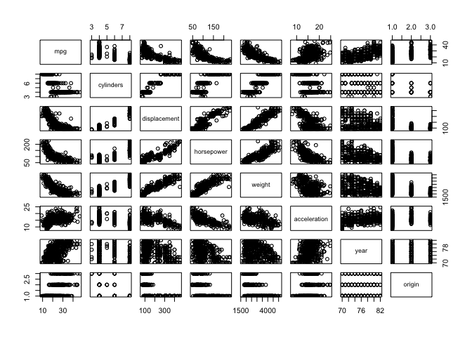<!-- -->

```r
auto %>% ggplot(aes(x=cylinders,y=mpg)) +
  geom_point() +
  geom_smooth(method = "lm")
```

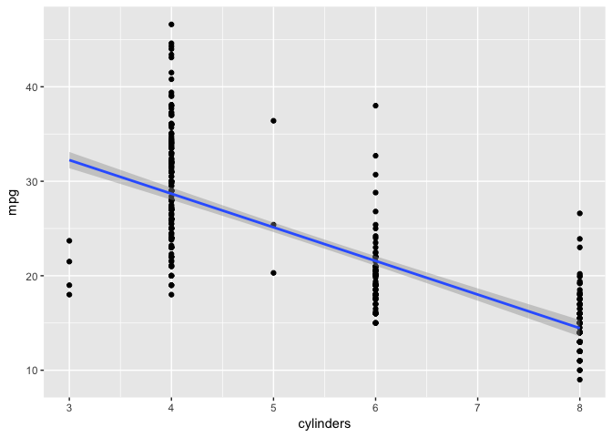<!-- -->

```r
auto %>% ggplot(aes(x=origin,y=mpg)) +
  geom_point() +
  geom_smooth(method = "lm")
```

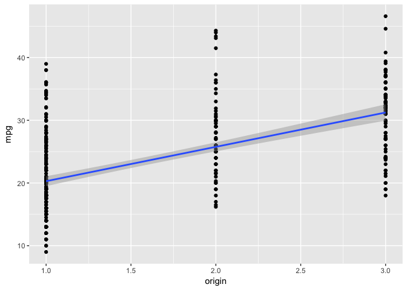<!-- -->

```r
auto %>% ggplot(aes(x=acceleration,y=mpg)) +
  geom_point() +
  geom_smooth(method="lm")
```

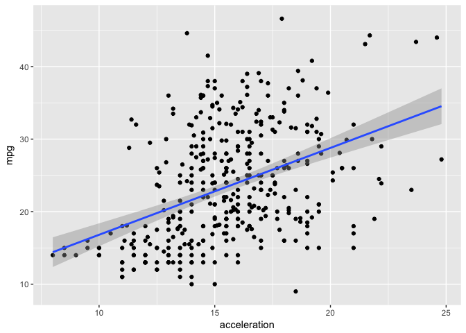<!-- -->

_(f) Suppose that we wish to predict gas mileage (mpg) on the basis of the other variables. Do your plots suggest that any of the other variables might be useful in predicting mpg? Justify your answer._

All could be predictive; accelaration is probably the least useful (most scatter).
Displacement, horespower, and weight are all highly correlated so it may not be helpful/necessary to include them all.

_10. This exercise involves the Boston housing data set._

_(a) To begin, load in the Boston data set. The Boston data set is
part of the MASS library in R. > library(MASS)
Now the data set is contained in the object Boston. > Boston
Read about the data set:
?Boston_


```r
library(MASS)
```

```
## 
## Attaching package: 'MASS'
```

```
## The following object is masked from 'package:dplyr':
## 
##     select
```

```r
data(Boston)
boston <- as_tibble(Boston)
?Boston
summary(boston)
```

```
##       crim                zn             indus            chas        
##  Min.   : 0.00632   Min.   :  0.00   Min.   : 0.46   Min.   :0.00000  
##  1st Qu.: 0.08204   1st Qu.:  0.00   1st Qu.: 5.19   1st Qu.:0.00000  
##  Median : 0.25651   Median :  0.00   Median : 9.69   Median :0.00000  
##  Mean   : 3.61352   Mean   : 11.36   Mean   :11.14   Mean   :0.06917  
##  3rd Qu.: 3.67708   3rd Qu.: 12.50   3rd Qu.:18.10   3rd Qu.:0.00000  
##  Max.   :88.97620   Max.   :100.00   Max.   :27.74   Max.   :1.00000  
##       nox               rm             age              dis        
##  Min.   :0.3850   Min.   :3.561   Min.   :  2.90   Min.   : 1.130  
##  1st Qu.:0.4490   1st Qu.:5.886   1st Qu.: 45.02   1st Qu.: 2.100  
##  Median :0.5380   Median :6.208   Median : 77.50   Median : 3.207  
##  Mean   :0.5547   Mean   :6.285   Mean   : 68.57   Mean   : 3.795  
##  3rd Qu.:0.6240   3rd Qu.:6.623   3rd Qu.: 94.08   3rd Qu.: 5.188  
##  Max.   :0.8710   Max.   :8.780   Max.   :100.00   Max.   :12.127  
##       rad              tax           ptratio          black       
##  Min.   : 1.000   Min.   :187.0   Min.   :12.60   Min.   :  0.32  
##  1st Qu.: 4.000   1st Qu.:279.0   1st Qu.:17.40   1st Qu.:375.38  
##  Median : 5.000   Median :330.0   Median :19.05   Median :391.44  
##  Mean   : 9.549   Mean   :408.2   Mean   :18.46   Mean   :356.67  
##  3rd Qu.:24.000   3rd Qu.:666.0   3rd Qu.:20.20   3rd Qu.:396.23  
##  Max.   :24.000   Max.   :711.0   Max.   :22.00   Max.   :396.90  
##      lstat            medv      
##  Min.   : 1.73   Min.   : 5.00  
##  1st Qu.: 6.95   1st Qu.:17.02  
##  Median :11.36   Median :21.20  
##  Mean   :12.65   Mean   :22.53  
##  3rd Qu.:16.95   3rd Qu.:25.00  
##  Max.   :37.97   Max.   :50.00
```


_How many rows are in this data set? How many columns? What do the rows and columns represent?_

506 rows (1 per town); 14 columns (variables)


_(b) Make some pairwise scatterplots of the predictors (columns) in this data set. Describe your findings._


```r
pairs(boston) #uggh.  Too many varaibles to see
```

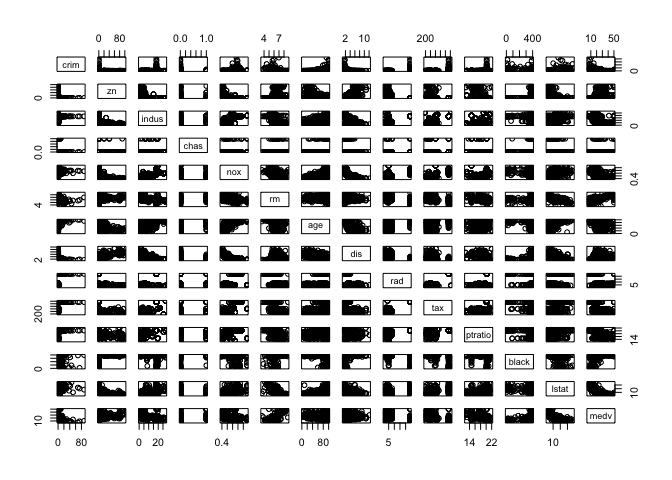<!-- -->

_(c) Are any of the predictors associated with per capita crime rate? If so, explain the relationship._

scatter plot for each predicitor vs. crime.

```r
plots <- lapply(colnames(boston)[-1], function(p) { #creates a list of plots
  ggplot(boston, aes_string(x=p,y="crim")) +
    geom_point(shape=1) +
    geom_smooth(method="loess") + 
    ggtitle(p)
})

sapply(plots, print) # now for each item in the list, print it 
```

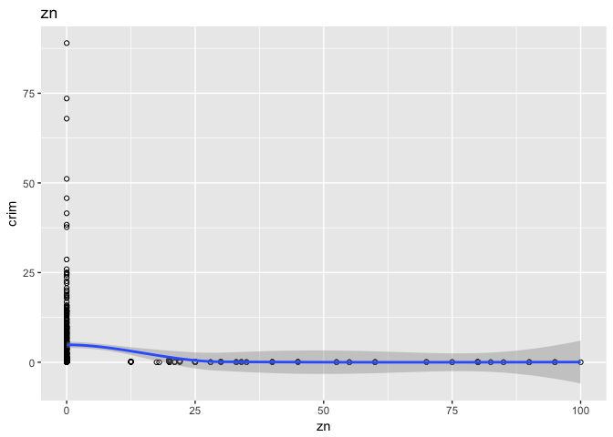<!-- -->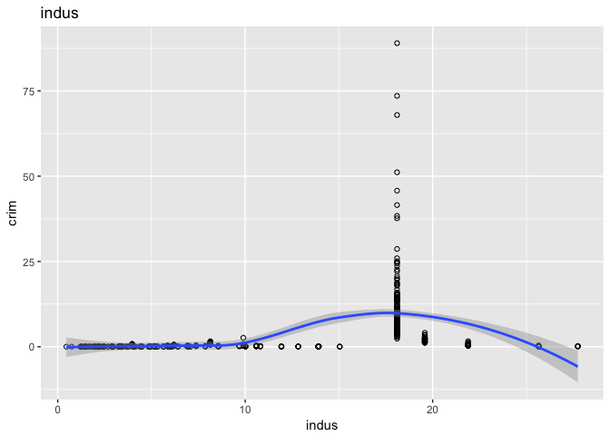<!-- -->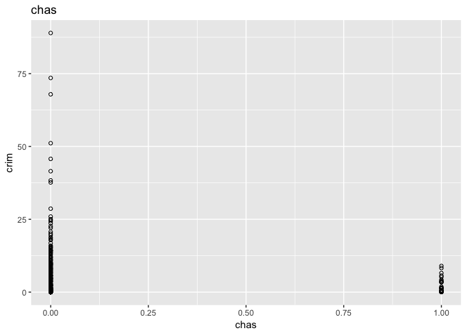<!-- -->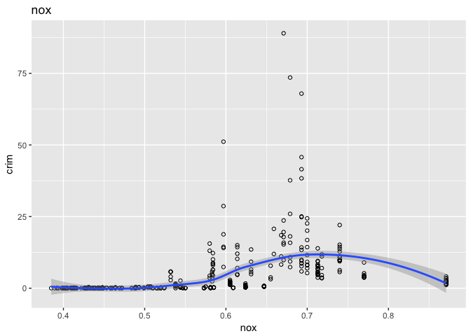<!-- -->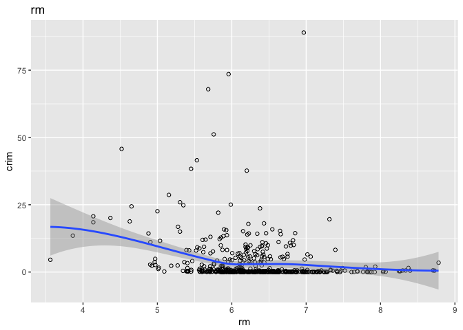<!-- -->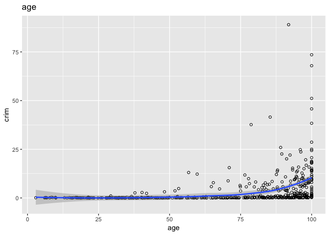<!-- -->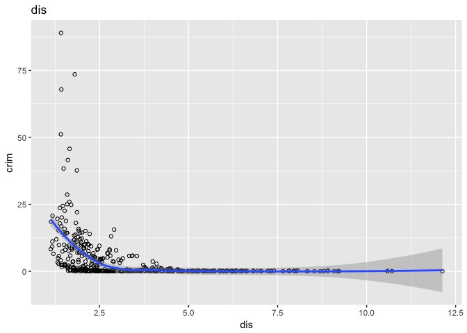<!-- -->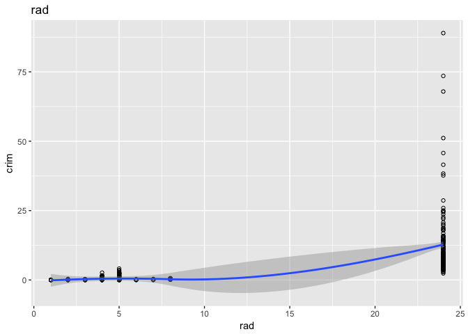<!-- -->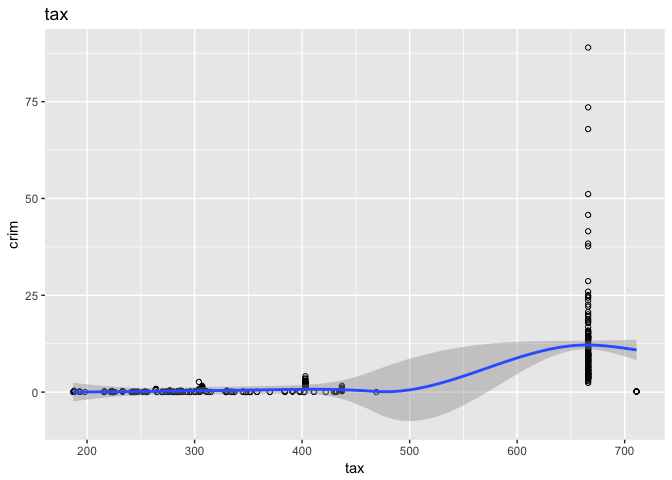<!-- -->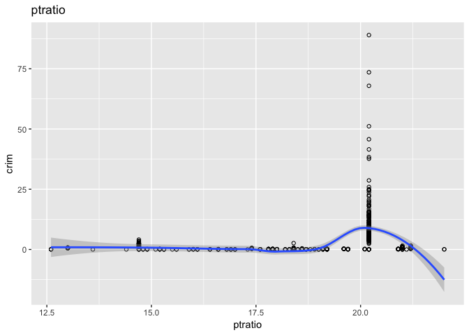<!-- -->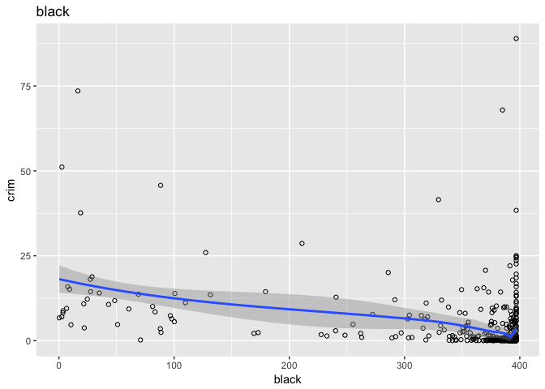<!-- -->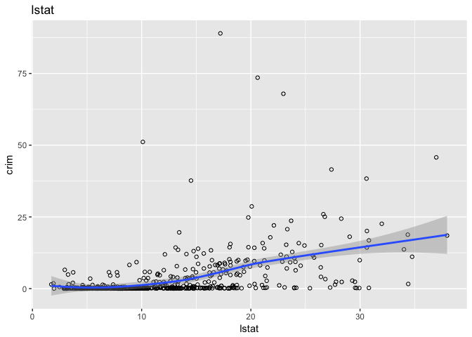<!-- -->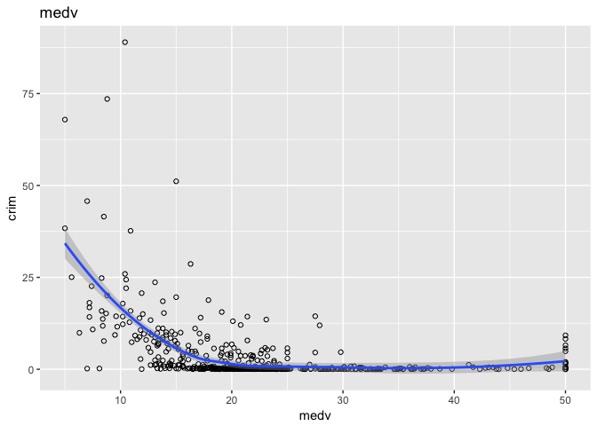<!-- -->

```
##        [,1]   [,2]   [,3]   [,4]   [,5]   [,6]   [,7]   [,8]   [,9]  
## data   List,2 List,2 List,2 List,2 List,2 List,2 List,2 List,2 List,2
## layout ?      ?      ?      ?      ?      ?      ?      ?      ?     
## plot   List,9 List,9 List,9 List,9 List,9 List,9 List,9 List,9 List,9
##        [,10]  [,11]  [,12]  [,13] 
## data   List,2 List,2 List,2 List,2
## layout ?      ?      ?      ?     
## plot   List,9 List,9 List,9 List,9
```

Because the predictors are mostly highly non-normal it is a bit difficult to see relationships here.

(d) Do any of the suburbs of Boston appear to have particularly high crime rates? Tax rates? Pupil-teacher ratios? Comment on the range of each predictor.


```r
boston %>% gather(key="variable", value="value", everything()) %>% #gather take wide format and converts to long
  ggplot(aes(x=variable,y=value)) +
  geom_violin() +
  facet_wrap(~variable, scales="free",nrow=2)
```

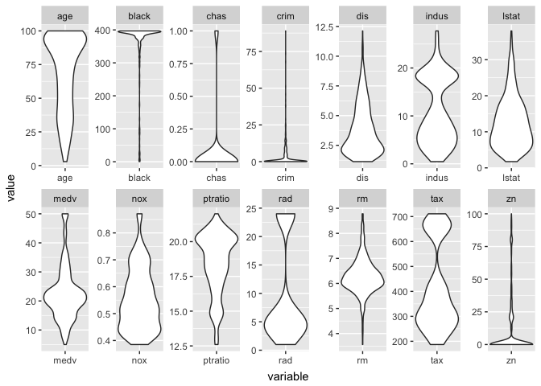<!-- -->

```r
boston %>% gather(key="variable", value="value", everything()) %>%
  ggplot(aes(x=variable,y=value)) +
  geom_boxplot() +
  facet_wrap(~variable, scales="free",nrow=2)
```

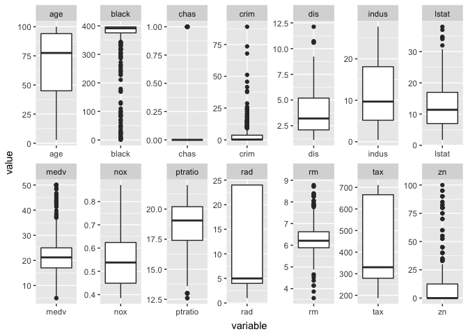<!-- -->


(e) How many of the suburbs in this data set bound the Charles river?


```r
sum(boston$chas)
```

```
## [1] 35
```

(f) What is the median pupil-teacher ratio among the towns in this data set?


```r
median(boston$ptratio)
```

```
## [1] 19.05
```

(g) Which suburb of Boston has lowest median value of owner- occupied homes? What are the values of the other predictors for that suburb, and how do those values compare to the overall ranges for those predictors? Comment on your findings.


```r
(boston_min_medv <- boston[which.min(boston$medv),])
```

```
## # A tibble: 1 x 14
##      crim    zn indus  chas   nox    rm   age    dis   rad   tax ptratio
##     <dbl> <dbl> <dbl> <int> <dbl> <dbl> <dbl>  <dbl> <int> <dbl>   <dbl>
## 1 38.3518     0  18.1     0 0.693 5.453   100 1.4896    24   666    20.2
## # ... with 3 more variables: black <dbl>, lstat <dbl>, medv <dbl>
```


```r
boston_min_medv_gather <- boston_min_medv %>% gather(key="variable", value="value", everything())
boston %>% gather(key="variable", value="value", everything()) %>%
  ggplot(aes(x=variable,y=value)) +
  geom_boxplot() +
  geom_hline(data=boston_min_medv_gather,aes(yintercept=value),color="red") +
  facet_wrap(~variable, scales="free",nrow=2)
```

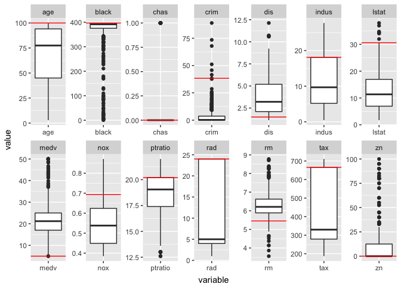<!-- -->

The suburub with the lowest median value has the oldest houses, high crime, low distnace to employtment center, high "lstat", high nox, high ptratio, high rad, high tax, and low zoning as large lots.


(h) In this data set, how many of the suburbs average more than seven rooms per dwelling? More than eight rooms per dwelling? Comment on the suburbs that average more than eight rooms per dwelling.


