# Chapter 3
Julin N Maloof  
12/5/2017  


# Dec 6th

Questions 8, 13 (13g optional), 15(a)

## Q8

_8. This question involves the use of simple linear regression on the Auto data set._


```r
library(ISLR)
```

```
## Warning: package 'ISLR' was built under R version 3.4.2
```

```r
library(tidyverse)
```

```
## Loading tidyverse: ggplot2
## Loading tidyverse: tibble
## Loading tidyverse: tidyr
## Loading tidyverse: readr
## Loading tidyverse: purrr
## Loading tidyverse: dplyr
```

```
## Warning: package 'tidyr' was built under R version 3.4.2
```

```
## Warning: package 'purrr' was built under R version 3.4.2
```

```
## Warning: package 'dplyr' was built under R version 3.4.2
```

```
## Conflicts with tidy packages ----------------------------------------------
```

```
## filter(): dplyr, stats
## lag():    dplyr, stats
```

```r
data(Auto)
auto <- as.tibble(Auto)
auto
```

```
## # A tibble: 392 x 9
##      mpg cylinders displacement horsepower weight acceleration  year
##  * <dbl>     <dbl>        <dbl>      <dbl>  <dbl>        <dbl> <dbl>
##  1    18         8          307        130   3504         12.0    70
##  2    15         8          350        165   3693         11.5    70
##  3    18         8          318        150   3436         11.0    70
##  4    16         8          304        150   3433         12.0    70
##  5    17         8          302        140   3449         10.5    70
##  6    15         8          429        198   4341         10.0    70
##  7    14         8          454        220   4354          9.0    70
##  8    14         8          440        215   4312          8.5    70
##  9    14         8          455        225   4425         10.0    70
## 10    15         8          390        190   3850          8.5    70
## # ... with 382 more rows, and 2 more variables: origin <dbl>, name <fctr>
```

_(a) Use the lm() function to perform a simple linear regression with mpg as the response and horsepower as the predictor. Use the summary() function to print the results. Comment on the output. For example:_


```r
lm1 <- lm(mpg ~ horsepower, data = auto)

summary(lm1)
```

```
## 
## Call:
## lm(formula = mpg ~ horsepower, data = auto)
## 
## Residuals:
##      Min       1Q   Median       3Q      Max 
## -13.5710  -3.2592  -0.3435   2.7630  16.9240 
## 
## Coefficients:
##              Estimate Std. Error t value Pr(>|t|)    
## (Intercept) 39.935861   0.717499   55.66   <2e-16 ***
## horsepower  -0.157845   0.006446  -24.49   <2e-16 ***
## ---
## Signif. codes:  0 '***' 0.001 '**' 0.01 '*' 0.05 '.' 0.1 ' ' 1
## 
## Residual standard error: 4.906 on 390 degrees of freedom
## Multiple R-squared:  0.6059,	Adjusted R-squared:  0.6049 
## F-statistic: 599.7 on 1 and 390 DF,  p-value: < 2.2e-16
```


_i. Is there a relationship between the predictor and the response?_

Yes, there is a highly significant (negative) relationship between horsepower and mpg

_ii. How strong is the relationship between the predictor and the response?_

given very low p-value and very non-zero t-value,  strong

_iii. Is the relationship between the predictor and the response positive or negative?_

negative

_iv. What is the predicted mpg associated with a horsepower of 98? What are the associated 95 % confidence and prediction intervals?_


```r
cat("predition at horsepower 98 and 95% confidence intervals:\n")
```

```
## predition at horsepower 98 and 95% confidence intervals:
```

```r
predict(lm1,data.frame(horsepower=98),interval = "conf")
```

```
##        fit      lwr      upr
## 1 24.46708 23.97308 24.96108
```

```r
cat("\npredition at horsepower 98 and 95% prediction intervals:\n")
```

```
## 
## predition at horsepower 98 and 95% prediction intervals:
```

```r
predict(lm1,data.frame(horsepower=98),interval = "pred")
```

```
##        fit     lwr      upr
## 1 24.46708 14.8094 34.12476
```

_(b) Plot the response and the predictor. Use the abline() function to display the least squares regression line._


```r
auto %>% 
  ggplot(aes(x=horsepower, y=mpg)) +
           geom_point() +
           geom_smooth(method = "lm", se=FALSE)
```

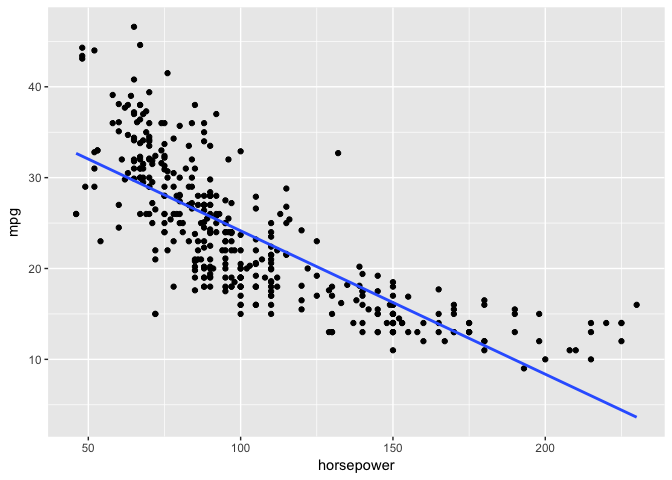<!-- -->


_(c) Use the plot() function to produce diagnostic plots of the least squares regression fit. Comment on any problems you see with the fit._


```r
library(modelr)
auto %>% 
  add_residuals(lm1) %>%
  ggplot(aes(x=horsepower, y = resid)) +
  geom_point() +
  geom_hline(yintercept=0)
```

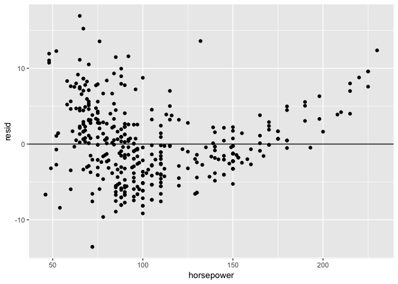<!-- -->
Residuals not evenly distributed!


```r
plot(lm1,ask = FALSE)
```

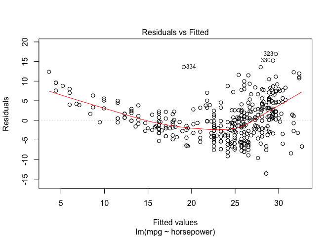<!-- -->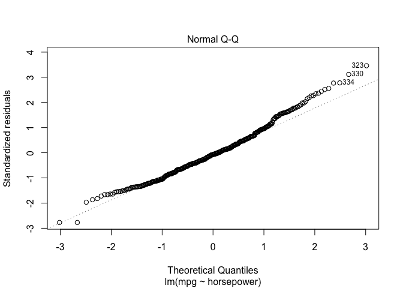<!-- -->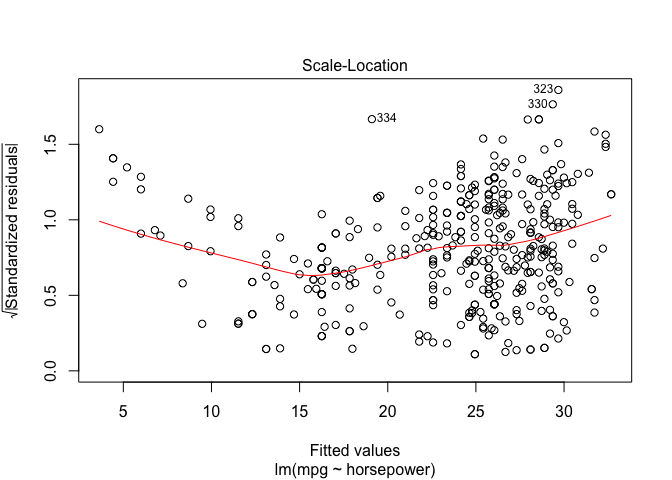<!-- -->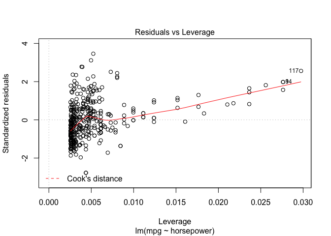<!-- -->

## Q 13

_13. In this exercise you will create some simulated data and will fit simple linear regression models to it. Make sure to use set.seed(1) prior to starting part (a) to ensure consistent results._

_(a) Using the rnorm() function, create a vector, x, containing 100 observations drawn from a N (0, 1) distribution. This represents a feature, X._
_(b) Using the rnorm() function, create a vector, eps, containing 100 observations drawn from a N(0,0.25) distribution i.e. a normal distribution with mean zero and variance 0.25._
_(c) Using x and eps, generate a vector y according to the model Y =−1+0.5X+ε. (3.39)_
_What is the length of the vector y? What are the values of β0 and β1 in this linear model?_


```r
set.seed(1)
data13 <- tibble(
  x = rnorm(100,mean = 0, sd = 1),
  eps = rnorm(100,0, sqrt(0.25)),
  y = 1 + 0.5*x + eps)

data13
```

```
## # A tibble: 100 x 3
##             x         eps         y
##         <dbl>       <dbl>     <dbl>
##  1 -0.6264538 -0.31018334 0.3765898
##  2  0.1836433  0.02105794 1.1128796
##  3 -0.8356286 -0.45546082 0.1267249
##  4  1.5952808  0.07901439 1.8766548
##  5  0.3295078 -0.32729232 0.8374616
##  6 -0.8204684  0.88364363 1.4734094
##  7  0.4874291  0.35835374 1.6020683
##  8  0.7383247  0.45508711 1.8242495
##  9  0.5757814  0.19209268 1.4799834
## 10 -0.3053884  0.84108804 1.6883938
## # ... with 90 more rows
```

$$\beta_0 = 1$$

$$\beta_1=0.5$$
length of y is 100

_(d) Create a scatterplot displaying the relationship between x and y. Comment on what you observe._


```r
data13 %>% qplot(x,y,data=.)
```

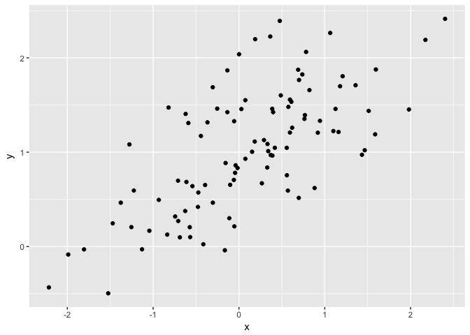<!-- -->

Pretty nice linear relationship, but some scatter...

_(e) Fit a least squares linear model to predict y using x. Comment on the model obtained. How do βˆ0 and βˆ1 compare to β0 and β1?_


```r
lm13 <- lm(y~x, data=data13)
summary(lm13)
```

```
## 
## Call:
## lm(formula = y ~ x, data = data13)
## 
## Residuals:
##      Min       1Q   Median       3Q      Max 
## -0.93842 -0.30688 -0.06975  0.26970  1.17309 
## 
## Coefficients:
##             Estimate Std. Error t value Pr(>|t|)    
## (Intercept)  0.98115    0.04849  20.233  < 2e-16 ***
## x            0.49947    0.05386   9.273 4.58e-15 ***
## ---
## Signif. codes:  0 '***' 0.001 '**' 0.01 '*' 0.05 '.' 0.1 ' ' 1
## 
## Residual standard error: 0.4814 on 98 degrees of freedom
## Multiple R-squared:  0.4674,	Adjusted R-squared:  0.4619 
## F-statistic: 85.99 on 1 and 98 DF,  p-value: 4.583e-15
```

```r
confint(lm13)
```

```
##                 2.5 %    97.5 %
## (Intercept) 0.8849196 1.0773878
## x           0.3925794 0.6063602
```

The estimates are near the real values and the 95% confidence intervals include the real values

_(f) Display the least squares line on the scatterplot obtained in (d). Draw the population regression line on the plot, in a different color. Use the legend() command to create an appropriate legend._


```r
data13 %>% ggplot(aes(x=x,y=y)) +
  geom_point() +
  geom_smooth(aes(color="blue"),method="lm",se=FALSE) +
  geom_abline(aes(intercept=1,slope=.5,color="red")) +
  scale_color_manual(name="legend",values=c("red"="red","blue"="blue"),labels=c("population","sample"), guide="legend")
```

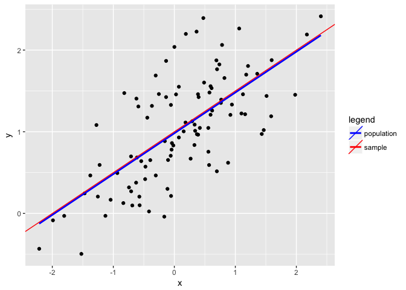<!-- -->

(g) Now fit a polynomial regression model that predicts y using x and x2. Is there evidence that the quadratic term improves the model fit? Explain your answer.


```r
lm13b <- lm(y ~ x + I(x^2), data=data13)
summary(lm13b)
```

```
## 
## Call:
## lm(formula = y ~ x + I(x^2), data = data13)
## 
## Residuals:
##      Min       1Q   Median       3Q      Max 
## -0.98252 -0.31270 -0.06441  0.29014  1.13500 
## 
## Coefficients:
##             Estimate Std. Error t value Pr(>|t|)    
## (Intercept)  1.02836    0.05883  17.481  < 2e-16 ***
## x            0.50858    0.05399   9.420  2.4e-15 ***
## I(x^2)      -0.05946    0.04238  -1.403    0.164    
## ---
## Signif. codes:  0 '***' 0.001 '**' 0.01 '*' 0.05 '.' 0.1 ' ' 1
## 
## Residual standard error: 0.479 on 97 degrees of freedom
## Multiple R-squared:  0.4779,	Adjusted R-squared:  0.4672 
## F-statistic:  44.4 on 2 and 97 DF,  p-value: 2.038e-14
```

```r
confint(lm13b)
```

```
##                  2.5 %     97.5 %
## (Intercept)  0.9116007 1.14511430
## x            0.4014226 0.61573832
## I(x^2)      -0.1435788 0.02465763
```

The fits are pretty similar, so no real improvement.  RSE and R-squeared similar.

_(h) Repeat (a)–(f) after modifying the data generation process in such a way that there is less noise in the data. The model (3.39) should remain the same. You can do this by decreasing the variance of the normal distribution used to generate the error term ε in (b). Describe your results._


```r
data13h <- tibble(
  x = rnorm(100,mean = 0, sd = 1),
  eps = rnorm(100,0, sqrt(0.1)),
  y = 1 + 0.5*x + eps)

data13h
```

```
## # A tibble: 100 x 3
##              x         eps         y
##          <dbl>       <dbl>     <dbl>
##  1  0.40940184  0.28260444 1.4873054
##  2  1.68887329 -0.33118475 1.5132519
##  3  1.58658843  0.62339162 2.4166858
##  4 -0.33090780 -0.12131512 0.7132310
##  5 -2.28523554  0.52308667 0.3804689
##  6  2.49766159  0.47820364 2.7270344
##  7  0.66706617  0.02623607 1.3597692
##  8  0.54132734  0.17937100 1.4500347
##  9 -0.01339952 -0.32399068 0.6693096
## 10  0.51010842  0.10214362 1.3571978
## # ... with 90 more rows
```


```r
lm13h <- lm(y ~ x, data=data13h)
summary(lm13h)
```

```
## 
## Call:
## lm(formula = y ~ x, data = data13h)
## 
## Residuals:
##      Min       1Q   Median       3Q      Max 
## -0.86703 -0.17753 -0.00553  0.21495  0.58452 
## 
## Coefficients:
##             Estimate Std. Error t value Pr(>|t|)    
## (Intercept)  1.01532    0.03134   32.40   <2e-16 ***
## x            0.53359    0.03044   17.53   <2e-16 ***
## ---
## Signif. codes:  0 '***' 0.001 '**' 0.01 '*' 0.05 '.' 0.1 ' ' 1
## 
## Residual standard error: 0.3133 on 98 degrees of freedom
## Multiple R-squared:  0.7582,	Adjusted R-squared:  0.7557 
## F-statistic: 307.3 on 1 and 98 DF,  p-value: < 2.2e-16
```

```r
confint(lm13h)
```

```
##                 2.5 %    97.5 %
## (Intercept) 0.9531317 1.0775107
## x           0.4731823 0.5939962
```


```r
data13h %>%
  ggplot(aes(x=x,y=y)) +
  geom_point() +
  geom_smooth(aes(color="blue"),method="lm",se=FALSE) +
  geom_abline(aes(intercept=1,slope=.5,color="red")) +
  scale_color_manual(name="legend",values=c("red"="red","blue"="blue"),labels=c("population","sample"), guide="legend")
```

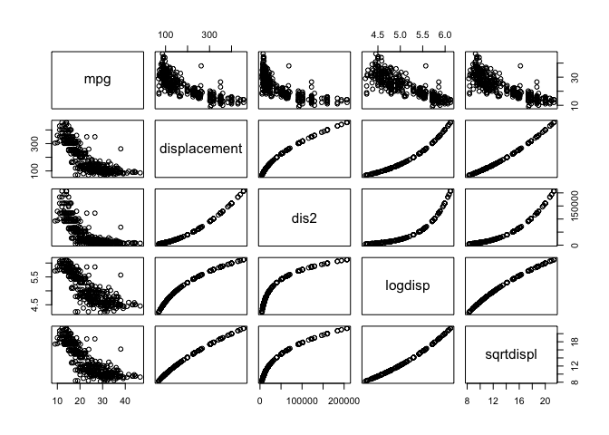<!-- -->

smaller confidence intervals, lower RSE, higher R^2

(i) Repeat (a)–(f) after modifying the data generation process in such a way that there is more noise in the data. The model (3.39) should remain the same. You can do this by increasing the variance of the normal distribution used to generate the error term ε in (b). Describe your results.


```r
data13i <- tibble(
  x = rnorm(100,mean = 0, sd = 1),
  eps = rnorm(100,0, sqrt(0.5)),
  y = 1 + 0.5*x + eps)

data13h
```

```
## # A tibble: 100 x 3
##              x         eps         y
##          <dbl>       <dbl>     <dbl>
##  1  0.40940184  0.28260444 1.4873054
##  2  1.68887329 -0.33118475 1.5132519
##  3  1.58658843  0.62339162 2.4166858
##  4 -0.33090780 -0.12131512 0.7132310
##  5 -2.28523554  0.52308667 0.3804689
##  6  2.49766159  0.47820364 2.7270344
##  7  0.66706617  0.02623607 1.3597692
##  8  0.54132734  0.17937100 1.4500347
##  9 -0.01339952 -0.32399068 0.6693096
## 10  0.51010842  0.10214362 1.3571978
## # ... with 90 more rows
```


```r
lm13i <- lm(y ~ x, data=data13i)
summary(lm13i)
```

```
## 
## Call:
## lm(formula = y ~ x, data = data13i)
## 
## Residuals:
##     Min      1Q  Median      3Q     Max 
## -1.7749 -0.4281  0.0146  0.4984  1.4777 
## 
## Coefficients:
##             Estimate Std. Error t value Pr(>|t|)    
## (Intercept)  0.96645    0.06842  14.125  < 2e-16 ***
## x            0.44700    0.05876   7.607 1.73e-11 ***
## ---
## Signif. codes:  0 '***' 0.001 '**' 0.01 '*' 0.05 '.' 0.1 ' ' 1
## 
## Residual standard error: 0.6838 on 98 degrees of freedom
## Multiple R-squared:  0.3713,	Adjusted R-squared:  0.3648 
## F-statistic: 57.87 on 1 and 98 DF,  p-value: 1.731e-11
```

```r
confint(lm13i)
```

```
##                 2.5 %    97.5 %
## (Intercept) 0.8306640 1.1022281
## x           0.3303927 0.5636136
```


```r
data13i %>%
  ggplot(aes(x=x,y=y)) +
  geom_point() +
  geom_smooth(aes(color="blue"),method="lm",se=FALSE) +
  geom_abline(aes(intercept=1,slope=.5,color="red")) +
  scale_color_manual(name="legend",values=c("red"="red","blue"="blue"),labels=c("population","sample"), guide="legend")
```

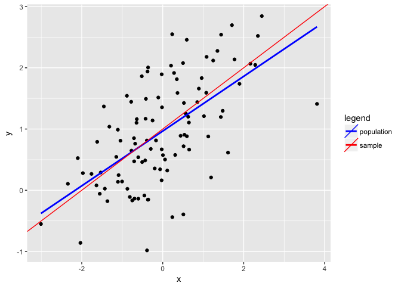<!-- -->

_(j) What are the confidence intervals for β0 and β1 based on the original data set, the noisier data set, and the less noisy data set? Comment on your results._

Already discussed above in part, but...


```r
map(list(original=lm13,lower_var=lm13h,higher_var=lm13i),confint)
```

```
## $original
##                 2.5 %    97.5 %
## (Intercept) 0.8849196 1.0773878
## x           0.3925794 0.6063602
## 
## $lower_var
##                 2.5 %    97.5 %
## (Intercept) 0.9531317 1.0775107
## x           0.4731823 0.5939962
## 
## $higher_var
##                 2.5 %    97.5 %
## (Intercept) 0.8306640 1.1022281
## x           0.3303927 0.5636136
```

```r
map(list(original=lm13,lower_var=lm13h,higher_var=lm13i),confint) %>%
  map(as.data.frame) %>%
  map(rownames_to_column,var="coefficient") %>%
  bind_rows(.id="data_source") %>%
  ggplot(aes(x=data_source,ymin=`2.5 %`,ymax=`97.5 %`,color=coefficient)) +
  geom_linerange(lwd=3) + 
  ggtitle("95% Confidence Intervals") +
  geom_hline(yintercept = c(0.5,1))
```

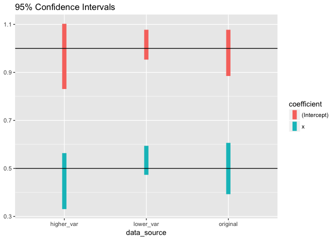<!-- -->


## 15a

_15. This problem involves the Boston data set, which we saw in the lab for this chapter. We will now try to predict per capita crime rate using the other variables in this data set. In other words, per capita crime rate is the response, and the other variables are the predictors._

_(a) For each predictor, fit a simple linear regression model to predict the response. Describe your results. In which of the models is there a statistically significant association between the predictor and the response? Create some plots to back up your assertions._


```r
library(MASS)
```

```
## 
## Attaching package: 'MASS'
```

```
## The following object is masked from 'package:dplyr':
## 
##     select
```

```r
data(Boston)
boston <- as_tibble(Boston)
boston
```

```
## # A tibble: 506 x 14
##       crim    zn indus  chas   nox    rm   age    dis   rad   tax ptratio
##  *   <dbl> <dbl> <dbl> <int> <dbl> <dbl> <dbl>  <dbl> <int> <dbl>   <dbl>
##  1 0.00632  18.0  2.31     0 0.538 6.575  65.2 4.0900     1   296    15.3
##  2 0.02731   0.0  7.07     0 0.469 6.421  78.9 4.9671     2   242    17.8
##  3 0.02729   0.0  7.07     0 0.469 7.185  61.1 4.9671     2   242    17.8
##  4 0.03237   0.0  2.18     0 0.458 6.998  45.8 6.0622     3   222    18.7
##  5 0.06905   0.0  2.18     0 0.458 7.147  54.2 6.0622     3   222    18.7
##  6 0.02985   0.0  2.18     0 0.458 6.430  58.7 6.0622     3   222    18.7
##  7 0.08829  12.5  7.87     0 0.524 6.012  66.6 5.5605     5   311    15.2
##  8 0.14455  12.5  7.87     0 0.524 6.172  96.1 5.9505     5   311    15.2
##  9 0.21124  12.5  7.87     0 0.524 5.631 100.0 6.0821     5   311    15.2
## 10 0.17004  12.5  7.87     0 0.524 6.004  85.9 6.5921     5   311    15.2
## # ... with 496 more rows, and 3 more variables: black <dbl>, lstat <dbl>,
## #   medv <dbl>
```


```r
predictors <- colnames(boston)[-1]
lmfits <- map(predictors,function(x) lm(crim ~ get(x), data=boston))
```


```r
lmsummaries <- lapply(lmfits,summary)
names(lmsummaries) <- predictors
lmsummaries
```

```
## $zn
## 
## Call:
## lm(formula = crim ~ get(x), data = boston)
## 
## Residuals:
##    Min     1Q Median     3Q    Max 
## -4.429 -4.222 -2.620  1.250 84.523 
## 
## Coefficients:
##             Estimate Std. Error t value Pr(>|t|)    
## (Intercept)  4.45369    0.41722  10.675  < 2e-16 ***
## get(x)      -0.07393    0.01609  -4.594 5.51e-06 ***
## ---
## Signif. codes:  0 '***' 0.001 '**' 0.01 '*' 0.05 '.' 0.1 ' ' 1
## 
## Residual standard error: 8.435 on 504 degrees of freedom
## Multiple R-squared:  0.04019,	Adjusted R-squared:  0.03828 
## F-statistic:  21.1 on 1 and 504 DF,  p-value: 5.506e-06
## 
## 
## $indus
## 
## Call:
## lm(formula = crim ~ get(x), data = boston)
## 
## Residuals:
##     Min      1Q  Median      3Q     Max 
## -11.972  -2.698  -0.736   0.712  81.813 
## 
## Coefficients:
##             Estimate Std. Error t value Pr(>|t|)    
## (Intercept) -2.06374    0.66723  -3.093  0.00209 ** 
## get(x)       0.50978    0.05102   9.991  < 2e-16 ***
## ---
## Signif. codes:  0 '***' 0.001 '**' 0.01 '*' 0.05 '.' 0.1 ' ' 1
## 
## Residual standard error: 7.866 on 504 degrees of freedom
## Multiple R-squared:  0.1653,	Adjusted R-squared:  0.1637 
## F-statistic: 99.82 on 1 and 504 DF,  p-value: < 2.2e-16
## 
## 
## $chas
## 
## Call:
## lm(formula = crim ~ get(x), data = boston)
## 
## Residuals:
##    Min     1Q Median     3Q    Max 
## -3.738 -3.661 -3.435  0.018 85.232 
## 
## Coefficients:
##             Estimate Std. Error t value Pr(>|t|)    
## (Intercept)   3.7444     0.3961   9.453   <2e-16 ***
## get(x)       -1.8928     1.5061  -1.257    0.209    
## ---
## Signif. codes:  0 '***' 0.001 '**' 0.01 '*' 0.05 '.' 0.1 ' ' 1
## 
## Residual standard error: 8.597 on 504 degrees of freedom
## Multiple R-squared:  0.003124,	Adjusted R-squared:  0.001146 
## F-statistic: 1.579 on 1 and 504 DF,  p-value: 0.2094
## 
## 
## $nox
## 
## Call:
## lm(formula = crim ~ get(x), data = boston)
## 
## Residuals:
##     Min      1Q  Median      3Q     Max 
## -12.371  -2.738  -0.974   0.559  81.728 
## 
## Coefficients:
##             Estimate Std. Error t value Pr(>|t|)    
## (Intercept)  -13.720      1.699  -8.073 5.08e-15 ***
## get(x)        31.249      2.999  10.419  < 2e-16 ***
## ---
## Signif. codes:  0 '***' 0.001 '**' 0.01 '*' 0.05 '.' 0.1 ' ' 1
## 
## Residual standard error: 7.81 on 504 degrees of freedom
## Multiple R-squared:  0.1772,	Adjusted R-squared:  0.1756 
## F-statistic: 108.6 on 1 and 504 DF,  p-value: < 2.2e-16
## 
## 
## $rm
## 
## Call:
## lm(formula = crim ~ get(x), data = boston)
## 
## Residuals:
##    Min     1Q Median     3Q    Max 
## -6.604 -3.952 -2.654  0.989 87.197 
## 
## Coefficients:
##             Estimate Std. Error t value Pr(>|t|)    
## (Intercept)   20.482      3.365   6.088 2.27e-09 ***
## get(x)        -2.684      0.532  -5.045 6.35e-07 ***
## ---
## Signif. codes:  0 '***' 0.001 '**' 0.01 '*' 0.05 '.' 0.1 ' ' 1
## 
## Residual standard error: 8.401 on 504 degrees of freedom
## Multiple R-squared:  0.04807,	Adjusted R-squared:  0.04618 
## F-statistic: 25.45 on 1 and 504 DF,  p-value: 6.347e-07
## 
## 
## $age
## 
## Call:
## lm(formula = crim ~ get(x), data = boston)
## 
## Residuals:
##    Min     1Q Median     3Q    Max 
## -6.789 -4.257 -1.230  1.527 82.849 
## 
## Coefficients:
##             Estimate Std. Error t value Pr(>|t|)    
## (Intercept) -3.77791    0.94398  -4.002 7.22e-05 ***
## get(x)       0.10779    0.01274   8.463 2.85e-16 ***
## ---
## Signif. codes:  0 '***' 0.001 '**' 0.01 '*' 0.05 '.' 0.1 ' ' 1
## 
## Residual standard error: 8.057 on 504 degrees of freedom
## Multiple R-squared:  0.1244,	Adjusted R-squared:  0.1227 
## F-statistic: 71.62 on 1 and 504 DF,  p-value: 2.855e-16
## 
## 
## $dis
## 
## Call:
## lm(formula = crim ~ get(x), data = boston)
## 
## Residuals:
##    Min     1Q Median     3Q    Max 
## -6.708 -4.134 -1.527  1.516 81.674 
## 
## Coefficients:
##             Estimate Std. Error t value Pr(>|t|)    
## (Intercept)   9.4993     0.7304  13.006   <2e-16 ***
## get(x)       -1.5509     0.1683  -9.213   <2e-16 ***
## ---
## Signif. codes:  0 '***' 0.001 '**' 0.01 '*' 0.05 '.' 0.1 ' ' 1
## 
## Residual standard error: 7.965 on 504 degrees of freedom
## Multiple R-squared:  0.1441,	Adjusted R-squared:  0.1425 
## F-statistic: 84.89 on 1 and 504 DF,  p-value: < 2.2e-16
## 
## 
## $rad
## 
## Call:
## lm(formula = crim ~ get(x), data = boston)
## 
## Residuals:
##     Min      1Q  Median      3Q     Max 
## -10.164  -1.381  -0.141   0.660  76.433 
## 
## Coefficients:
##             Estimate Std. Error t value Pr(>|t|)    
## (Intercept) -2.28716    0.44348  -5.157 3.61e-07 ***
## get(x)       0.61791    0.03433  17.998  < 2e-16 ***
## ---
## Signif. codes:  0 '***' 0.001 '**' 0.01 '*' 0.05 '.' 0.1 ' ' 1
## 
## Residual standard error: 6.718 on 504 degrees of freedom
## Multiple R-squared:  0.3913,	Adjusted R-squared:   0.39 
## F-statistic: 323.9 on 1 and 504 DF,  p-value: < 2.2e-16
## 
## 
## $tax
## 
## Call:
## lm(formula = crim ~ get(x), data = boston)
## 
## Residuals:
##     Min      1Q  Median      3Q     Max 
## -12.513  -2.738  -0.194   1.065  77.696 
## 
## Coefficients:
##              Estimate Std. Error t value Pr(>|t|)    
## (Intercept) -8.528369   0.815809  -10.45   <2e-16 ***
## get(x)       0.029742   0.001847   16.10   <2e-16 ***
## ---
## Signif. codes:  0 '***' 0.001 '**' 0.01 '*' 0.05 '.' 0.1 ' ' 1
## 
## Residual standard error: 6.997 on 504 degrees of freedom
## Multiple R-squared:  0.3396,	Adjusted R-squared:  0.3383 
## F-statistic: 259.2 on 1 and 504 DF,  p-value: < 2.2e-16
## 
## 
## $ptratio
## 
## Call:
## lm(formula = crim ~ get(x), data = boston)
## 
## Residuals:
##    Min     1Q Median     3Q    Max 
## -7.654 -3.985 -1.912  1.825 83.353 
## 
## Coefficients:
##             Estimate Std. Error t value Pr(>|t|)    
## (Intercept) -17.6469     3.1473  -5.607 3.40e-08 ***
## get(x)        1.1520     0.1694   6.801 2.94e-11 ***
## ---
## Signif. codes:  0 '***' 0.001 '**' 0.01 '*' 0.05 '.' 0.1 ' ' 1
## 
## Residual standard error: 8.24 on 504 degrees of freedom
## Multiple R-squared:  0.08407,	Adjusted R-squared:  0.08225 
## F-statistic: 46.26 on 1 and 504 DF,  p-value: 2.943e-11
## 
## 
## $black
## 
## Call:
## lm(formula = crim ~ get(x), data = boston)
## 
## Residuals:
##     Min      1Q  Median      3Q     Max 
## -13.756  -2.299  -2.095  -1.296  86.822 
## 
## Coefficients:
##              Estimate Std. Error t value Pr(>|t|)    
## (Intercept) 16.553529   1.425903  11.609   <2e-16 ***
## get(x)      -0.036280   0.003873  -9.367   <2e-16 ***
## ---
## Signif. codes:  0 '***' 0.001 '**' 0.01 '*' 0.05 '.' 0.1 ' ' 1
## 
## Residual standard error: 7.946 on 504 degrees of freedom
## Multiple R-squared:  0.1483,	Adjusted R-squared:  0.1466 
## F-statistic: 87.74 on 1 and 504 DF,  p-value: < 2.2e-16
## 
## 
## $lstat
## 
## Call:
## lm(formula = crim ~ get(x), data = boston)
## 
## Residuals:
##     Min      1Q  Median      3Q     Max 
## -13.925  -2.822  -0.664   1.079  82.862 
## 
## Coefficients:
##             Estimate Std. Error t value Pr(>|t|)    
## (Intercept) -3.33054    0.69376  -4.801 2.09e-06 ***
## get(x)       0.54880    0.04776  11.491  < 2e-16 ***
## ---
## Signif. codes:  0 '***' 0.001 '**' 0.01 '*' 0.05 '.' 0.1 ' ' 1
## 
## Residual standard error: 7.664 on 504 degrees of freedom
## Multiple R-squared:  0.2076,	Adjusted R-squared:  0.206 
## F-statistic:   132 on 1 and 504 DF,  p-value: < 2.2e-16
## 
## 
## $medv
## 
## Call:
## lm(formula = crim ~ get(x), data = boston)
## 
## Residuals:
##    Min     1Q Median     3Q    Max 
## -9.071 -4.022 -2.343  1.298 80.957 
## 
## Coefficients:
##             Estimate Std. Error t value Pr(>|t|)    
## (Intercept) 11.79654    0.93419   12.63   <2e-16 ***
## get(x)      -0.36316    0.03839   -9.46   <2e-16 ***
## ---
## Signif. codes:  0 '***' 0.001 '**' 0.01 '*' 0.05 '.' 0.1 ' ' 1
## 
## Residual standard error: 7.934 on 504 degrees of freedom
## Multiple R-squared:  0.1508,	Adjusted R-squared:  0.1491 
## F-statistic: 89.49 on 1 and 504 DF,  p-value: < 2.2e-16
```


