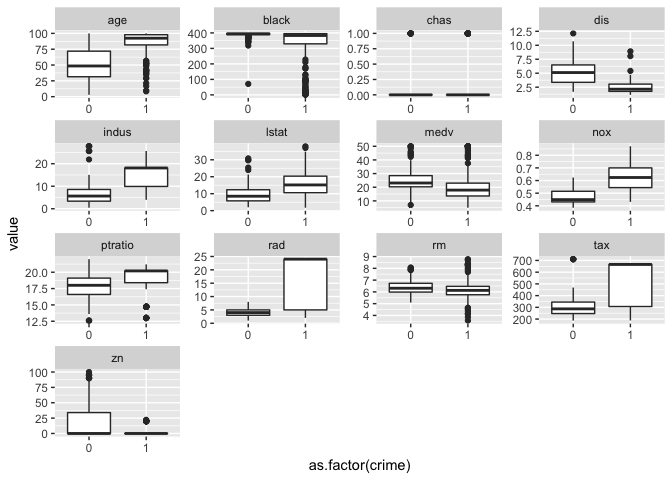

# Chapter 4
Julin N Maloof  
1/21/2018  


## Q5

_We now examine the differences between LDA and QDA._

_(a) If the Bayes decision boundary is linear, do we expect LDA or QDA to perform better on the training set? On the test set?_

QDA may perform better on the training set because it is more flexible, but LDA will perform better on the test set.

_(b) If the Bayes decision boundary is non-linear, do we expect LDA or QDA to perform better on the training set? On the test set?_

QDA will perform beter on both test and train.

_(c) In general, as the sample size n increases, do we expect the test prediction accuracy of QDA relative to LDA to improve, decline, or be unchanged? Why?_

Improve.  QDA is much more highly paramterized.  With small training sets it is hard to accurately estimate those parameters but this will improve with sample size.

_(d) True or False: Even if the Bayes decision boundary for a given problem is linear, we will probably achieve a superior test error rate using QDA rather than LDA because QDA is flexible enough to model a linear decision boundary. Justify your answer._

False.  Because QDA is flexible it is more prone to variance from training set to training set.


## Q6
 
_Suppose we collect data for a group of students in a statistics class with variables X1 = hours studied, X2 = undergrad GPA, and Y = receive an A. We fit a logistic regression and produce estimated coefficient, βˆ0 = −6, βˆ1 = 0.05, βˆ2 = 1_

_(a) Estimate the probability that a student who studies for 40 h and has an undergrad GPA of 3.5 gets an A in the class._


```r
exp(-6 + 0.05*40 +1*3.5) /
  (1 + exp(-6 + 0.05*40 +1*3.5) )
```

```
## [1] 0.3775407
```


_(b) How many hours would the student in part (a) need to study to have a 50 % chance of getting an A in the class?_

Easier for me to think about this if I log transform the equation

log(0.5/0.5) = -6 + hours * 0.05 + 3.5


```r
log(1) # 0
```

```
## [1] 0
```

```r
hours <- (6 -3.5) / 0.05

hours
```

```
## [1] 50
```

50 hours

## Q8
_Suppose that we take a data set, divide it into equally-sized training and test sets, and then try out two different classification procedures. First we use logistic regression and get an error rate of 20 % on the training data and 30 % on the test data. Next we use 1-nearest neighbors (i.e. K = 1) and get an average error rate (averaged over both test and training data sets) of 18%. Based on these results, which method should we prefer to use for classification of new observations? Why?_

Logistic regression.  The training error on KNN K=1 should be 0, implying that the test error is 36%.

## Q9
_This problem has to do with odds._

_(a) On average, what fraction of people with an odds of 0.37 of defaulting on their credit card payment will in fact default?_

$$
\begin{align}
\frac{Pr(x)}{1 - Pr(x)} &= 0.37 \\

Pr(x) &= 0.37 - .37*Pr(x) \\

1.37*Pr(x) &= 0.37\\

Pr(x) &= 0.37 / 1.37\\

Pr(x) &= 0.27
\end{align}
$$


_(b) Suppose that an individual has a 16% chance of defaulting on her credit card payment. What are the odds that she will default?_


```r
.16 / (1-.16)
```

```
## [1] 0.1904762
```

 
## Q 10 a-d
 
 _10. This question should be answered using the Weekly data set, which is part of the ISLR package. This data is similar in nature to the Smarket data from this chapter’s lab, except that it contains 1,089 weekly returns for 21 years, from the beginning of 1990 to the end of 2010._
 
_(a) Produce some numerical and graphical summaries of the Weekly data. Do there appear to be any patterns?_


```r
library(ISLR)
```

```
## Warning: package 'ISLR' was built under R version 3.4.2
```

```r
library(tidyverse)
```

```
## Loading tidyverse: ggplot2
## Loading tidyverse: tibble
## Loading tidyverse: tidyr
## Loading tidyverse: readr
## Loading tidyverse: purrr
## Loading tidyverse: dplyr
```

```
## Warning: package 'tidyr' was built under R version 3.4.2
```

```
## Warning: package 'purrr' was built under R version 3.4.2
```

```
## Warning: package 'dplyr' was built under R version 3.4.2
```

```
## Conflicts with tidy packages ----------------------------------------------
```

```
## filter(): dplyr, stats
## lag():    dplyr, stats
```

```r
data("Weekly")
?Weekly
weekly <- as.tibble(Weekly)
weekly
```

```
## # A tibble: 1,089 x 9
##     Year   Lag1   Lag2   Lag3   Lag4   Lag5    Volume  Today Direction
##  * <dbl>  <dbl>  <dbl>  <dbl>  <dbl>  <dbl>     <dbl>  <dbl>    <fctr>
##  1  1990  0.816  1.572 -3.936 -0.229 -3.484 0.1549760 -0.270      Down
##  2  1990 -0.270  0.816  1.572 -3.936 -0.229 0.1485740 -2.576      Down
##  3  1990 -2.576 -0.270  0.816  1.572 -3.936 0.1598375  3.514        Up
##  4  1990  3.514 -2.576 -0.270  0.816  1.572 0.1616300  0.712        Up
##  5  1990  0.712  3.514 -2.576 -0.270  0.816 0.1537280  1.178        Up
##  6  1990  1.178  0.712  3.514 -2.576 -0.270 0.1544440 -1.372      Down
##  7  1990 -1.372  1.178  0.712  3.514 -2.576 0.1517220  0.807        Up
##  8  1990  0.807 -1.372  1.178  0.712  3.514 0.1323100  0.041        Up
##  9  1990  0.041  0.807 -1.372  1.178  0.712 0.1439720  1.253        Up
## 10  1990  1.253  0.041  0.807 -1.372  1.178 0.1336350 -2.678      Down
## # ... with 1,079 more rows
```

```r
summary(weekly)
```

```
##       Year           Lag1               Lag2               Lag3         
##  Min.   :1990   Min.   :-18.1950   Min.   :-18.1950   Min.   :-18.1950  
##  1st Qu.:1995   1st Qu.: -1.1540   1st Qu.: -1.1540   1st Qu.: -1.1580  
##  Median :2000   Median :  0.2410   Median :  0.2410   Median :  0.2410  
##  Mean   :2000   Mean   :  0.1506   Mean   :  0.1511   Mean   :  0.1472  
##  3rd Qu.:2005   3rd Qu.:  1.4050   3rd Qu.:  1.4090   3rd Qu.:  1.4090  
##  Max.   :2010   Max.   : 12.0260   Max.   : 12.0260   Max.   : 12.0260  
##       Lag4               Lag5              Volume       
##  Min.   :-18.1950   Min.   :-18.1950   Min.   :0.08747  
##  1st Qu.: -1.1580   1st Qu.: -1.1660   1st Qu.:0.33202  
##  Median :  0.2380   Median :  0.2340   Median :1.00268  
##  Mean   :  0.1458   Mean   :  0.1399   Mean   :1.57462  
##  3rd Qu.:  1.4090   3rd Qu.:  1.4050   3rd Qu.:2.05373  
##  Max.   : 12.0260   Max.   : 12.0260   Max.   :9.32821  
##      Today          Direction 
##  Min.   :-18.1950   Down:484  
##  1st Qu.: -1.1540   Up  :605  
##  Median :  0.2410             
##  Mean   :  0.1499             
##  3rd Qu.:  1.4050             
##  Max.   : 12.0260
```

```r
pairs(weekly)
```

<!-- -->

```r
weekly %>% mutate(Direction = as.numeric(Direction)) %>% cor() %>% round(2)
```

```
##            Year  Lag1  Lag2  Lag3  Lag4  Lag5 Volume Today Direction
## Year       1.00 -0.03 -0.03 -0.03 -0.03 -0.03   0.84 -0.03     -0.02
## Lag1      -0.03  1.00 -0.07  0.06 -0.07 -0.01  -0.06 -0.08     -0.05
## Lag2      -0.03 -0.07  1.00 -0.08  0.06 -0.07  -0.09  0.06      0.07
## Lag3      -0.03  0.06 -0.08  1.00 -0.08  0.06  -0.07 -0.07     -0.02
## Lag4      -0.03 -0.07  0.06 -0.08  1.00 -0.08  -0.06 -0.01     -0.02
## Lag5      -0.03 -0.01 -0.07  0.06 -0.08  1.00  -0.06  0.01     -0.02
## Volume     0.84 -0.06 -0.09 -0.07 -0.06 -0.06   1.00 -0.03     -0.02
## Today     -0.03 -0.08  0.06 -0.07 -0.01  0.01  -0.03  1.00      0.72
## Direction -0.02 -0.05  0.07 -0.02 -0.02 -0.02  -0.02  0.72      1.00
```

Volume and year are correlated, and Today and direction, but that is no surprise...overall not much going on

_(b) Use the full data set to perform a logistic regression with Direction as the response and the five lag variables plus Volume as predictors. Use the summary function to print the results. Do any of the predictors appear to be statistically significant? If so, which ones?_


```r
mod10b <- glm(Direction ~ Lag1 + Lag2 + Lag3 + Lag4 + Lag5 + Volume, data=weekly,family = "binomial")
summary(mod10b)
```

```
## 
## Call:
## glm(formula = Direction ~ Lag1 + Lag2 + Lag3 + Lag4 + Lag5 + 
##     Volume, family = "binomial", data = weekly)
## 
## Deviance Residuals: 
##     Min       1Q   Median       3Q      Max  
## -1.6949  -1.2565   0.9913   1.0849   1.4579  
## 
## Coefficients:
##             Estimate Std. Error z value Pr(>|z|)   
## (Intercept)  0.26686    0.08593   3.106   0.0019 **
## Lag1        -0.04127    0.02641  -1.563   0.1181   
## Lag2         0.05844    0.02686   2.175   0.0296 * 
## Lag3        -0.01606    0.02666  -0.602   0.5469   
## Lag4        -0.02779    0.02646  -1.050   0.2937   
## Lag5        -0.01447    0.02638  -0.549   0.5833   
## Volume      -0.02274    0.03690  -0.616   0.5377   
## ---
## Signif. codes:  0 '***' 0.001 '**' 0.01 '*' 0.05 '.' 0.1 ' ' 1
## 
## (Dispersion parameter for binomial family taken to be 1)
## 
##     Null deviance: 1496.2  on 1088  degrees of freedom
## Residual deviance: 1486.4  on 1082  degrees of freedom
## AIC: 1500.4
## 
## Number of Fisher Scoring iterations: 4
```

2 weeks prior has some predicitive value...

_(c) Compute the confusion matrix and overall fraction of correct predictions. Explain what the confusion matrix is telling you about the types of mistakes made by logistic regression._


```r
mod10b.pred <- predict(mod10b,type = "response")
head(mod10b.pred)
```

```
##         1         2         3         4         5         6 
## 0.6086249 0.6010314 0.5875699 0.4816416 0.6169013 0.5684190
```

```r
mod10b.pred <- ifelse(mod10b.pred>.5,"Up","Down")
table(mod10b.pred,weekly$Direction)
```

```
##            
## mod10b.pred Down  Up
##        Down   54  48
##        Up    430 557
```

```r
mean(mod10b.pred==weekly$Direction)
```

```
## [1] 0.5610652
```

56.1% of the predictions were correct.  This model does a pretty good job of predicting up weeks, that is it correctly called 557 of 605 or 92.07% of the up markets (Good sensitivity).  However it has lousy specificity, classifying 430 of the 484 down weeks incorrectly. The specificity is 11.16%

_(d) Now fit the logistic regression model using a training data period from 1990 to 2008, with Lag2 as the only predictor. Compute the confusion matrix and the overall fraction of correct predictions for the held out data (that is, the data from 2009 and 2010)._


```r
train <- weekly %>% filter(Year<2009)
test <- weekly %>% filter(Year>=2009)
mod10d <- glm(Direction ~ Lag2, data=train, family="binomial")
mod10d.pred <- predict(mod10d,newdata = test, type="response")
mod10d.pred <- ifelse(mod10d.pred>.5,"Up","Down")
mean(mod10d.pred!=test$Direction)
```

```
## [1] 0.375
```

```r
table(mod10d.pred, test$Direction)
```

```
##            
## mod10d.pred Down Up
##        Down    9  5
##        Up     34 56
```

OK so now it does surprisingly well!  37.5% error rate

_(e) Repeat (d) using LDA._


```r
library(MASS)
```

```
## 
## Attaching package: 'MASS'
```

```
## The following object is masked from 'package:dplyr':
## 
##     select
```

```r
mod10e <- lda(Direction ~ Lag2, data=train)
mod10e
```

```
## Call:
## lda(Direction ~ Lag2, data = train)
## 
## Prior probabilities of groups:
##      Down        Up 
## 0.4477157 0.5522843 
## 
## Group means:
##             Lag2
## Down -0.03568254
## Up    0.26036581
## 
## Coefficients of linear discriminants:
##            LD1
## Lag2 0.4414162
```

```r
plot(mod10e)
```

<!-- -->

```r
pred.10e <- predict(mod10e,newdata = test)
table(pred.10e$class,test$Direction)
```

```
##       
##        Down Up
##   Down    9  5
##   Up     34 56
```

```r
mean(pred.10e$class!=test$Direction)
```

```
## [1] 0.375
```
Exactly the same as the logistic regression.

_(f) Repeat (d) using QDA._


```r
mod10f <- qda(Direction ~ Lag2, data=train)
mod10f
```

```
## Call:
## qda(Direction ~ Lag2, data = train)
## 
## Prior probabilities of groups:
##      Down        Up 
## 0.4477157 0.5522843 
## 
## Group means:
##             Lag2
## Down -0.03568254
## Up    0.26036581
```

```r
pred.10f <- predict(mod10f,newdata = test)
table(pred.10f$class,test$Direction)
```

```
##       
##        Down Up
##   Down    0  0
##   Up     43 61
```

```r
mean(pred.10f$class!=test$Direction)
```

```
## [1] 0.4134615
```

Is something wrong here??

Higher error rate and terrible specificity.  

_(g) Repeat (d) using KNN with K = 1._


```r
library(class)
set.seed(123)
knn10g <- knn(train[,"Lag2"],test[,"Lag2"],train$Direction, k = 1)
table(knn10g,test$Direction)
```

```
##       
## knn10g Down Up
##   Down   21 29
##   Up     22 32
```

```r
mean(knn10g!=test$Direction)
```

```
## [1] 0.4903846
```


_(h) Which of these methods appears to provide the best results on this data?_

Logistic regression and LDA have the lowest test error, followed by QDA and then knn.

_(i) Experiment with different combinations of predictors, including possible transformations and interactions, for each of the methods. Report the variables, method, and associated confusion matrix that appears to provide the best results on the held out data. Note that you should also experiment with values for K in the KNN classifier._
 
 ## Q 11 
 
_(a) Create a binary variable, mpg01, that contains a 1 if mpg contains a value above its median, and a 0 if mpg contains a value below its median. You can compute the median using the median() function. Note you may find it helpful to use the data.frame() function to create a single data set containing both mpg01 and the other Auto variables._


```r
library(ISLR)
library(tidyverse)
data(Auto)
auto <- as.tibble(Auto)
auto <- auto %>% mutate(mpg01=ifelse(mpg>median(mpg),1,0))
auto
```

```
## # A tibble: 392 x 10
##      mpg cylinders displacement horsepower weight acceleration  year
##    <dbl>     <dbl>        <dbl>      <dbl>  <dbl>        <dbl> <dbl>
##  1    18         8          307        130   3504         12.0    70
##  2    15         8          350        165   3693         11.5    70
##  3    18         8          318        150   3436         11.0    70
##  4    16         8          304        150   3433         12.0    70
##  5    17         8          302        140   3449         10.5    70
##  6    15         8          429        198   4341         10.0    70
##  7    14         8          454        220   4354          9.0    70
##  8    14         8          440        215   4312          8.5    70
##  9    14         8          455        225   4425         10.0    70
## 10    15         8          390        190   3850          8.5    70
## # ... with 382 more rows, and 3 more variables: origin <dbl>, name <fctr>,
## #   mpg01 <dbl>
```


_(b) Explore the data graphically in order to investigate the association between mpg01 and the other features. Which of the other features seem most likely to be useful in predicting mpg01? Scatterplots and boxplots may be useful tools to answer this question. Describe your findings._


```r
auto %>% dplyr::select(-mpg, -name) %>%
  gather(key="key", value="value", -mpg01) %>%
  ggplot(aes(x=as.factor(mpg01),y=value,color=as.factor(mpg01))) +
  geom_boxplot() +
  facet_wrap(~ key, scales = "free")
```

<!-- -->


_(c) Split the data into a training set and a test set._


```r
nrow(auto) #392
```

```
## [1] 392
```

```r
set.seed(123)
test.index <- sample(c(0,1),size = nrow(auto), replace = TRUE,prob = c(.75,.25)) 

auto.train <- auto[test.index==0,]
auto.test <- auto[test.index==1,]
```


_(d) Perform LDA on the training data in order to predict mpg01 using the variables that seemed most associated with mpg01 in (b). What is the test error of the model obtained?_


```r
mod11d <- auto.train %>% dplyr::select(-acceleration, -mpg, -name) %>%
  lda(mpg01 ~ . , data = .)
mod11d
```

```
## Call:
## lda(mpg01 ~ ., data = .)
## 
## Prior probabilities of groups:
##         0         1 
## 0.5050505 0.4949495 
## 
## Group means:
##   cylinders displacement horsepower   weight     year   origin
## 0  6.746667     273.2267  129.58000 3626.520 74.39333 1.160000
## 1  4.149660     113.6259   79.07483 2322.714 77.57143 2.013605
## 
## Coefficients of linear discriminants:
##                       LD1
## cylinders    -0.491278370
## displacement -0.001471414
## horsepower    0.015765991
## weight       -0.001227812
## year          0.129503798
## origin        0.156495445
```

```r
plot(mod11d)
```

<!-- -->


```r
pred.11d <- auto.test %>% dplyr::select(-acceleration, -mpg, -name) %>%
  predict(mod11d, .)
table(pred.11d$class, auto.test$mpg01)
```

```
##    
##      0  1
##   0 38  5
##   1  8 44
```

```r
mean(pred.11d$class!=auto.test$mpg01)
```

```
## [1] 0.1368421
```


_(e) Perform QDA on the training data in order to predict mpg01 using the variables that seemed most associated with mpg01 in (b). What is the test error of the model obtained?_


```r
mod11e <- auto.train %>% dplyr::select(-acceleration, -mpg, -name) %>%
  qda(mpg01 ~ . , data = .)
mod11e
```

```
## Call:
## qda(mpg01 ~ ., data = .)
## 
## Prior probabilities of groups:
##         0         1 
## 0.5050505 0.4949495 
## 
## Group means:
##   cylinders displacement horsepower   weight     year   origin
## 0  6.746667     273.2267  129.58000 3626.520 74.39333 1.160000
## 1  4.149660     113.6259   79.07483 2322.714 77.57143 2.013605
```

```r
pred.11e <- auto.test %>% dplyr::select(-acceleration, -mpg, -name) %>%
  predict(mod11e, .)
table(pred.11e$class, auto.test$mpg01)
```

```
##    
##      0  1
##   0 41  7
##   1  5 42
```

```r
mean(pred.11e$class!=auto.test$mpg01)
```

```
## [1] 0.1263158
```

_(f) Perform logistic regression on the training data in order to predict mpg01 using the variables that seemed most associated with mpg01 in (b). What is the test error of the model obtained?_


```r
mod11f <- auto.train %>% dplyr::select(-acceleration, -mpg, -name) %>%
  glm(mpg01 ~ . , data = ., family = "binomial")
summary(mod11f)
```

```
## 
## Call:
## glm(formula = mpg01 ~ ., family = "binomial", data = .)
## 
## Deviance Residuals: 
##      Min        1Q    Median        3Q       Max  
## -2.37593  -0.06007  -0.00005   0.16481   2.37014  
## 
## Coefficients:
##                Estimate Std. Error z value Pr(>|z|)    
## (Intercept)  -21.953771   6.326524  -3.470  0.00052 ***
## cylinders      0.238961   0.578418   0.413  0.67951    
## displacement  -0.019802   0.018692  -1.059  0.28941    
## horsepower    -0.037802   0.023631  -1.600  0.10967    
## weight        -0.004373   0.001349  -3.242  0.00119 ** 
## year           0.517378   0.101596   5.093 3.53e-07 ***
## origin         0.215269   0.442729   0.486  0.62680    
## ---
## Signif. codes:  0 '***' 0.001 '**' 0.01 '*' 0.05 '.' 0.1 ' ' 1
## 
## (Dispersion parameter for binomial family taken to be 1)
## 
##     Null deviance: 411.70  on 296  degrees of freedom
## Residual deviance: 100.63  on 290  degrees of freedom
## AIC: 114.63
## 
## Number of Fisher Scoring iterations: 8
```


```r
mod11f.pred <- auto.test %>% dplyr::select(-acceleration, -mpg, -name) %>%
  predict(mod11f, ., type = "response")
mod11f.pred <- ifelse(mod11f.pred>0.5,1,0)
table(mod11f.pred,auto.test$mpg01)
```

```
##            
## mod11f.pred  0  1
##           0 40  7
##           1  6 42
```


```r
mean(mod11f.pred!=auto.test$mpg01)
```

```
## [1] 0.1368421
```

compared to LDA, same error rate, but lower sensitivity (worse false positive), better specificity (better false negative).

_(g) Perform KNN on the training data, with several values of K, in order to predict mpg01. Use only the variables that seemed most associated with mpg01 in (b). What test errors do you obtain? Which value of K seems to perform the best on this data set?_


```r
set.seed(123)
auto.train.predictors <- auto.train %>% dplyr::select(-acceleration, -mpg, -name, -mpg01)
auto.test.predictors <-  auto.test %>% dplyr::select(-acceleration, -mpg, -name, -mpg01)
kmodels <- lapply(1:5, function(k) {
  knn(auto.train.predictors, auto.test.predictors, auto.train$mpg01, k = k)
}
)
```


```r
for(k in 1:5) {
  print(k)
  cat("error\n")
  print(mean(kmodels[[k]]!=auto.test$mpg01))
  cat("confusion\n")
  print(table(kmodels[[k]],auto.test$mpg01))
  cat("-------------------------------\n\n")
}
```

```
## [1] 1
## error
## [1] 0.1578947
## confusion
##    
##      0  1
##   0 39  8
##   1  7 41
## -------------------------------
## 
## [1] 2
## error
## [1] 0.1473684
## confusion
##    
##      0  1
##   0 38  6
##   1  8 43
## -------------------------------
## 
## [1] 3
## error
## [1] 0.1052632
## confusion
##    
##      0  1
##   0 42  6
##   1  4 43
## -------------------------------
## 
## [1] 4
## error
## [1] 0.1473684
## confusion
##    
##      0  1
##   0 38  6
##   1  8 43
## -------------------------------
## 
## [1] 5
## error
## [1] 0.1368421
## confusion
##    
##      0  1
##   0 39  6
##   1  7 43
## -------------------------------
```

k=3 is best...and better than the the other methods...

## Q13


```r
data("Boston")

boston <- as.tibble(Boston) %>% mutate(crime=as.factor(ifelse(crim > median(crim),"above","below"))) %>% dplyr::select(-crim)

boston.long <- boston %>% gather(key = "index", value = "value", -crime)

ggplot(boston.long,aes(x=crime,y=value)) +
  geom_boxplot() +
  facet_wrap(~index, scales = "free")
```

<!-- -->


```r
set.seed(123)
train <- sample(c("train","test"),size = nrow(boston), replace = TRUE, prob = c(.75,.25))
boston.train <- boston %>% filter(train=="train")
boston.test <- boston %>% filter(train=="test")
```


```r
glm1 <- glm(crime ~ ., data = boston.train, family = "binomial")
summary(glm1)
```

```
## 
## Call:
## glm(formula = crime ~ ., family = "binomial", data = boston.train)
## 
## Deviance Residuals: 
##      Min        1Q    Median        3Q       Max  
## -2.45527  -0.00084  -0.00001   0.10315   2.02785  
## 
## Coefficients:
##               Estimate Std. Error z value Pr(>|z|)    
## (Intercept)  39.655188   8.009508   4.951 7.38e-07 ***
## zn            0.106377   0.043287   2.458  0.01399 *  
## indus         0.052974   0.051754   1.024  0.30604    
## chas         -1.219761   0.873057  -1.397  0.16238    
## nox         -54.150890   9.559348  -5.665 1.47e-08 ***
## rm            0.748484   0.847058   0.884  0.37690    
## age          -0.026748   0.014814  -1.806  0.07099 .  
## dis          -0.870718   0.280225  -3.107  0.00189 ** 
## rad          -0.759204   0.192561  -3.943 8.06e-05 ***
## tax           0.005447   0.003020   1.803  0.07134 .  
## ptratio      -0.371850   0.150232  -2.475  0.01332 *  
## black         0.010534   0.005751   1.832  0.06699 .  
## lstat        -0.070729   0.058431  -1.210  0.22609    
## medv         -0.225109   0.083886  -2.684  0.00729 ** 
## ---
## Signif. codes:  0 '***' 0.001 '**' 0.01 '*' 0.05 '.' 0.1 ' ' 1
## 
## (Dispersion parameter for binomial family taken to be 1)
## 
##     Null deviance: 536.18  on 386  degrees of freedom
## Residual deviance: 147.77  on 373  degrees of freedom
## AIC: 175.77
## 
## Number of Fisher Scoring iterations: 9
```
 

```r
glm1.pred <- predict(glm1, newdata = boston.test, type = "response")
glm1.pred <- as.factor(ifelse(glm1.pred > 0.5, "above", "below"))
mean(glm1.pred != boston.test$crime)
```

```
## [1] 0.8991597
```
 
something wrong?


```r
boston.small <- boston %>% dplyr::select(-indus,-chas,-rm,-lstat)
glm2 <- glm(crime ~ . , data=boston.small, family = "binomial")
summary(glm2)
```

```
## 
## Call:
## glm(formula = crime ~ ., family = "binomial", data = boston.small)
## 
## Deviance Residuals: 
##     Min       1Q   Median       3Q      Max  
## -3.4087  -0.0022   0.0004   0.1840   2.4197  
## 
## Coefficients:
##               Estimate Std. Error z value Pr(>|z|)    
## (Intercept)  31.441272   6.048989   5.198 2.02e-07 ***
## zn            0.082567   0.031424   2.628  0.00860 ** 
## nox         -43.195824   6.452812  -6.694 2.17e-11 ***
## age          -0.022851   0.009894  -2.310  0.02091 *  
## dis          -0.634380   0.207634  -3.055  0.00225 ** 
## rad          -0.718773   0.142066  -5.059 4.21e-07 ***
## tax           0.007676   0.002503   3.066  0.00217 ** 
## ptratio      -0.303502   0.109255  -2.778  0.00547 ** 
## black         0.012866   0.006334   2.031  0.04224 *  
## medv         -0.112882   0.034362  -3.285  0.00102 ** 
## ---
## Signif. codes:  0 '***' 0.001 '**' 0.01 '*' 0.05 '.' 0.1 ' ' 1
## 
## (Dispersion parameter for binomial family taken to be 1)
## 
##     Null deviance: 701.46  on 505  degrees of freedom
## Residual deviance: 216.22  on 496  degrees of freedom
## AIC: 236.22
## 
## Number of Fisher Scoring iterations: 9
```
 
 
