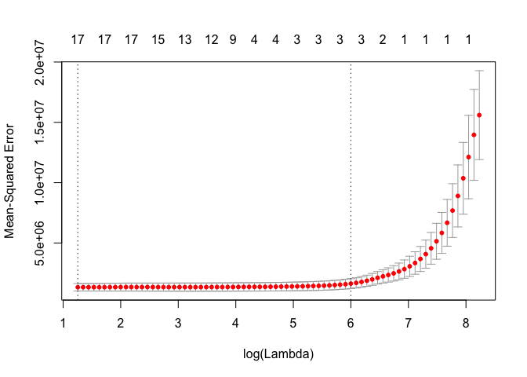

# Chapter 6
Julin N Maloof  
2/27/2018  


## Q2
_For parts (a) through (c), indicate which of i. through iv. is correct. Justify your answer._
_i. More flexible and hence will give improved prediction accuracy when its increase in bias is less than its decrease in variance._
_ii. More flexible and hence will give improved prediction accuracy when its increase in variance is less than its decrease in bias._
_iii. Less flexible and hence will give improved prediction accuracy when its increase in bias is less than its decrease in variance._
_iv. Less flexible and hence will give improved prediction accuracy when its increase in variance is less than its decrease in bias._

### _(a) The lasso, relative to least squares, is:_

iii.  Because lasso forces some coefficients to zero it is less flexible.  This will cause an increase in bias but a decrease in variance.

### _(b) Repeat (a) for ridge regression relative to least squares._

iii.  Because lasso forces some coefficients to be small it is less flexible.  This will cause an increase in bias but a decrease in variance.


### _(c) Repeat (a) for non-linear methods relative to least squares._

ii.  Because the model is not constrained to be linear there is more flexibility.  This flexibility can reduce bias but also will increase variance.

## Q3

_Asks about adding an additional constraint to a standard least squares where we limit the size of the beta coefficients to be less than some value _s_._

_For parts (a) through (e), indicate which of i. through v. is correct. Justify your answer._

_i. Increase initially, and then eventually start decreasing in an inverted U shape._
_ii. Decrease initially, and then eventually start increasing in a U shape._
_iii. Steadily increase._
_iv. Steadily decrease._
_v. Remain constant._

_(a) As we increase s from 0, the training RSS will:_

iv. Steadliy decrease.  We have a more and more flexible model so it will better be able to fit the training set.  Actually it won't steadly decrease, it will plateau...

_(b) Repeat (a) for test RSS._

I think this depends on the scenario.  If we have a small number of good predictors then this will be pretty similar to (a).  OTOH if we have a large number of predictors, or some that aren't good predictors, then 

ii. Decrease initially, and then eventually start increasing in a U shape.

_(c) variance_

Variance is high if there are a lot of differences in models when we use different training sets.

with low s we won't fit anything well (and the model won't change much from training to training) so variance will be low.  As s increases there will start to be more and more difference betweenthe models, so I expect Variance to increase.

_(d) Squared bias._

Bias represents the difference between our model and the data.  When s = 0 then there is no flexibility and bias will be high.  This will decrease as s increases.

_(e) irreducible error._

By definition this should remain constant.

## Q4

_This asks the same questions as 3, but here the model is the Ridge Regression model and penalizes based on lambda, the tuning coefficent that is amultiplier for the sum of the squred beta coefficients._

_As we increase lambda from 0..._

_(a) training RSS_

Will steadily decrease as we fit less and less flexible models

_(b) test RSS_

Will decrease as we reduce variance, and then increase as eventually we increase bias

_(c) variance_

Will decrease steadily

_(d) bias_

will increase steadily

_(e) irreducible error_

unchanged

## Q5 

## Q8

## Q9 

_9. In this exercise, we will predict the number of applications received using the other variables in the College data set._

_(a) Split the data set into a training set and a test set._


```r
data(College)
head(College)
```

```
##                              Private Apps Accept Enroll Top10perc
## Abilene Christian University     Yes 1660   1232    721        23
## Adelphi University               Yes 2186   1924    512        16
## Adrian College                   Yes 1428   1097    336        22
## Agnes Scott College              Yes  417    349    137        60
## Alaska Pacific University        Yes  193    146     55        16
## Albertson College                Yes  587    479    158        38
##                              Top25perc F.Undergrad P.Undergrad Outstate
## Abilene Christian University        52        2885         537     7440
## Adelphi University                  29        2683        1227    12280
## Adrian College                      50        1036          99    11250
## Agnes Scott College                 89         510          63    12960
## Alaska Pacific University           44         249         869     7560
## Albertson College                   62         678          41    13500
##                              Room.Board Books Personal PhD Terminal
## Abilene Christian University       3300   450     2200  70       78
## Adelphi University                 6450   750     1500  29       30
## Adrian College                     3750   400     1165  53       66
## Agnes Scott College                5450   450      875  92       97
## Alaska Pacific University          4120   800     1500  76       72
## Albertson College                  3335   500      675  67       73
##                              S.F.Ratio perc.alumni Expend Grad.Rate
## Abilene Christian University      18.1          12   7041        60
## Adelphi University                12.2          16  10527        56
## Adrian College                    12.9          30   8735        54
## Agnes Scott College                7.7          37  19016        59
## Alaska Pacific University         11.9           2  10922        15
## Albertson College                  9.4          11   9727        55
```

```r
College$Private <- as.numeric(College$Private)-1 # 0 = no, 1 = yes
set.seed(123)
train <- sample(c(TRUE,FALSE),size = nrow(College),prob = c(0.80,0.20),replace=TRUE)
college.train <- College %>% as_tibble() %>% filter(train)
college.test <- College %>% as_tibble() %>% filter(!train)
```


_(b) Fit a linear model using least squares on the training set, and report the test error obtained._


```r
lm9b <- lm(Apps ~ . , data = college.train)
summary(lm9b)
```

```
## 
## Call:
## lm(formula = Apps ~ ., data = college.train)
## 
## Residuals:
##     Min      1Q  Median      3Q     Max 
## -4717.8  -369.3   -18.5   274.6  7587.3 
## 
## Coefficients:
##               Estimate Std. Error t value Pr(>|t|)    
## (Intercept) -688.43195  444.05806  -1.550 0.121591    
## Private     -425.27078  153.35092  -2.773 0.005723 ** 
## Accept         1.61595    0.04351  37.136  < 2e-16 ***
## Enroll        -1.08780    0.20094  -5.414 8.93e-08 ***
## Top10perc     38.90903    6.14557   6.331 4.76e-10 ***
## Top25perc     -8.48165    4.81936  -1.760 0.078931 .  
## F.Undergrad    0.07257    0.03486   2.082 0.037794 *  
## P.Undergrad    0.07315    0.03602   2.031 0.042688 *  
## Outstate      -0.07236    0.02125  -3.405 0.000707 ***
## Room.Board     0.10194    0.05350   1.905 0.057213 .  
## Books         -0.13449    0.26193  -0.513 0.607835    
## Personal       0.07104    0.06988   1.017 0.309756    
## PhD           -8.21216    5.21613  -1.574 0.115926    
## Terminal      -3.73357    5.63224  -0.663 0.507654    
## S.F.Ratio     24.11325   14.18632   1.700 0.089695 .  
## perc.alumni    4.73124    4.59216   1.030 0.303290    
## Expend         0.09618    0.01416   6.791 2.68e-11 ***
## Grad.Rate      6.97940    3.23140   2.160 0.031178 *  
## ---
## Signif. codes:  0 '***' 0.001 '**' 0.01 '*' 0.05 '.' 0.1 ' ' 1
## 
## Residual standard error: 1038 on 601 degrees of freedom
## Multiple R-squared:  0.9336,	Adjusted R-squared:  0.9317 
## F-statistic: 496.9 on 17 and 601 DF,  p-value: < 2.2e-16
```


```r
lm9c.predict <- predict(lm9b,newdata = college.test)
test.error <- (college.test$Apps - lm9c.predict)^2 %>% mean()
test.error
```

```
## [1] 1203826
```


_(c) Fit a ridge regression model on the training set, with λ chosen by cross-validation. Report the test error obtained._


```r
ridge9c <- college.train %>% select(-Apps) %>% as.matrix() %>%
  glmnet(y=college.train$Apps, alpha = 0)
```


```r
cv.out <- college.train %>% select(-Apps) %>% as.matrix() %>%
  cv.glmnet(y=college.train$Apps, alpha = 0)
```


```r
plot(cv.out)
```

<!-- -->

```r
lam1se=cv.out$lambda.1se
lam1se
```

```
## [1] 1827.768
```

```r
log(lam1se)
```

```
## [1] 7.510851
```


```r
ridge9c.predict <- college.test %>% select(-Apps) %>% as.matrix() %>%
  predict(ridge9c,s=lam1se,newx=.)
(college.test$Apps - ridge9c.predict)^2 %>% mean()
```

```
## [1] 1663179
```
Something wrong??


```r
ridge9c.predict <- college.test %>% select(-Apps) %>% as.matrix() %>%
  predict(ridge9c,s=cv.out$lambda.min,newx=.)
(college.test$Apps - ridge9c.predict)^2 %>% mean()
```

```
## [1] 1292858
```

Still high...

_(d) Fit a lasso model on the training set, with λ chosen by cross- validation. Report the test error obtained, along with the number of non-zero coefficient estimates._


```r
lasso9d <- college.train %>% select(-Apps) %>% as.matrix() %>%
  glmnet(y=college.train$Apps, alpha = 1)
```


```r
cv.out <- college.train %>% select(-Apps) %>% as.matrix() %>%
  cv.glmnet(y=college.train$Apps, alpha = 1)
```


```r
plot(cv.out)
```

<!-- -->

```r
lam1se=cv.out$lambda.1se
lam1se
```

```
## [1] 403.0468
```

```r
log(lam1se)
```

```
## [1] 5.999053
```


```r
lasso9d.predict <- college.test %>% select(-Apps) %>% as.matrix() %>%
  predict(lasso9d,s=lam1se,newx=.)
(college.test$Apps - lasso9d.predict)^2 %>% mean()
```

```
## [1] 1714090
```
Larger than lm.  Something wrong??


```r
lasso9d.predict <- college.test %>% select(-Apps) %>% as.matrix() %>%
  predict(lasso9d,s=cv.out$lambda.min,newx=.)
(college.test$Apps - lasso9d.predict)^2 %>% mean()
```

```
## [1] 1199173
```


```r
lasso9d.predict <- college.test %>% select(-Apps) %>% as.matrix() %>%
  predict(lasso9d,s=0,newx=.)
(college.test$Apps - lasso9d.predict)^2 %>% mean()
```

```
## [1] 1200249
```

## Q11
_We will now try to predict per capita crime rate in the Boston data set._

### a
_Try out some of the regression methods explored in this chapter, such as best subset selection, the lasso, ridge regression, and PCR. Present and discuss results for the approaches that you consider._

Prepare the data

```r
data(Boston, package = "MASS")
boston <- as_tibble(Boston)
boston
```

```
## # A tibble: 506 x 14
##       crim    zn indus  chas   nox    rm   age    dis   rad   tax ptratio
##  *   <dbl> <dbl> <dbl> <int> <dbl> <dbl> <dbl>  <dbl> <int> <dbl>   <dbl>
##  1 0.00632  18.0  2.31     0 0.538 6.575  65.2 4.0900     1   296    15.3
##  2 0.02731   0.0  7.07     0 0.469 6.421  78.9 4.9671     2   242    17.8
##  3 0.02729   0.0  7.07     0 0.469 7.185  61.1 4.9671     2   242    17.8
##  4 0.03237   0.0  2.18     0 0.458 6.998  45.8 6.0622     3   222    18.7
##  5 0.06905   0.0  2.18     0 0.458 7.147  54.2 6.0622     3   222    18.7
##  6 0.02985   0.0  2.18     0 0.458 6.430  58.7 6.0622     3   222    18.7
##  7 0.08829  12.5  7.87     0 0.524 6.012  66.6 5.5605     5   311    15.2
##  8 0.14455  12.5  7.87     0 0.524 6.172  96.1 5.9505     5   311    15.2
##  9 0.21124  12.5  7.87     0 0.524 5.631 100.0 6.0821     5   311    15.2
## 10 0.17004  12.5  7.87     0 0.524 6.004  85.9 6.5921     5   311    15.2
## # ... with 496 more rows, and 3 more variables: black <dbl>, lstat <dbl>,
## #   medv <dbl>
```

#### Best Subset


```r
bs <- regsubsets(crim ~ .,data=boston,nvmax = 13)
(bs.sum <- summary(bs))
```

```
## Subset selection object
## Call: regsubsets.formula(crim ~ ., data = boston, nvmax = 13)
## 13 Variables  (and intercept)
##         Forced in Forced out
## zn          FALSE      FALSE
## indus       FALSE      FALSE
## chas        FALSE      FALSE
## nox         FALSE      FALSE
## rm          FALSE      FALSE
## age         FALSE      FALSE
## dis         FALSE      FALSE
## rad         FALSE      FALSE
## tax         FALSE      FALSE
## ptratio     FALSE      FALSE
## black       FALSE      FALSE
## lstat       FALSE      FALSE
## medv        FALSE      FALSE
## 1 subsets of each size up to 13
## Selection Algorithm: exhaustive
##           zn  indus chas nox rm  age dis rad tax ptratio black lstat medv
## 1  ( 1 )  " " " "   " "  " " " " " " " " "*" " " " "     " "   " "   " " 
## 2  ( 1 )  " " " "   " "  " " " " " " " " "*" " " " "     " "   "*"   " " 
## 3  ( 1 )  " " " "   " "  " " " " " " " " "*" " " " "     "*"   "*"   " " 
## 4  ( 1 )  "*" " "   " "  " " " " " " "*" "*" " " " "     " "   " "   "*" 
## 5  ( 1 )  "*" " "   " "  " " " " " " "*" "*" " " " "     "*"   " "   "*" 
## 6  ( 1 )  "*" " "   " "  "*" " " " " "*" "*" " " " "     "*"   " "   "*" 
## 7  ( 1 )  "*" " "   " "  "*" " " " " "*" "*" " " "*"     "*"   " "   "*" 
## 8  ( 1 )  "*" " "   " "  "*" " " " " "*" "*" " " "*"     "*"   "*"   "*" 
## 9  ( 1 )  "*" "*"   " "  "*" " " " " "*" "*" " " "*"     "*"   "*"   "*" 
## 10  ( 1 ) "*" "*"   " "  "*" "*" " " "*" "*" " " "*"     "*"   "*"   "*" 
## 11  ( 1 ) "*" "*"   " "  "*" "*" " " "*" "*" "*" "*"     "*"   "*"   "*" 
## 12  ( 1 ) "*" "*"   "*"  "*" "*" " " "*" "*" "*" "*"     "*"   "*"   "*" 
## 13  ( 1 ) "*" "*"   "*"  "*" "*" "*" "*" "*" "*" "*"     "*"   "*"   "*"
```

```r
plot(bs)
```

<!-- -->

make my own plot

```r
bs.plot.frame <- tibble(predictors=1:13,bs.sum$rsq, bs.sum$adjr2, bs.sum$cp, bs.sum$bic) %>%
  gather(key="criterion",value="value",-predictors)
bs.plot.frame %>% ggplot(aes(x=predictors,y=value)) +
  geom_line() +
  facet_wrap(~criterion,scales="free_y")
```

<!-- -->

Get pretty different answers here.  Try a CV approach.


```r
#From ISLR book
predict.regsubsets  <- function (object ,newdata ,id ,...){
 form=as.formula(object$call [[2]])
 mat=model.matrix(form,newdata)
 coefi=coef(object ,id=id)
 xvars=names(coefi)
 mat[,xvars]%*%coefi}
```

create folds

```r
k <- 10
set.seed(123)
folds <- sample(1:k,nrow(boston),replace=TRUE)
cv.errors <- matrix(NA,k,13, dimnames=list(NULL, paste(1:13)))
```

test the folds

```r
for(j in 1:k){
  best.fit <- regsubsets(crim ~ . , data=boston[folds!=j,],nvmax = 13)
  for(i in 1:13) {
    pred=predict(best.fit, boston[folds==j,],id=i)
    cv.errors[j,i] <- mean( (boston$crim[folds==j]-pred)^2)
  } 
}
```

check the CV MSE

```r
(mean.cv.errors <- apply(cv.errors ,2,mean))
```

```
##        1        2        3        4        5        6        7        8 
## 45.86339 44.69114 45.83302 45.51746 45.37067 45.59112 44.82761 44.32101 
##        9       10       11       12       13 
## 44.09648 44.06860 43.90450 43.89125 43.95507
```

```r
plot(mean.cv.errors, type='b')
```

<!-- -->
12 predictors in best... refit model

```r
reg.best <- regsubsets(crim ~ ., data=boston , nvmax=12)
coef(reg.best,12)
```

```
##   (Intercept)            zn         indus          chas           nox 
##  16.985713928   0.044673247  -0.063848469  -0.744367726 -10.202169211 
##            rm           dis           rad           tax       ptratio 
##   0.439588002  -0.993556631   0.587660185  -0.003767546  -0.269948860 
##         black         lstat          medv 
##  -0.007518904   0.128120290  -0.198877768
```

#### ridge


```r
mod.matrix <- model.matrix(crim ~ . -1., data = boston)
boston.ridge <- glmnet(mod.matrix, boston$crim, alpha=0)
boston.ridge.cv <- cv.glmnet(mod.matrix, boston$crim, alpha=0, foldid=folds)
plot(boston.ridge.cv)
```

<!-- -->


```r
boston.ridge.cv$lambda.min
```

```
## [1] 0.5899047
```

```r
boston.ridge.cv$lambda.1se
```

```
## [1] 98.40203
```

```r
boston.ridge.cv$cvm[boston.ridge.cv$lambda==boston.ridge.cv$lambda.min]
```

```
## [1] 43.39413
```

```r
boston.ridge.cv$cvm[boston.ridge.cv$lambda==boston.ridge.cv$lambda.1se]
```

```
## [1] 60.02177
```

```r
coef(boston.ridge,s=boston.ridge.cv$lambda.min)
```

```
## 14 x 1 sparse Matrix of class "dgCMatrix"
##                        1
## (Intercept)  8.617905279
## zn           0.032352168
## indus       -0.081183885
## chas        -0.739986141
## nox         -5.095661105
## rm           0.328170831
## age          0.002074971
## dis         -0.683786238
## rad          0.414237411
## tax          0.003695600
## ptratio     -0.127614747
## black       -0.008532788
## lstat        0.142710654
## medv        -0.136308133
```

```r
coef(boston.ridge,s=boston.ridge.cv$lambda.1se)
```

```
## 14 x 1 sparse Matrix of class "dgCMatrix"
##                        1
## (Intercept)  1.761587688
## zn          -0.002865786
## indus        0.026514040
## chas        -0.142145708
## nox          1.684835359
## rm          -0.130992458
## age          0.005612849
## dis         -0.084630196
## rad          0.039946869
## tax          0.001830673
## ptratio      0.063756646
## black       -0.002278831
## lstat        0.031682619
## medv        -0.020839190
```

#### lasso


```r
mod.matrix <- model.matrix(crim ~ . -1., data = boston)
boston.lasso <- glmnet(mod.matrix, boston$crim, alpha=1)
boston.lasso.cv <- cv.glmnet(mod.matrix, boston$crim, alpha=1, foldid=folds)
plot(boston.lasso.cv)
```

<!-- -->


```r
boston.lasso.cv$lambda.min
```

```
## [1] 0.02220953
```

```r
boston.lasso.cv$lambda.1se
```

```
## [1] 3.704773
```

```r
boston.lasso.cv$cvm[boston.lasso.cv$lambda==boston.lasso.cv$lambda.min]
```

```
## [1] 43.24984
```

```r
boston.lasso.cv$cvm[boston.lasso.cv$lambda==boston.lasso.cv$lambda.1se]
```

```
## [1] 59.48745
```

```r
coef(boston.lasso,s=boston.lasso.cv$lambda.min)
```

```
## 14 x 1 sparse Matrix of class "dgCMatrix"
##                        1
## (Intercept) 15.037223009
## zn           0.040598111
## indus       -0.069837673
## chas        -0.666136981
## nox         -8.839873726
## rm           0.350179026
## age          .          
## dis         -0.903831964
## rad          0.549987327
## tax         -0.001721130
## ptratio     -0.234929706
## black       -0.007537975
## lstat        0.127491697
## medv        -0.180477364
```

```r
coef(boston.lasso,s=boston.lasso.cv$lambda.1se)
```

```
## 14 x 1 sparse Matrix of class "dgCMatrix"
##                     1
## (Intercept) 1.7799525
## zn          .        
## indus       .        
## chas        .        
## nox         .        
## rm          .        
## age         .        
## dis         .        
## rad         0.1920089
## tax         .        
## ptratio     .        
## black       .        
## lstat       .        
## medv        .
```
#### PCR


```r
set.seed(1)
boston.pcr <- pcr(crim ~ . , data=boston, scale=TRUE, validation="CV")
summary(boston.pcr)
```

```
## Data: 	X dimension: 506 13 
## 	Y dimension: 506 1
## Fit method: svdpc
## Number of components considered: 13
## 
## VALIDATION: RMSEP
## Cross-validated using 10 random segments.
##        (Intercept)  1 comps  2 comps  3 comps  4 comps  5 comps  6 comps
## CV            8.61    7.173    7.173    6.754    6.728    6.740    6.753
## adjCV         8.61    7.172    7.172    6.749    6.724    6.737    6.748
##        7 comps  8 comps  9 comps  10 comps  11 comps  12 comps  13 comps
## CV       6.745    6.625    6.636     6.633     6.626     6.579     6.507
## adjCV    6.740    6.619    6.630     6.626     6.619     6.571     6.499
## 
## TRAINING: % variance explained
##       1 comps  2 comps  3 comps  4 comps  5 comps  6 comps  7 comps
## X       47.70    60.36    69.67    76.45    82.99    88.00    91.14
## crim    30.69    30.87    39.27    39.61    39.61    39.86    40.14
##       8 comps  9 comps  10 comps  11 comps  12 comps  13 comps
## X       93.45    95.40     97.04     98.46     99.52     100.0
## crim    42.47    42.55     42.78     43.04     44.13      45.4
```


```r
validationplot(boston.pcr, val.type = "MSEP")
```

<!-- -->

So something like 3 components is good

#### PLS


```r
set.seed(1)
boston.pls <- plsr(crim ~ . , data=boston, scale=TRUE, validation="CV")
summary(boston.pls)
```

```
## Data: 	X dimension: 506 13 
## 	Y dimension: 506 1
## Fit method: kernelpls
## Number of components considered: 13
## 
## VALIDATION: RMSEP
## Cross-validated using 10 random segments.
##        (Intercept)  1 comps  2 comps  3 comps  4 comps  5 comps  6 comps
## CV            8.61    6.999    6.649    6.576    6.558    6.530    6.514
## adjCV         8.61    6.997    6.644    6.567    6.550    6.523    6.506
##        7 comps  8 comps  9 comps  10 comps  11 comps  12 comps  13 comps
## CV       6.513    6.509    6.508     6.507     6.507     6.507     6.507
## adjCV    6.505    6.501    6.500     6.498     6.499     6.499     6.499
## 
## TRAINING: % variance explained
##       1 comps  2 comps  3 comps  4 comps  5 comps  6 comps  7 comps
## X       47.27    56.79    61.38    71.13    76.41    79.78    83.99
## crim    34.32    41.81    44.03    44.58    44.94    45.24    45.33
##       8 comps  9 comps  10 comps  11 comps  12 comps  13 comps
## X       86.27     88.5     91.32     96.56     98.26     100.0
## crim    45.38     45.4     45.40     45.40     45.40      45.4
```


```r
validationplot(boston.pls, val.type = "MSEP")
```

<!-- -->


### b
_Propose a model (or set of models) that seem to perform well on this data set, and justify your answer. Make sure that you are evaluating model performance using validation set error, cross- validation, or some other reasonable alternative, as opposed to using training error._

### c
_Does your chosen model involve all of the features in the data set? Why or why not?_
