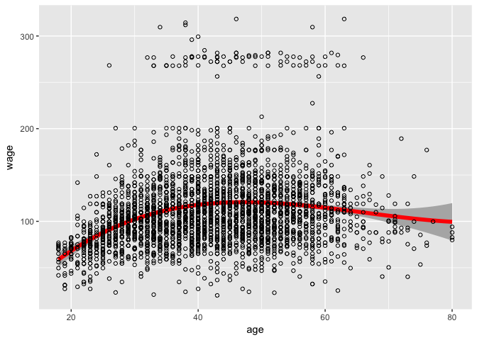
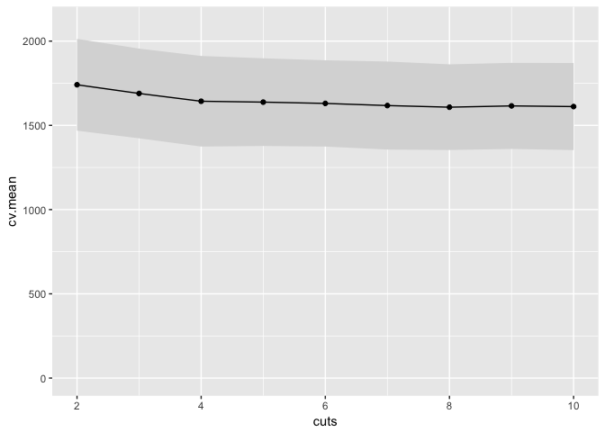
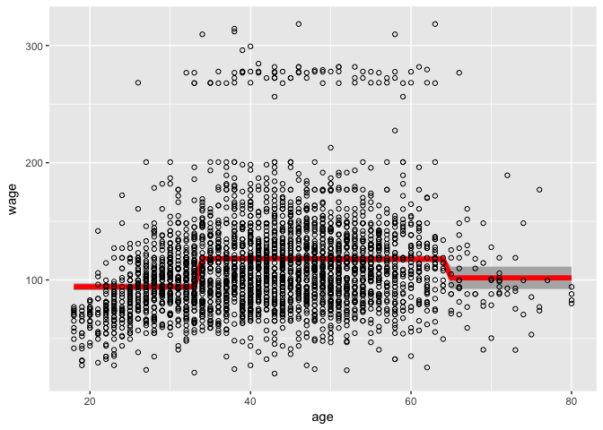
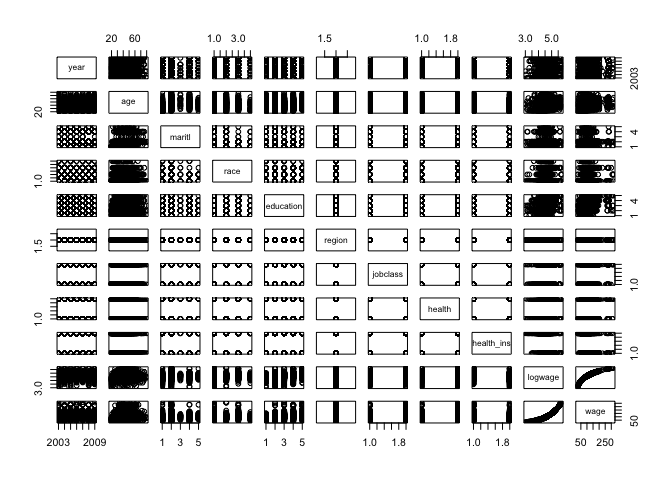
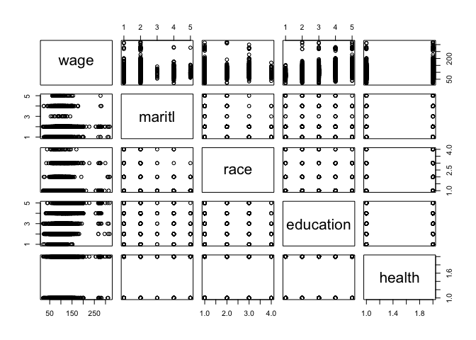
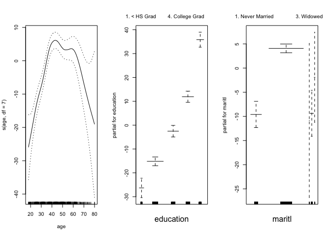
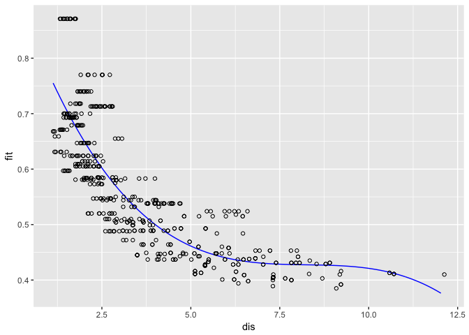

# Chapter 7

6, 7, 8, 9

## Q6

_6. In this exercise, you will further analyze the Wage data set considered throughout this chapter._

_(a) Perform polynomial regression to predict wage using age. Use cross-validation to select the optimal degree d for the polynomial. What degree was chosen, and how does this compare to the results of hypothesis testing using ANOVA? Make a plot of the resulting polynomial fit to the data._


```r
library(ISLR)
library(tidyverse)
```

```
## ── Attaching packages ───────────────────────────── tidyverse 1.2.1 ──
```

```
## ✔ ggplot2 2.2.1     ✔ purrr   0.2.4
## ✔ tibble  1.3.4     ✔ dplyr   0.7.4
## ✔ tidyr   0.7.2     ✔ stringr 1.2.0
## ✔ readr   1.1.1     ✔ forcats 0.2.0
```

```
## ── Conflicts ──────────────────────────────── tidyverse_conflicts() ──
## ✖ dplyr::filter() masks stats::filter()
## ✖ dplyr::lag()    masks stats::lag()
```

```r
library(broom)
library(splines)
data(Wage)
?Wage
head(Wage)
```

```
##        year age           maritl     race       education
## 231655 2006  18 1. Never Married 1. White    1. < HS Grad
## 86582  2004  24 1. Never Married 1. White 4. College Grad
## 161300 2003  45       2. Married 1. White 3. Some College
## 155159 2003  43       2. Married 3. Asian 4. College Grad
## 11443  2005  50      4. Divorced 1. White      2. HS Grad
## 376662 2008  54       2. Married 1. White 4. College Grad
##                    region       jobclass         health health_ins
## 231655 2. Middle Atlantic  1. Industrial      1. <=Good      2. No
## 86582  2. Middle Atlantic 2. Information 2. >=Very Good      2. No
## 161300 2. Middle Atlantic  1. Industrial      1. <=Good     1. Yes
## 155159 2. Middle Atlantic 2. Information 2. >=Very Good     1. Yes
## 11443  2. Middle Atlantic 2. Information      1. <=Good     1. Yes
## 376662 2. Middle Atlantic 2. Information 2. >=Very Good     1. Yes
##         logwage      wage
## 231655 4.318063  75.04315
## 86582  4.255273  70.47602
## 161300 4.875061 130.98218
## 155159 5.041393 154.68529
## 11443  4.318063  75.04315
## 376662 4.845098 127.11574
```


```r
fits.poly <- tibble(degree=1:15)
fitpoly <- function(degree,data=Wage) {
  lm(wage ~ poly(age,degree=degree), data=data)
}
fits.poly <- fits.poly %>% mutate(fit=map(degree, fitpoly))
fits.poly # a column of models...
```

```
## # A tibble: 15 x 2
##    degree      fit
##     <int>   <list>
##  1      1 <S3: lm>
##  2      2 <S3: lm>
##  3      3 <S3: lm>
##  4      4 <S3: lm>
##  5      5 <S3: lm>
##  6      6 <S3: lm>
##  7      7 <S3: lm>
##  8      8 <S3: lm>
##  9      9 <S3: lm>
## 10     10 <S3: lm>
## 11     11 <S3: lm>
## 12     12 <S3: lm>
## 13     13 <S3: lm>
## 14     14 <S3: lm>
## 15     15 <S3: lm>
```

some stats for each model

```r
fits.poly <- fits.poly %>% mutate(glance=map(fit,glance))
fits.poly %>% unnest(glance)
```

```
## # A tibble: 15 x 13
##    degree      fit  r.squared adj.r.squared    sigma statistic
##     <int>   <list>      <dbl>         <dbl>    <dbl>     <dbl>
##  1      1 <S3: lm> 0.03827391    0.03795313 40.92907 119.31172
##  2      2 <S3: lm> 0.08208515    0.08147259 39.99262 134.00436
##  3      3 <S3: lm> 0.08510227    0.08418615 39.93350  92.89432
##  4      4 <S3: lm> 0.08626467    0.08504433 39.91479  70.68860
##  5      5 <S3: lm> 0.08651028    0.08498474 39.91608  56.70820
##  6      6 <S3: lm> 0.08726328    0.08543354 39.90629  47.69156
##  7      7 <S3: lm> 0.08775260    0.08561834 39.90226  41.11601
##  8      8 <S3: lm> 0.08777686    0.08533695 39.90840  35.97538
##  9      9 <S3: lm> 0.08911815    0.08637636 39.88572  32.50370
## 10     10 <S3: lm> 0.08911865    0.08607121 39.89238  29.24373
## 11     11 <S3: lm> 0.08913841    0.08578518 39.89862  26.58278
## 12     12 <S3: lm> 0.08913972    0.08548042 39.90527  24.35979
## 13     13 <S3: lm> 0.08917601    0.08521060 39.91116  22.48848
## 14     14 <S3: lm> 0.08922245    0.08495080 39.91683  20.88710
## 15     15 <S3: lm> 0.08937462    0.08479708 39.92018  19.52459
## # ... with 7 more variables: p.value <dbl>, df <int>, logLik <dbl>,
## #   AIC <dbl>, BIC <dbl>, deviance <dbl>, df.residual <int>
```


```r
fits.poly$fit %>% do.call(anova,.)
```

```
## Analysis of Variance Table
## 
## Model  1: wage ~ poly(age, degree = degree)
## Model  2: wage ~ poly(age, degree = degree)
## Model  3: wage ~ poly(age, degree = degree)
## Model  4: wage ~ poly(age, degree = degree)
## Model  5: wage ~ poly(age, degree = degree)
## Model  6: wage ~ poly(age, degree = degree)
## Model  7: wage ~ poly(age, degree = degree)
## Model  8: wage ~ poly(age, degree = degree)
## Model  9: wage ~ poly(age, degree = degree)
## Model 10: wage ~ poly(age, degree = degree)
## Model 11: wage ~ poly(age, degree = degree)
## Model 12: wage ~ poly(age, degree = degree)
## Model 13: wage ~ poly(age, degree = degree)
## Model 14: wage ~ poly(age, degree = degree)
## Model 15: wage ~ poly(age, degree = degree)
##    Res.Df     RSS Df Sum of Sq        F    Pr(>F)    
## 1    2998 5022216                                    
## 2    2997 4793430  1    228786 143.5637 < 2.2e-16 ***
## 3    2996 4777674  1     15756   9.8867  0.001681 ** 
## 4    2995 4771604  1      6070   3.8090  0.051070 .  
## 5    2994 4770322  1      1283   0.8048  0.369731    
## 6    2993 4766389  1      3932   2.4675  0.116329    
## 7    2992 4763834  1      2555   1.6034  0.205515    
## 8    2991 4763707  1       127   0.0795  0.778016    
## 9    2990 4756703  1      7004   4.3952  0.036124 *  
## 10   2989 4756701  1         3   0.0017  0.967552    
## 11   2988 4756597  1       103   0.0648  0.799144    
## 12   2987 4756591  1         7   0.0043  0.947923    
## 13   2986 4756401  1       190   0.1189  0.730224    
## 14   2985 4756158  1       243   0.1522  0.696488    
## 15   2984 4755364  1       795   0.4986  0.480151    
## ---
## Signif. codes:  0 '***' 0.001 '**' 0.01 '*' 0.05 '.' 0.1 ' ' 1
```

So...anova suggests that degree=3 is best.  This also is consistent with the adjusted R-squared.

get predictions from degree=3 model

```r
pred.df <- tibble(age=seq(min(Wage$age),max(Wage$age),by=1))
pred.df <- cbind(pred.df, predict(fits.poly$fit[[3]], newdata=pred.df, se.fit=TRUE))
pred.df <- pred.df %>% mutate(upper.95 = fit + 2*se.fit, lower.95 = fit - 2*se.fit)
```

plot it

```r
ggplot(pred.df,aes(x=age,y=fit,ymin=lower.95,ymax=upper.95)) +
  geom_ribbon(fill="gray70") +
  geom_line(color="red",lwd=2) +
  geom_point(aes(y=wage,x=age),shape=1,data=Wage,inherit.aes=FALSE) +
  ylab("wage")
```

<!-- -->


_(b) Fit a step function to predict wage using age, and perform cross-validation to choose the optimal number of cuts. Make a plot of the fit obtained._


```r
fits.cut <- tibble(cuts=2:10)
fitcut<- function(cuts,data=Wage) {
  lm(wage ~ cut(age,cuts), data=Wage)
}
fits.cut <- fits.cut %>% mutate(fit=map(cuts, fitcut))
fits.cut # a column of models...
```

```
## # A tibble: 9 x 2
##    cuts      fit
##   <int>   <list>
## 1     2 <S3: lm>
## 2     3 <S3: lm>
## 3     4 <S3: lm>
## 4     5 <S3: lm>
## 5     6 <S3: lm>
## 6     7 <S3: lm>
## 7     8 <S3: lm>
## 8     9 <S3: lm>
## 9    10 <S3: lm>
```

some stats for each model

```r
fits.cut <- fits.cut %>% mutate(glance=map(fit,glance))
fits.cut %>% unnest(glance)
```

```
## # A tibble: 9 x 13
##    cuts      fit   r.squared adj.r.squared    sigma statistic      p.value
##   <int>   <list>       <dbl>         <dbl>    <dbl>     <dbl>        <dbl>
## 1     2 <S3: lm> 0.005162302   0.004830469 41.62769  15.55689 8.189293e-05
## 2     3 <S3: lm> 0.035280911   0.034637121 40.99955  54.80191 4.214119e-24
## 3     4 <S3: lm> 0.062497696   0.061558942 40.42381  66.57516 1.134957e-41
## 4     5 <S3: lm> 0.065578767   0.064330792 40.36407  52.54814 7.659863e-43
## 5     6 <S3: lm> 0.070874490   0.069322844 40.25625  45.67698 1.344364e-45
## 6     7 <S3: lm> 0.078240355   0.076392524 40.10306  42.34173 7.835420e-50
## 7     8 <S3: lm> 0.084667276   0.082525789 39.96968  39.53668 1.846433e-53
## 8     9 <S3: lm> 0.079902165   0.077441188 40.08028  32.46766 2.395788e-49
## 9    10 <S3: lm> 0.083644897   0.080886637 40.00537  30.32525 3.741111e-51
## # ... with 6 more variables: df <int>, logLik <dbl>, AIC <dbl>, BIC <dbl>,
## #   deviance <dbl>, df.residual <int>
```

cross validation

```r
k <- 10
folds <- sample(1:k,nrow(Wage),replace = TRUE)

fitcut.cv <- function(cuts,folds,data=Wage) {
  sapply(1:max(folds), function(fold) {
    data$cut <- cut(data$age,cuts)
    train=data[folds!=fold,]
    test=data[folds==fold,]
    fit <- lm(wage ~ cut, data=train)
    pred.cv <- predict(fit,newdata=test)
    MSE <- (test$wage-pred.cv)^2 %>% mean()
    MSE
  }
  )
}

cv.results <- sapply(2:10,fitcut.cv,folds)

cv.results
```

```
##           [,1]     [,2]     [,3]     [,4]     [,5]     [,6]     [,7]
##  [1,] 1732.184 1641.009 1588.482 1587.949 1569.327 1548.005 1550.299
##  [2,] 1484.579 1443.938 1431.365 1433.448 1433.569 1401.337 1399.639
##  [3,] 1932.977 1869.190 1821.652 1811.078 1828.466 1837.664 1806.889
##  [4,] 1770.595 1714.739 1639.136 1642.559 1635.731 1620.380 1627.434
##  [5,] 1787.801 1689.160 1674.555 1688.355 1670.936 1624.638 1635.671
##  [6,] 1576.856 1541.740 1463.339 1458.990 1446.045 1445.762 1398.389
##  [7,] 1570.647 1533.457 1484.545 1500.962 1469.559 1486.100 1432.431
##  [8,] 1959.442 1884.824 1827.109 1814.910 1807.717 1825.249 1820.488
##  [9,] 2043.540 2072.078 1958.296 1950.741 1957.162 1921.961 1902.129
## [10,] 1526.177 1494.104 1515.976 1468.232 1466.920 1472.582 1472.902
##           [,8]     [,9]
##  [1,] 1562.083 1556.863
##  [2,] 1416.006 1396.037
##  [3,] 1834.301 1831.590
##  [4,] 1628.231 1602.833
##  [5,] 1636.919 1628.882
##  [6,] 1423.387 1418.952
##  [7,] 1459.594 1467.569
##  [8,] 1798.734 1811.825
##  [9,] 1960.559 1943.220
## [10,] 1443.827 1465.506
```

```r
cv.summary <- tibble(
  cuts = 2:10,
  cv.mean = colMeans(cv.results),
  cv.se = apply(cv.results,2,sd),
  cv.upper=cv.mean+cv.se,
  cv.lower=cv.mean-cv.se)

cv.summary
```

```
## # A tibble: 9 x 5
##    cuts  cv.mean    cv.se cv.upper cv.lower
##   <int>    <dbl>    <dbl>    <dbl>    <dbl>
## 1     2 1738.480 196.3689 1934.849 1542.111
## 2     3 1688.424 201.2310 1889.655 1487.193
## 3     4 1640.446 178.7152 1819.161 1461.731
## 4     5 1635.723 178.1249 1813.847 1457.598
## 5     6 1628.543 185.0334 1813.577 1443.510
## 6     7 1618.368 183.6958 1802.064 1434.672
## 7     8 1604.627 186.1918 1790.819 1418.435
## 8     9 1616.364 192.7765 1809.141 1423.588
## 9    10 1612.328 190.7568 1803.085 1421.571
```

```r
cv.summary %>% ggplot(aes(x=cuts,y=cv.mean,ymax=cv.upper,ymin=cv.lower)) +
  geom_ribbon(fill="gray85") +
  geom_point() +
  geom_line() +
  ylim(c(0,2100))
```

<!-- -->

Choose 4 cuts; this is where it starts to level off.  Arguably could choose 2 based on the 1SE rule, or 8 based on minimum.

Predict and plot for cuts=4


```r
pred.df <- tibble(age=seq(min(Wage$age),max(Wage$age),by=1))
pred.df <- cbind(pred.df, predict(fits.cut$fit[[3]], newdata=pred.df, se.fit=TRUE))
pred.df <- pred.df %>% mutate(upper.95 = fit + 2*se.fit, lower.95 = fit - 2*se.fit)
```

plot it

```r
ggplot(pred.df,aes(x=age,y=fit,ymin=lower.95,ymax=upper.95)) +
  geom_ribbon(fill="gray70") +
  geom_line(color="red",lwd=2) +
  geom_point(aes(y=wage,x=age),shape=1,data=Wage,inherit.aes=FALSE) +
  ylab("wage")
```

<!-- -->


```r
summary(fits.cut$fit[[3]])
```

```
## 
## Call:
## lm(formula = wage ~ cut(age, cuts), data = Wage)
## 
## Residuals:
##     Min      1Q  Median      3Q     Max 
## -98.126 -24.803  -6.177  16.493 200.519 
## 
## Coefficients:
##                           Estimate Std. Error t value Pr(>|t|)    
## (Intercept)                 94.158      1.476  63.790   <2e-16 ***
## cut(age, cuts)(33.5,49]     24.053      1.829  13.148   <2e-16 ***
## cut(age, cuts)(49,64.5]     23.665      2.068  11.443   <2e-16 ***
## cut(age, cuts)(64.5,80.1]    7.641      4.987   1.532    0.126    
## ---
## Signif. codes:  0 '***' 0.001 '**' 0.01 '*' 0.05 '.' 0.1 ' ' 1
## 
## Residual standard error: 40.42 on 2996 degrees of freedom
## Multiple R-squared:  0.0625,	Adjusted R-squared:  0.06156 
## F-statistic: 66.58 on 3 and 2996 DF,  p-value: < 2.2e-16
```

## Q7

_7. The Wage data set contains a number of other features not explored in this chapter, such as marital status (maritl), job class (jobclass), and others. Explore the relationships between some of these other predictors and wage, and use non-linear fitting techniques in order to fit flexible models to the data. Create plots of the results obtained, and write a summary of your findings._

First make a plot...


```r
pairs(Wage)
```

<!-- -->

Looks like the potentially interesting variables are maritil, race, and education


```r
Wage %>% select(wage,maritl, race, education, health) %>% pairs()
```

<!-- -->

OK this doesn't really make since because the rest of these are categorical. but anyway...

### polynomials

```r
fit1 <- lm(wage ~ poly(age,3) + poly(as.numeric(maritl),3) + poly(as.numeric(race),3) + poly(as.numeric(education),3) ,data=na.omit(Wage))

summary(fit1)
```

```
## 
## Call:
## lm(formula = wage ~ poly(age, 3) + poly(as.numeric(maritl), 3) + 
##     poly(as.numeric(race), 3) + poly(as.numeric(education), 3), 
##     data = na.omit(Wage))
## 
## Residuals:
##      Min       1Q   Median       3Q      Max 
## -116.500  -19.369   -2.962   14.446  215.334 
## 
## Coefficients:
##                                  Estimate Std. Error t value Pr(>|t|)    
## (Intercept)                      111.7036     0.6355 175.764  < 2e-16 ***
## poly(age, 3)1                    254.4105    39.8581   6.383 2.01e-10 ***
## poly(age, 3)2                   -298.4509    36.8482  -8.099 7.96e-16 ***
## poly(age, 3)3                     40.4813    35.2987   1.147   0.2515    
## poly(as.numeric(maritl), 3)1      37.2831    38.0869   0.979   0.3277    
## poly(as.numeric(maritl), 3)2    -275.4176    38.8004  -7.098 1.57e-12 ***
## poly(as.numeric(maritl), 3)3     179.3109    35.1242   5.105 3.51e-07 ***
## poly(as.numeric(race), 3)1       -86.3864    35.0224  -2.467   0.0137 *  
## poly(as.numeric(race), 3)2        19.2403    35.0764   0.549   0.5834    
## poly(as.numeric(race), 3)3       -21.0389    35.5122  -0.592   0.5536    
## poly(as.numeric(education), 3)1 1013.1259    35.7035  28.376  < 2e-16 ***
## poly(as.numeric(education), 3)2  163.0289    35.1238   4.642 3.61e-06 ***
## poly(as.numeric(education), 3)3   61.7761    34.8832   1.771   0.0767 .  
## ---
## Signif. codes:  0 '***' 0.001 '**' 0.01 '*' 0.05 '.' 0.1 ' ' 1
## 
## Residual standard error: 34.81 on 2987 degrees of freedom
## Multiple R-squared:  0.3069,	Adjusted R-squared:  0.3041 
## F-statistic: 110.2 on 12 and 2987 DF,  p-value: < 2.2e-16
```


```r
fit2  <- lm(wage ~ poly(age,2) + poly(as.numeric(maritl),3) + poly(as.numeric(race),1) + poly(as.numeric(education),2) ,data=Wage)

summary(fit2)
```

```
## 
## Call:
## lm(formula = wage ~ poly(age, 2) + poly(as.numeric(maritl), 3) + 
##     poly(as.numeric(race), 1) + poly(as.numeric(education), 2), 
##     data = Wage)
## 
## Residuals:
##      Min       1Q   Median       3Q      Max 
## -115.588  -19.458   -3.151   14.325  214.851 
## 
## Coefficients:
##                                  Estimate Std. Error t value Pr(>|t|)    
## (Intercept)                      111.7036     0.6356 175.737  < 2e-16 ***
## poly(age, 2)1                    249.7418    39.5876   6.309 3.23e-10 ***
## poly(age, 2)2                   -296.8773    36.7975  -8.068 1.03e-15 ***
## poly(as.numeric(maritl), 3)1      41.2269    37.9135   1.087   0.2770    
## poly(as.numeric(maritl), 3)2    -286.5584    38.2006  -7.501 8.28e-14 ***
## poly(as.numeric(maritl), 3)3     179.4111    35.0700   5.116 3.32e-07 ***
## poly(as.numeric(race), 1)        -86.6486    34.9979  -2.476   0.0133 *  
## poly(as.numeric(education), 2)1 1017.7974    35.2403  28.882  < 2e-16 ***
## poly(as.numeric(education), 2)2  165.6256    35.0303   4.728 2.37e-06 ***
## ---
## Signif. codes:  0 '***' 0.001 '**' 0.01 '*' 0.05 '.' 0.1 ' ' 1
## 
## Residual standard error: 34.81 on 2991 degrees of freedom
## Multiple R-squared:  0.3058,	Adjusted R-squared:  0.3039 
## F-statistic: 164.7 on 8 and 2991 DF,  p-value: < 2.2e-16
```

cross validation

```r
fit.cv <- function(folds,data=Wage) {
  sapply(1:max(folds), function(fold) {
    train=data[folds!=fold,]
    test=data[folds==fold,]
    fit <- lm(wage ~ poly(age,2) + poly(as.numeric(maritl),3) + poly(as.numeric(race),1) + poly(as.numeric(education),2) ,data=train)
    pred.cv <- predict(fit,newdata=test)
    MSE <- (test$wage-pred.cv)^2 %>% mean()
    MSE
  }
  )
}

cv.results <- fit.cv(folds)

cat("MSE: ",mean(cv.results),"\n")
```

```
## MSE:  1213.966
```

```r
cat("SE of MSE: ",sd(cv.results),"\n")
```

```
## SE of MSE:  149.0579
```

This is a better fit than obtained above.

### splines


```r
fit3 <- lm(wage ~ ns(age,5) + ns(as.numeric(maritl),4) + ns(as.numeric(race),3) + ns(as.numeric(education),4) ,data=Wage)

summary(fit3)
```

```
## 
## Call:
## lm(formula = wage ~ ns(age, 5) + ns(as.numeric(maritl), 4) + 
##     ns(as.numeric(race), 3) + ns(as.numeric(education), 4), data = Wage)
## 
## Residuals:
##      Min       1Q   Median       3Q      Max 
## -116.223  -19.108   -3.069   14.291  215.116 
## 
## Coefficients: (3 not defined because of singularities)
##                               Estimate Std. Error t value Pr(>|t|)    
## (Intercept)                     44.517      5.591   7.962 2.39e-15 ***
## ns(age, 5)1                     32.162      4.574   7.031 2.53e-12 ***
## ns(age, 5)2                     27.338      5.360   5.100 3.60e-07 ***
## ns(age, 5)3                     24.690      4.604   5.363 8.80e-08 ***
## ns(age, 5)4                     29.892     10.983   2.722  0.00653 ** 
## ns(age, 5)5                      0.528      8.377   0.063  0.94975    
## ns(as.numeric(maritl), 4)1      13.406      1.859   7.210 7.04e-13 ***
## ns(as.numeric(maritl), 4)2     -17.858     10.655  -1.676  0.09383 .  
## ns(as.numeric(maritl), 4)3      13.421     10.643   1.261  0.20743    
## ns(as.numeric(maritl), 4)4          NA         NA      NA       NA    
## ns(as.numeric(race), 3)1        17.154      7.276   2.358  0.01846 *  
## ns(as.numeric(race), 3)2            NA         NA      NA       NA    
## ns(as.numeric(race), 3)3            NA         NA      NA       NA    
## ns(as.numeric(education), 4)1   23.856      3.164   7.539 6.24e-14 ***
## ns(as.numeric(education), 4)2   32.753      2.639  12.411  < 2e-16 ***
## ns(as.numeric(education), 4)3   62.111      4.930  12.598  < 2e-16 ***
## ns(as.numeric(education), 4)4   56.441      2.126  26.552  < 2e-16 ***
## ---
## Signif. codes:  0 '***' 0.001 '**' 0.01 '*' 0.05 '.' 0.1 ' ' 1
## 
## Residual standard error: 34.79 on 2986 degrees of freedom
## Multiple R-squared:  0.3081,	Adjusted R-squared:  0.3051 
## F-statistic: 102.3 on 13 and 2986 DF,  p-value: < 2.2e-16
```


```r
fit4 <- lm(wage ~ ns(age,2) + ns(as.numeric(maritl),2) + ns(as.numeric(race),1) + ns(as.numeric(education),4) ,data=Wage)

summary(fit4)
```

```
## 
## Call:
## lm(formula = wage ~ ns(age, 2) + ns(as.numeric(maritl), 2) + 
##     ns(as.numeric(race), 1) + ns(as.numeric(education), 4), data = Wage)
## 
## Residuals:
##      Min       1Q   Median       3Q      Max 
## -116.839  -19.467   -2.892   14.443  214.243 
## 
## Coefficients:
##                               Estimate Std. Error t value Pr(>|t|)    
## (Intercept)                     52.849      3.053  17.312  < 2e-16 ***
## ns(age, 2)1                     51.027      5.454   9.355  < 2e-16 ***
## ns(age, 2)2                    -13.946      4.764  -2.928  0.00344 ** 
## ns(as.numeric(maritl), 2)1      21.008      4.411   4.763 2.00e-06 ***
## ns(as.numeric(maritl), 2)2     -15.962      3.487  -4.578 4.90e-06 ***
## ns(as.numeric(race), 1)         -9.119      3.822  -2.386  0.01710 *  
## ns(as.numeric(education), 4)1   23.090      3.167   7.291 3.93e-13 ***
## ns(as.numeric(education), 4)2   32.179      2.641  12.186  < 2e-16 ***
## ns(as.numeric(education), 4)3   60.671      4.935  12.294  < 2e-16 ***
## ns(as.numeric(education), 4)4   56.420      2.125  26.545  < 2e-16 ***
## ---
## Signif. codes:  0 '***' 0.001 '**' 0.01 '*' 0.05 '.' 0.1 ' ' 1
## 
## Residual standard error: 34.91 on 2990 degrees of freedom
## Multiple R-squared:  0.3024,	Adjusted R-squared:  0.3003 
## F-statistic:   144 on 9 and 2990 DF,  p-value: < 2.2e-16
```

cross validation

```r
fit.cv <- function(folds,data=Wage) {
  sapply(1:max(folds), function(fold) {
    train=data[folds!=fold,]
    test=data[folds==fold,]
    fit <- lm(wage ~ ns(age,2) + ns(as.numeric(maritl),2) + ns(as.numeric(race),1) + ns(as.numeric(education),4) ,data=train)
    pred.cv <- predict(fit,newdata=test)
    MSE <- (test$wage-pred.cv)^2 %>% mean()
    MSE
  }
  )
}

cv.results <- fit.cv(folds)

cat("MSE: ",mean(cv.results),"\n")
```

```
## MSE:  1222.587
```

```r
cat("SE of MSE: ",sd(cv.results),"\n")
```

```
## SE of MSE:  154.1113
```

## Q8

## Q9

_This question uses the variables dis (the weighted mean of distances to five Boston employment centers) and nox (nitrogen oxides concentration in parts per 10 million) from the Boston data. We will treat dis as the predictor and nox as the response._


```r
data(Boston,package = "MASS")
qplot(Boston$dis, Boston$nox)
```

<!-- -->

_(a) Use the poly() function to fit a cubic polynomial regression to predict nox using dis. Report the regression output, and plot the resulting data and polynomial fits._


```r
fit9a <- lm(nox ~ poly(dis,3), data=Boston)
summary(fit9a)
```

```
## 
## Call:
## lm(formula = nox ~ poly(dis, 3), data = Boston)
## 
## Residuals:
##       Min        1Q    Median        3Q       Max 
## -0.121130 -0.040619 -0.009738  0.023385  0.194904 
## 
## Coefficients:
##                Estimate Std. Error t value Pr(>|t|)    
## (Intercept)    0.554695   0.002759 201.021  < 2e-16 ***
## poly(dis, 3)1 -2.003096   0.062071 -32.271  < 2e-16 ***
## poly(dis, 3)2  0.856330   0.062071  13.796  < 2e-16 ***
## poly(dis, 3)3 -0.318049   0.062071  -5.124 4.27e-07 ***
## ---
## Signif. codes:  0 '***' 0.001 '**' 0.01 '*' 0.05 '.' 0.1 ' ' 1
## 
## Residual standard error: 0.06207 on 502 degrees of freedom
## Multiple R-squared:  0.7148,	Adjusted R-squared:  0.7131 
## F-statistic: 419.3 on 3 and 502 DF,  p-value: < 2.2e-16
```

```r
dis.grid <- seq(min(Boston$dis), max(Boston$dis), by=0.1)
pred.9a <- as.data.frame(predict(fit9a, newdata = list(dis=dis.grid),se=TRUE)) %>%
  select(-df, -residual.scale)
pred.9a$dis <- dis.grid
head(pred.9a)
```

```
##         fit      se.fit    dis
## 1 0.7551526 0.008283080 1.1296
## 2 0.7417479 0.007532891 1.2296
## 3 0.7287166 0.006841704 1.3296
## 4 0.7160531 0.006211142 1.4296
## 5 0.7037523 0.005643231 1.5296
## 6 0.6918089 0.005140319 1.6296
```


```r
pl <- ggplot(pred.9a,aes(x=dis,y=fit, ymin=fit+se.fit, ymax=fit+se.fit)) +
  geom_ribbon(fill="gray85") +
  geom_line(color="blue") +
  geom_point(aes(x=dis, y=nox), data=Boston, shape=1, inherit.aes = FALSE)
pl
```

<!-- -->


_(b) Plot the polynomial fits for a range of different polynomial degrees (say, from 1 to 10), and report the associated residual sum of squares._


```r
fitpoly <- function(degree,data) {
  lm(nox ~ poly(dis,degree=degree), data=data)
}

fits.9b <- tibble(degree=1:10)
fits.9b <- fits.9b %>% mutate(fit=map(degree,fitpoly,Boston))
fits.9b %>% mutate(glance=map(fit,glance)) %>% unnest(glance)
```

```
## # A tibble: 10 x 13
##    degree      fit r.squared adj.r.squared      sigma statistic
##     <int>   <list>     <dbl>         <dbl>      <dbl>     <dbl>
##  1      1 <S3: lm> 0.5917150     0.5909049 0.07411599  730.4317
##  2      2 <S3: lm> 0.6998562     0.6986628 0.06361011  586.4317
##  3      3 <S3: lm> 0.7147737     0.7130692 0.06207094  419.3354
##  4      4 <S3: lm> 0.7149397     0.7126638 0.06211478  314.1307
##  5      5 <S3: lm> 0.7175487     0.7147242 0.06189168  254.0433
##  6      6 <S3: lm> 0.7230100     0.7196794 0.06135179  217.0848
##  7      7 <S3: lm> 0.7272533     0.7234195 0.06094114  189.6957
##  8      8 <S3: lm> 0.7292963     0.7249389 0.06077351  167.3695
##  9      9 <S3: lm> 0.7296354     0.7247295 0.06079664  148.7288
## 10     10 <S3: lm> 0.7298064     0.7243479 0.06083877  133.7020
## # ... with 7 more variables: p.value <dbl>, df <int>, logLik <dbl>,
## #   AIC <dbl>, BIC <dbl>, deviance <dbl>, df.residual <int>
```


```r
make.plot <- function(fit) {
  
  pred.tmp <- as.data.frame(predict(fit, newdata = list(dis=dis.grid),se=TRUE)) %>%
  select(-df, -residual.scale)
pred.tmp$dis <- dis.grid
  
  ggplot(pred.tmp,aes(x=dis,y=fit, ymin=fit+se.fit, ymax=fit+se.fit)) +
  geom_ribbon(fill="gray85") +
  geom_line(color="blue") +
  geom_point(aes(x=dis, y=nox), data=Boston, shape=1, inherit.aes = FALSE)
}

for(i in 1:10) {
  print(make.plot(fits.9b$fit[[i]]))
}
```


_(c) Perform cross-validation or another approach to select the opti- mal degree for the polynomial, and explain your results._

_(d) Use the bs() function to fit a regression spline to predict nox using dis. Report the output for the fit using four degrees of freedom. How did you choose the knots? Plot the resulting fit._

_(e) Now fit a regression spline for a range of degrees of freedom, and plot the resulting fits and report the resulting RSS. Describe the results obtained._

_(f) Perform cross-validation or another approach in order to select the best degrees of freedom for a regression spline on this data. Describe your results._

