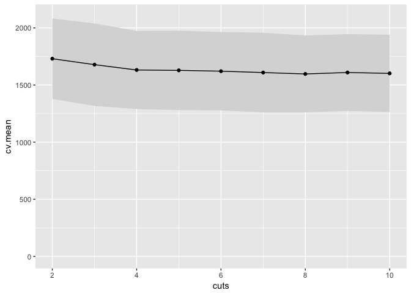
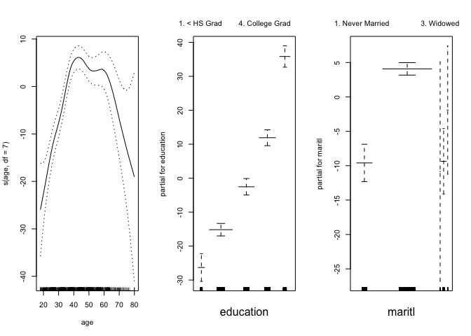
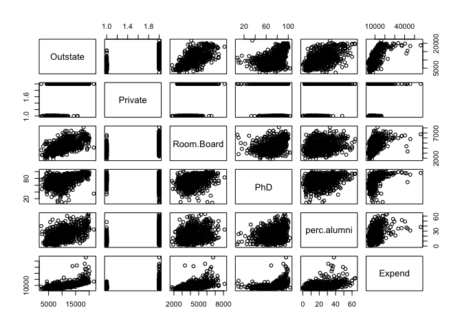

# Chapter 7

6, 7, 8, 9

## Q6

_6. In this exercise, you will further analyze the Wage data set considered throughout this chapter._

_(a) Perform polynomial regression to predict wage using age. Use cross-validation to select the optimal degree d for the polynomial. What degree was chosen, and how does this compare to the results of hypothesis testing using ANOVA? Make a plot of the resulting polynomial fit to the data._


```r
library(ISLR)
library(tidyverse)
```

```
## ── Attaching packages ─────────── tidyverse 1.2.1 ──
```

```
## ✔ ggplot2 2.2.1     ✔ purrr   0.2.4
## ✔ tibble  1.3.4     ✔ dplyr   0.7.4
## ✔ tidyr   0.7.2     ✔ stringr 1.2.0
## ✔ readr   1.1.1     ✔ forcats 0.2.0
```

```
## ── Conflicts ────────────── tidyverse_conflicts() ──
## ✖ dplyr::filter() masks stats::filter()
## ✖ dplyr::lag()    masks stats::lag()
```

```r
library(broom)
library(splines)
library(gam)
```

```
## Warning: package 'gam' was built under R version 3.4.3
```

```
## Loading required package: foreach
```

```
## 
## Attaching package: 'foreach'
```

```
## The following objects are masked from 'package:purrr':
## 
##     accumulate, when
```

```
## Loaded gam 1.15
```

```r
library(leaps)
library(GGally)
```

```
## 
## Attaching package: 'GGally'
```

```
## The following object is masked from 'package:dplyr':
## 
##     nasa
```

```r
data(Wage)
?Wage
head(Wage)
```

```
##        year age           maritl     race       education
## 231655 2006  18 1. Never Married 1. White    1. < HS Grad
## 86582  2004  24 1. Never Married 1. White 4. College Grad
## 161300 2003  45       2. Married 1. White 3. Some College
## 155159 2003  43       2. Married 3. Asian 4. College Grad
## 11443  2005  50      4. Divorced 1. White      2. HS Grad
## 376662 2008  54       2. Married 1. White 4. College Grad
##                    region       jobclass         health health_ins
## 231655 2. Middle Atlantic  1. Industrial      1. <=Good      2. No
## 86582  2. Middle Atlantic 2. Information 2. >=Very Good      2. No
## 161300 2. Middle Atlantic  1. Industrial      1. <=Good     1. Yes
## 155159 2. Middle Atlantic 2. Information 2. >=Very Good     1. Yes
## 11443  2. Middle Atlantic 2. Information      1. <=Good     1. Yes
## 376662 2. Middle Atlantic 2. Information 2. >=Very Good     1. Yes
##         logwage      wage
## 231655 4.318063  75.04315
## 86582  4.255273  70.47602
## 161300 4.875061 130.98218
## 155159 5.041393 154.68529
## 11443  4.318063  75.04315
## 376662 4.845098 127.11574
```


```r
fits.poly <- tibble(degree=1:15)
fitpoly <- function(degree,data=Wage) {
  lm(wage ~ poly(age,degree=degree), data=data)
}
fits.poly <- fits.poly %>% mutate(fit=map(degree, fitpoly))
fits.poly # a column of models...
```

```
## # A tibble: 15 x 2
##    degree      fit
##     <int>   <list>
##  1      1 <S3: lm>
##  2      2 <S3: lm>
##  3      3 <S3: lm>
##  4      4 <S3: lm>
##  5      5 <S3: lm>
##  6      6 <S3: lm>
##  7      7 <S3: lm>
##  8      8 <S3: lm>
##  9      9 <S3: lm>
## 10     10 <S3: lm>
## 11     11 <S3: lm>
## 12     12 <S3: lm>
## 13     13 <S3: lm>
## 14     14 <S3: lm>
## 15     15 <S3: lm>
```

some stats for each model

```r
fits.poly <- fits.poly %>% mutate(glance=map(fit,glance))
fits.poly %>% unnest(glance)
```

```
## # A tibble: 15 x 13
##    degree      fit  r.squared adj.r.squared    sigma statistic
##     <int>   <list>      <dbl>         <dbl>    <dbl>     <dbl>
##  1      1 <S3: lm> 0.03827391    0.03795313 40.92907 119.31172
##  2      2 <S3: lm> 0.08208515    0.08147259 39.99262 134.00436
##  3      3 <S3: lm> 0.08510227    0.08418615 39.93350  92.89432
##  4      4 <S3: lm> 0.08626467    0.08504433 39.91479  70.68860
##  5      5 <S3: lm> 0.08651028    0.08498474 39.91608  56.70820
##  6      6 <S3: lm> 0.08726328    0.08543354 39.90629  47.69156
##  7      7 <S3: lm> 0.08775260    0.08561834 39.90226  41.11601
##  8      8 <S3: lm> 0.08777686    0.08533695 39.90840  35.97538
##  9      9 <S3: lm> 0.08911815    0.08637636 39.88572  32.50370
## 10     10 <S3: lm> 0.08911865    0.08607121 39.89238  29.24373
## 11     11 <S3: lm> 0.08913841    0.08578518 39.89862  26.58278
## 12     12 <S3: lm> 0.08913972    0.08548042 39.90527  24.35979
## 13     13 <S3: lm> 0.08917601    0.08521060 39.91116  22.48848
## 14     14 <S3: lm> 0.08922245    0.08495080 39.91683  20.88710
## 15     15 <S3: lm> 0.08937462    0.08479708 39.92018  19.52459
## # ... with 7 more variables: p.value <dbl>, df <int>, logLik <dbl>,
## #   AIC <dbl>, BIC <dbl>, deviance <dbl>, df.residual <int>
```


```r
fits.poly$fit %>% do.call(anova,.)
```

```
## Analysis of Variance Table
## 
## Model  1: wage ~ poly(age, degree = degree)
## Model  2: wage ~ poly(age, degree = degree)
## Model  3: wage ~ poly(age, degree = degree)
## Model  4: wage ~ poly(age, degree = degree)
## Model  5: wage ~ poly(age, degree = degree)
## Model  6: wage ~ poly(age, degree = degree)
## Model  7: wage ~ poly(age, degree = degree)
## Model  8: wage ~ poly(age, degree = degree)
## Model  9: wage ~ poly(age, degree = degree)
## Model 10: wage ~ poly(age, degree = degree)
## Model 11: wage ~ poly(age, degree = degree)
## Model 12: wage ~ poly(age, degree = degree)
## Model 13: wage ~ poly(age, degree = degree)
## Model 14: wage ~ poly(age, degree = degree)
## Model 15: wage ~ poly(age, degree = degree)
##    Res.Df     RSS Df Sum of Sq        F    Pr(>F)    
## 1    2998 5022216                                    
## 2    2997 4793430  1    228786 143.5637 < 2.2e-16 ***
## 3    2996 4777674  1     15756   9.8867  0.001681 ** 
## 4    2995 4771604  1      6070   3.8090  0.051070 .  
## 5    2994 4770322  1      1283   0.8048  0.369731    
## 6    2993 4766389  1      3932   2.4675  0.116329    
## 7    2992 4763834  1      2555   1.6034  0.205515    
## 8    2991 4763707  1       127   0.0795  0.778016    
## 9    2990 4756703  1      7004   4.3952  0.036124 *  
## 10   2989 4756701  1         3   0.0017  0.967552    
## 11   2988 4756597  1       103   0.0648  0.799144    
## 12   2987 4756591  1         7   0.0043  0.947923    
## 13   2986 4756401  1       190   0.1189  0.730224    
## 14   2985 4756158  1       243   0.1522  0.696488    
## 15   2984 4755364  1       795   0.4986  0.480151    
## ---
## Signif. codes:  0 '***' 0.001 '**' 0.01 '*' 0.05 '.' 0.1 ' ' 1
```

So...anova suggests that degree=3 is best.  This also is consistent with the adjusted R-squared.

get predictions from degree=3 model

```r
pred.df <- tibble(age=seq(min(Wage$age),max(Wage$age),by=1))
pred.df <- cbind(pred.df, predict(fits.poly$fit[[3]], newdata=pred.df, se.fit=TRUE))
pred.df <- pred.df %>% mutate(upper.95 = fit + 2*se.fit, lower.95 = fit - 2*se.fit)
```

plot it

```r
ggplot(pred.df,aes(x=age,y=fit,ymin=lower.95,ymax=upper.95)) +
  geom_ribbon(fill="gray70") +
  geom_line(color="red",lwd=2) +
  geom_point(aes(y=wage,x=age),shape=1,data=Wage,inherit.aes=FALSE) +
  ylab("wage")
```

<!-- -->


_(b) Fit a step function to predict wage using age, and perform cross-validation to choose the optimal number of cuts. Make a plot of the fit obtained._


```r
fits.cut <- tibble(cuts=2:10)
fitcut<- function(cuts,data=Wage) {
  lm(wage ~ cut(age,cuts), data=Wage)
}
fits.cut <- fits.cut %>% mutate(fit=map(cuts, fitcut))
fits.cut # a column of models...
```

```
## # A tibble: 9 x 2
##    cuts      fit
##   <int>   <list>
## 1     2 <S3: lm>
## 2     3 <S3: lm>
## 3     4 <S3: lm>
## 4     5 <S3: lm>
## 5     6 <S3: lm>
## 6     7 <S3: lm>
## 7     8 <S3: lm>
## 8     9 <S3: lm>
## 9    10 <S3: lm>
```

some stats for each model

```r
fits.cut <- fits.cut %>% mutate(glance=map(fit,glance))
fits.cut %>% unnest(glance)
```

```
## # A tibble: 9 x 13
##    cuts      fit   r.squared adj.r.squared    sigma statistic      p.value
##   <int>   <list>       <dbl>         <dbl>    <dbl>     <dbl>        <dbl>
## 1     2 <S3: lm> 0.005162302   0.004830469 41.62769  15.55689 8.189293e-05
## 2     3 <S3: lm> 0.035280911   0.034637121 40.99955  54.80191 4.214119e-24
## 3     4 <S3: lm> 0.062497696   0.061558942 40.42381  66.57516 1.134957e-41
## 4     5 <S3: lm> 0.065578767   0.064330792 40.36407  52.54814 7.659863e-43
## 5     6 <S3: lm> 0.070874490   0.069322844 40.25625  45.67698 1.344364e-45
## 6     7 <S3: lm> 0.078240355   0.076392524 40.10306  42.34173 7.835420e-50
## 7     8 <S3: lm> 0.084667276   0.082525789 39.96968  39.53668 1.846433e-53
## 8     9 <S3: lm> 0.079902165   0.077441188 40.08028  32.46766 2.395788e-49
## 9    10 <S3: lm> 0.083644897   0.080886637 40.00537  30.32525 3.741111e-51
## # ... with 6 more variables: df <int>, logLik <dbl>, AIC <dbl>, BIC <dbl>,
## #   deviance <dbl>, df.residual <int>
```

cross validation

```r
k <- 10
folds <- sample(1:k,nrow(Wage),replace = TRUE)

fitcut.cv <- function(cuts,folds,data=Wage) {
  sapply(1:max(folds), function(fold) {
    data$cut <- cut(data$age,cuts)
    train=data[folds!=fold,]
    test=data[folds==fold,]
    fit <- lm(wage ~ cut, data=train)
    pred.cv <- predict(fit,newdata=test)
    MSE <- (test$wage-pred.cv)^2 %>% mean()
    MSE
  }
  )
}

cv.results <- sapply(2:10,fitcut.cv,folds)

cv.results
```

```
##           [,1]     [,2]     [,3]     [,4]     [,5]     [,6]     [,7]
##  [1,] 1789.760 1694.445 1641.472 1654.164 1629.236 1625.916 1633.645
##  [2,] 1608.166 1574.874 1529.399 1502.763 1513.206 1485.304 1481.303
##  [3,] 1694.251 1594.993 1557.811 1574.298 1558.893 1511.503 1519.117
##  [4,] 1183.803 1122.102 1119.336 1108.400 1105.101 1102.981 1111.653
##  [5,] 1844.991 1799.086 1728.570 1705.251 1727.616 1711.965 1706.871
##  [6,] 1606.471 1565.766 1488.656 1509.253 1490.931 1480.913 1453.519
##  [7,] 2413.730 2372.942 2315.703 2306.326 2271.979 2274.437 2273.276
##  [8,] 1552.561 1526.140 1517.506 1471.466 1500.999 1494.722 1486.216
##  [9,] 1444.596 1381.661 1354.548 1355.634 1322.183 1306.925 1295.013
## [10,] 2164.282 2151.193 2063.406 2094.431 2090.780 2096.459 2008.043
##           [,8]     [,9]
##  [1,] 1648.571 1629.973
##  [2,] 1513.930 1494.034
##  [3,] 1529.397 1528.282
##  [4,] 1114.264 1101.578
##  [5,] 1726.634 1689.981
##  [6,] 1479.359 1492.457
##  [7,] 2268.434 2254.447
##  [8,] 1465.314 1460.202
##  [9,] 1314.694 1307.281
## [10,] 2034.416 2060.776
```

```r
cv.summary <- tibble(
  cuts = 2:10,
  cv.mean = colMeans(cv.results),
  cv.se = apply(cv.results,2,sd),
  cv.upper=cv.mean+cv.se,
  cv.lower=cv.mean-cv.se)

cv.summary
```

```
## # A tibble: 9 x 5
##    cuts  cv.mean    cv.se cv.upper cv.lower
##   <int>    <dbl>    <dbl>    <dbl>    <dbl>
## 1     2 1730.261 352.0627 2082.324 1378.198
## 2     3 1678.320 360.8340 2039.154 1317.486
## 3     4 1631.641 341.9659 1973.607 1289.675
## 4     5 1628.199 347.3193 1975.518 1280.879
## 5     6 1621.092 342.8866 1963.979 1278.206
## 6     7 1609.112 348.4708 1957.583 1260.642
## 7     8 1596.866 336.4502 1933.316 1260.415
## 8     9 1609.501 335.8968 1945.398 1273.604
## 9    10 1601.901 338.4874 1940.388 1263.414
```

```r
cv.summary %>% ggplot(aes(x=cuts,y=cv.mean,ymax=cv.upper,ymin=cv.lower)) +
  geom_ribbon(fill="gray85") +
  geom_point() +
  geom_line() +
  ylim(c(0,2100))
```

<!-- -->

Choose 4 cuts; this is where it starts to level off.  Arguably could choose 2 based on the 1SE rule, or 8 based on minimum.

Predict and plot for cuts=4


```r
pred.df <- tibble(age=seq(min(Wage$age),max(Wage$age),by=1))
pred.df <- cbind(pred.df, predict(fits.cut$fit[[3]], newdata=pred.df, se.fit=TRUE))
pred.df <- pred.df %>% mutate(upper.95 = fit + 2*se.fit, lower.95 = fit - 2*se.fit)
```

plot it

```r
ggplot(pred.df,aes(x=age,y=fit,ymin=lower.95,ymax=upper.95)) +
  geom_ribbon(fill="gray70") +
  geom_line(color="red",lwd=2) +
  geom_point(aes(y=wage,x=age),shape=1,data=Wage,inherit.aes=FALSE) +
  ylab("wage")
```

<!-- -->


```r
summary(fits.cut$fit[[3]])
```

```
## 
## Call:
## lm(formula = wage ~ cut(age, cuts), data = Wage)
## 
## Residuals:
##     Min      1Q  Median      3Q     Max 
## -98.126 -24.803  -6.177  16.493 200.519 
## 
## Coefficients:
##                           Estimate Std. Error t value Pr(>|t|)    
## (Intercept)                 94.158      1.476  63.790   <2e-16 ***
## cut(age, cuts)(33.5,49]     24.053      1.829  13.148   <2e-16 ***
## cut(age, cuts)(49,64.5]     23.665      2.068  11.443   <2e-16 ***
## cut(age, cuts)(64.5,80.1]    7.641      4.987   1.532    0.126    
## ---
## Signif. codes:  0 '***' 0.001 '**' 0.01 '*' 0.05 '.' 0.1 ' ' 1
## 
## Residual standard error: 40.42 on 2996 degrees of freedom
## Multiple R-squared:  0.0625,	Adjusted R-squared:  0.06156 
## F-statistic: 66.58 on 3 and 2996 DF,  p-value: < 2.2e-16
```

## Q7

_7. The Wage data set contains a number of other features not explored in this chapter, such as marital status (maritl), job class (jobclass), and others. Explore the relationships between some of these other predictors and wage, and use non-linear fitting techniques in order to fit flexible models to the data. Create plots of the results obtained, and write a summary of your findings._

First make a plot...


```r
pairs(Wage)
```

<!-- -->

Looks like the potentially interesting variables are maritil, race, and education


```r
Wage %>% select(wage,maritl, race, education, health) %>% pairs()
```

<!-- -->

OK this doesn't really make since because the rest of these are categorical. but anyway...

### polynomials

```r
fit1 <- lm(wage ~ poly(age,3) + poly(as.numeric(maritl),3) + poly(as.numeric(race),3) + poly(as.numeric(education),3) ,data=na.omit(Wage))

summary(fit1)
```

```
## 
## Call:
## lm(formula = wage ~ poly(age, 3) + poly(as.numeric(maritl), 3) + 
##     poly(as.numeric(race), 3) + poly(as.numeric(education), 3), 
##     data = na.omit(Wage))
## 
## Residuals:
##      Min       1Q   Median       3Q      Max 
## -116.500  -19.369   -2.962   14.446  215.334 
## 
## Coefficients:
##                                  Estimate Std. Error t value Pr(>|t|)    
## (Intercept)                      111.7036     0.6355 175.764  < 2e-16 ***
## poly(age, 3)1                    254.4105    39.8581   6.383 2.01e-10 ***
## poly(age, 3)2                   -298.4509    36.8482  -8.099 7.96e-16 ***
## poly(age, 3)3                     40.4813    35.2987   1.147   0.2515    
## poly(as.numeric(maritl), 3)1      37.2831    38.0869   0.979   0.3277    
## poly(as.numeric(maritl), 3)2    -275.4176    38.8004  -7.098 1.57e-12 ***
## poly(as.numeric(maritl), 3)3     179.3109    35.1242   5.105 3.51e-07 ***
## poly(as.numeric(race), 3)1       -86.3864    35.0224  -2.467   0.0137 *  
## poly(as.numeric(race), 3)2        19.2403    35.0764   0.549   0.5834    
## poly(as.numeric(race), 3)3       -21.0389    35.5122  -0.592   0.5536    
## poly(as.numeric(education), 3)1 1013.1259    35.7035  28.376  < 2e-16 ***
## poly(as.numeric(education), 3)2  163.0289    35.1238   4.642 3.61e-06 ***
## poly(as.numeric(education), 3)3   61.7761    34.8832   1.771   0.0767 .  
## ---
## Signif. codes:  0 '***' 0.001 '**' 0.01 '*' 0.05 '.' 0.1 ' ' 1
## 
## Residual standard error: 34.81 on 2987 degrees of freedom
## Multiple R-squared:  0.3069,	Adjusted R-squared:  0.3041 
## F-statistic: 110.2 on 12 and 2987 DF,  p-value: < 2.2e-16
```


```r
fit2  <- lm(wage ~ poly(age,2) + poly(as.numeric(maritl),3) + poly(as.numeric(race),1) + poly(as.numeric(education),2) ,data=Wage)

summary(fit2)
```

```
## 
## Call:
## lm(formula = wage ~ poly(age, 2) + poly(as.numeric(maritl), 3) + 
##     poly(as.numeric(race), 1) + poly(as.numeric(education), 2), 
##     data = Wage)
## 
## Residuals:
##      Min       1Q   Median       3Q      Max 
## -115.588  -19.458   -3.151   14.325  214.851 
## 
## Coefficients:
##                                  Estimate Std. Error t value Pr(>|t|)    
## (Intercept)                      111.7036     0.6356 175.737  < 2e-16 ***
## poly(age, 2)1                    249.7418    39.5876   6.309 3.23e-10 ***
## poly(age, 2)2                   -296.8773    36.7975  -8.068 1.03e-15 ***
## poly(as.numeric(maritl), 3)1      41.2269    37.9135   1.087   0.2770    
## poly(as.numeric(maritl), 3)2    -286.5584    38.2006  -7.501 8.28e-14 ***
## poly(as.numeric(maritl), 3)3     179.4111    35.0700   5.116 3.32e-07 ***
## poly(as.numeric(race), 1)        -86.6486    34.9979  -2.476   0.0133 *  
## poly(as.numeric(education), 2)1 1017.7974    35.2403  28.882  < 2e-16 ***
## poly(as.numeric(education), 2)2  165.6256    35.0303   4.728 2.37e-06 ***
## ---
## Signif. codes:  0 '***' 0.001 '**' 0.01 '*' 0.05 '.' 0.1 ' ' 1
## 
## Residual standard error: 34.81 on 2991 degrees of freedom
## Multiple R-squared:  0.3058,	Adjusted R-squared:  0.3039 
## F-statistic: 164.7 on 8 and 2991 DF,  p-value: < 2.2e-16
```

cross validation

```r
fit.cv <- function(folds,data=Wage) {
  sapply(1:max(folds), function(fold) {
    train=data[folds!=fold,]
    test=data[folds==fold,]
    fit <- lm(wage ~ poly(age,2) + poly(as.numeric(maritl),3) + poly(as.numeric(race),1) + poly(as.numeric(education),2) ,data=train)
    pred.cv <- predict(fit,newdata=test)
    MSE <- (test$wage-pred.cv)^2 %>% mean()
    MSE
  }
  )
}

cv.results <- fit.cv(folds)

cat("MSE: ",mean(cv.results),"\n")
```

```
## MSE:  1212.619
```

```r
cat("SE of MSE: ",sd(cv.results),"\n")
```

```
## SE of MSE:  260.9214
```

This is a better fit than obtained above.

### splines


```r
fit3 <- lm(wage ~ ns(age,5) + ns(as.numeric(maritl),4) + ns(as.numeric(race),3) + ns(as.numeric(education),4) ,data=Wage)

summary(fit3)
```

```
## 
## Call:
## lm(formula = wage ~ ns(age, 5) + ns(as.numeric(maritl), 4) + 
##     ns(as.numeric(race), 3) + ns(as.numeric(education), 4), data = Wage)
## 
## Residuals:
##      Min       1Q   Median       3Q      Max 
## -116.223  -19.108   -3.069   14.291  215.116 
## 
## Coefficients: (3 not defined because of singularities)
##                               Estimate Std. Error t value Pr(>|t|)    
## (Intercept)                     44.517      5.591   7.962 2.39e-15 ***
## ns(age, 5)1                     32.162      4.574   7.031 2.53e-12 ***
## ns(age, 5)2                     27.338      5.360   5.100 3.60e-07 ***
## ns(age, 5)3                     24.690      4.604   5.363 8.80e-08 ***
## ns(age, 5)4                     29.892     10.983   2.722  0.00653 ** 
## ns(age, 5)5                      0.528      8.377   0.063  0.94975    
## ns(as.numeric(maritl), 4)1      13.406      1.859   7.210 7.04e-13 ***
## ns(as.numeric(maritl), 4)2     -17.858     10.655  -1.676  0.09383 .  
## ns(as.numeric(maritl), 4)3      13.421     10.643   1.261  0.20743    
## ns(as.numeric(maritl), 4)4          NA         NA      NA       NA    
## ns(as.numeric(race), 3)1        17.154      7.276   2.358  0.01846 *  
## ns(as.numeric(race), 3)2            NA         NA      NA       NA    
## ns(as.numeric(race), 3)3            NA         NA      NA       NA    
## ns(as.numeric(education), 4)1   23.856      3.164   7.539 6.24e-14 ***
## ns(as.numeric(education), 4)2   32.753      2.639  12.411  < 2e-16 ***
## ns(as.numeric(education), 4)3   62.111      4.930  12.598  < 2e-16 ***
## ns(as.numeric(education), 4)4   56.441      2.126  26.552  < 2e-16 ***
## ---
## Signif. codes:  0 '***' 0.001 '**' 0.01 '*' 0.05 '.' 0.1 ' ' 1
## 
## Residual standard error: 34.79 on 2986 degrees of freedom
## Multiple R-squared:  0.3081,	Adjusted R-squared:  0.3051 
## F-statistic: 102.3 on 13 and 2986 DF,  p-value: < 2.2e-16
```


```r
fit4 <- lm(wage ~ ns(age,2) + ns(as.numeric(maritl),2) + ns(as.numeric(race),1) + ns(as.numeric(education),4) ,data=Wage)

summary(fit4)
```

```
## 
## Call:
## lm(formula = wage ~ ns(age, 2) + ns(as.numeric(maritl), 2) + 
##     ns(as.numeric(race), 1) + ns(as.numeric(education), 4), data = Wage)
## 
## Residuals:
##      Min       1Q   Median       3Q      Max 
## -116.839  -19.467   -2.892   14.443  214.243 
## 
## Coefficients:
##                               Estimate Std. Error t value Pr(>|t|)    
## (Intercept)                     52.849      3.053  17.312  < 2e-16 ***
## ns(age, 2)1                     51.027      5.454   9.355  < 2e-16 ***
## ns(age, 2)2                    -13.946      4.764  -2.928  0.00344 ** 
## ns(as.numeric(maritl), 2)1      21.008      4.411   4.763 2.00e-06 ***
## ns(as.numeric(maritl), 2)2     -15.962      3.487  -4.578 4.90e-06 ***
## ns(as.numeric(race), 1)         -9.119      3.822  -2.386  0.01710 *  
## ns(as.numeric(education), 4)1   23.090      3.167   7.291 3.93e-13 ***
## ns(as.numeric(education), 4)2   32.179      2.641  12.186  < 2e-16 ***
## ns(as.numeric(education), 4)3   60.671      4.935  12.294  < 2e-16 ***
## ns(as.numeric(education), 4)4   56.420      2.125  26.545  < 2e-16 ***
## ---
## Signif. codes:  0 '***' 0.001 '**' 0.01 '*' 0.05 '.' 0.1 ' ' 1
## 
## Residual standard error: 34.91 on 2990 degrees of freedom
## Multiple R-squared:  0.3024,	Adjusted R-squared:  0.3003 
## F-statistic:   144 on 9 and 2990 DF,  p-value: < 2.2e-16
```

cross validation

```r
fit.cv <- function(folds,data=Wage) {
  sapply(1:max(folds), function(fold) {
    train=data[folds!=fold,]
    test=data[folds==fold,]
    fit <- lm(wage ~ ns(age,2) + ns(as.numeric(maritl),2) + ns(as.numeric(race),1) + ns(as.numeric(education),4) ,data=train)
    pred.cv <- predict(fit,newdata=test)
    MSE <- (test$wage-pred.cv)^2 %>% mean()
    MSE
  }
  )
}

cv.results <- fit.cv(folds)

cat("MSE: ",mean(cv.results),"\n")
```

```
## MSE:  1219.178
```

```r
cat("SE of MSE: ",sd(cv.results),"\n")
```

```
## SE of MSE:  257.4292
```

Now that I have read more of the book it is clear that the above several fits were general additive models.  Let's try again, using the GAM function


```r
gam1 <- gam(wage ~ s(age,df=7) + education + maritl + race, data=Wage)
summary(gam1)
```

```
## 
## Call: gam(formula = wage ~ s(age, df = 7) + education + maritl + race, 
##     data = Wage)
## Deviance Residuals:
##      Min       1Q   Median       3Q      Max 
## -117.151  -19.340   -2.919   14.156  215.712 
## 
## (Dispersion Parameter for gaussian family taken to be 1210.274)
## 
##     Null Deviance: 5222086 on 2999 degrees of freedom
## Residual Deviance: 3607827 on 2981 degrees of freedom
## AIC: 29830.38 
## 
## Number of Local Scoring Iterations: 2 
## 
## Anova for Parametric Effects
##                  Df  Sum Sq Mean Sq  F value  Pr(>F)    
## s(age, df = 7)    1  199870  199870 165.1442 < 2e-16 ***
## education         4 1092399  273100 225.6511 < 2e-16 ***
## maritl            4  101776   25444  21.0234 < 2e-16 ***
## race              3    7866    2622   2.1666 0.08991 .  
## Residuals      2981 3607827    1210                     
## ---
## Signif. codes:  0 '***' 0.001 '**' 0.01 '*' 0.05 '.' 0.1 ' ' 1
## 
## Anova for Nonparametric Effects
##                Npar Df Npar F     Pr(F)    
## (Intercept)                                
## s(age, df = 7)       6 12.223 1.255e-13 ***
## education                                  
## maritl                                     
## race                                       
## ---
## Signif. codes:  0 '***' 0.001 '**' 0.01 '*' 0.05 '.' 0.1 ' ' 1
```

```r
gam2 <- gam(wage ~ s(age,df=7) + education + maritl, data=Wage)
summary(gam2)
```

```
## 
## Call: gam(formula = wage ~ s(age, df = 7) + education + maritl, data = Wage)
## Deviance Residuals:
##     Min      1Q  Median      3Q     Max 
## -116.41  -19.23   -3.02   14.10  212.17 
## 
## (Dispersion Parameter for gaussian family taken to be 1211.664)
## 
##     Null Deviance: 5222086 on 2999 degrees of freedom
## Residual Deviance: 3615606 on 2984 degrees of freedom
## AIC: 29830.84 
## 
## Number of Local Scoring Iterations: 2 
## 
## Anova for Parametric Effects
##                  Df  Sum Sq Mean Sq F value    Pr(>F)    
## s(age, df = 7)    1  199870  199870 164.955 < 2.2e-16 ***
## education         4 1092544  273136 225.422 < 2.2e-16 ***
## maritl            4  101647   25412  20.973 < 2.2e-16 ***
## Residuals      2984 3615606    1212                      
## ---
## Signif. codes:  0 '***' 0.001 '**' 0.01 '*' 0.05 '.' 0.1 ' ' 1
## 
## Anova for Nonparametric Effects
##                Npar Df Npar F     Pr(F)    
## (Intercept)                                
## s(age, df = 7)       6 12.418 7.305e-14 ***
## education                                  
## maritl                                     
## ---
## Signif. codes:  0 '***' 0.001 '**' 0.01 '*' 0.05 '.' 0.1 ' ' 1
```

```r
anova(gam1,gam2)
```

```
## Analysis of Deviance Table
## 
## Model 1: wage ~ s(age, df = 7) + education + maritl + race
## Model 2: wage ~ s(age, df = 7) + education + maritl
##   Resid. Df Resid. Dev Df Deviance Pr(>Chi)  
## 1      2981    3607827                       
## 2      2984    3615606 -3  -7779.1  0.09256 .
## ---
## Signif. codes:  0 '***' 0.001 '**' 0.01 '*' 0.05 '.' 0.1 ' ' 1
```

```r
op <- par(mfrow=c(1,3))
plot(gam2,se=TRUE)
```

<!-- -->

```r
par(op)
```


## Q8

## Q9

_This question uses the variables dis (the weighted mean of distances to five Boston employment centers) and nox (nitrogen oxides concentration in parts per 10 million) from the Boston data. We will treat dis as the predictor and nox as the response._


```r
data(Boston,package = "MASS")
qplot(Boston$dis, Boston$nox)
```

<!-- -->

_(a) Use the poly() function to fit a cubic polynomial regression to predict nox using dis. Report the regression output, and plot the resulting data and polynomial fits._


```r
fit9a <- lm(nox ~ poly(dis,3), data=Boston)
summary(fit9a)
```

```
## 
## Call:
## lm(formula = nox ~ poly(dis, 3), data = Boston)
## 
## Residuals:
##       Min        1Q    Median        3Q       Max 
## -0.121130 -0.040619 -0.009738  0.023385  0.194904 
## 
## Coefficients:
##                Estimate Std. Error t value Pr(>|t|)    
## (Intercept)    0.554695   0.002759 201.021  < 2e-16 ***
## poly(dis, 3)1 -2.003096   0.062071 -32.271  < 2e-16 ***
## poly(dis, 3)2  0.856330   0.062071  13.796  < 2e-16 ***
## poly(dis, 3)3 -0.318049   0.062071  -5.124 4.27e-07 ***
## ---
## Signif. codes:  0 '***' 0.001 '**' 0.01 '*' 0.05 '.' 0.1 ' ' 1
## 
## Residual standard error: 0.06207 on 502 degrees of freedom
## Multiple R-squared:  0.7148,	Adjusted R-squared:  0.7131 
## F-statistic: 419.3 on 3 and 502 DF,  p-value: < 2.2e-16
```

```r
dis.grid <- seq(min(Boston$dis), max(Boston$dis), by=0.1)
pred.9a <- as.data.frame(predict(fit9a, newdata = list(dis=dis.grid),se=TRUE)) %>%
  select(-df, -residual.scale)
pred.9a$dis <- dis.grid
head(pred.9a)
```

```
##         fit      se.fit    dis
## 1 0.7551526 0.008283080 1.1296
## 2 0.7417479 0.007532891 1.2296
## 3 0.7287166 0.006841704 1.3296
## 4 0.7160531 0.006211142 1.4296
## 5 0.7037523 0.005643231 1.5296
## 6 0.6918089 0.005140319 1.6296
```


```r
pl <- ggplot(pred.9a,aes(x=dis,y=fit, ymin=fit-se.fit, ymax=fit+se.fit)) +
  geom_ribbon(fill="gray85") +
  geom_line(color="blue") +
  geom_point(aes(x=dis, y=nox), data=Boston, shape=1, inherit.aes = FALSE)
pl
```

<!-- -->


_(b) Plot the polynomial fits for a range of different polynomial degrees (say, from 1 to 10), and report the associated residual sum of squares._


```r
fitpoly <- function(degree,data) {
  lm(nox ~ poly(dis,degree=degree), data=data)
}

fits.9b <- tibble(degree=1:10)
fits.9b <- fits.9b %>% mutate(fit=map(degree,fitpoly,Boston))
fits.9b %>% mutate(glance=map(fit,glance)) %>% unnest(glance)
```

```
## # A tibble: 10 x 13
##    degree      fit r.squared adj.r.squared      sigma statistic
##     <int>   <list>     <dbl>         <dbl>      <dbl>     <dbl>
##  1      1 <S3: lm> 0.5917150     0.5909049 0.07411599  730.4317
##  2      2 <S3: lm> 0.6998562     0.6986628 0.06361011  586.4317
##  3      3 <S3: lm> 0.7147737     0.7130692 0.06207094  419.3354
##  4      4 <S3: lm> 0.7149397     0.7126638 0.06211478  314.1307
##  5      5 <S3: lm> 0.7175487     0.7147242 0.06189168  254.0433
##  6      6 <S3: lm> 0.7230100     0.7196794 0.06135179  217.0848
##  7      7 <S3: lm> 0.7272533     0.7234195 0.06094114  189.6957
##  8      8 <S3: lm> 0.7292963     0.7249389 0.06077351  167.3695
##  9      9 <S3: lm> 0.7296354     0.7247295 0.06079664  148.7288
## 10     10 <S3: lm> 0.7298064     0.7243479 0.06083877  133.7020
## # ... with 7 more variables: p.value <dbl>, df <int>, logLik <dbl>,
## #   AIC <dbl>, BIC <dbl>, deviance <dbl>, df.residual <int>
```


```r
make.plot <- function(fit) {
  
  pred.tmp <- as.data.frame(predict(fit, newdata = list(dis=dis.grid),se=TRUE)) %>%
  select(-df, -residual.scale)
pred.tmp$dis <- dis.grid
  
  ggplot(pred.tmp,aes(x=dis,y=fit, ymin=fit-se.fit, ymax=fit+se.fit)) +
  geom_ribbon(fill="gray85") +
  geom_line(color="blue") +
  geom_point(aes(x=dis, y=nox), data=Boston, shape=1, inherit.aes = FALSE)
}

for(i in 1:10) {
  print(make.plot(fits.9b$fit[[i]]))
}
```


_(c) Perform cross-validation or another approach to select the optimal degree for the polynomial, and explain your results._

_(d) Use the bs() function to fit a regression spline to predict nox using dis. Report the output for the fit using four degrees of freedom. How did you choose the knots? Plot the resulting fit._

_(e) Now fit a regression spline for a range of degrees of freedom, and plot the resulting fits and report the resulting RSS. Describe the results obtained._

_(f) Perform cross-validation or another approach in order to select the best degrees of freedom for a regression spline on this data. Describe your results._

## Q 10

_This question relates to the College data set._

_(a) Split the data into a training set and a test set. Using out-of-state tuition as the response and the other variables as the predictors, perform forward stepwise selection on the training set in order to identify a satisfactory model that uses just a subset of the predictors._


```r
data(College)
college <- as_tibble(College)
college
```

```
## # A tibble: 777 x 18
##    Private  Apps Accept Enroll Top10perc Top25perc F.Undergrad P.Undergrad
##  *  <fctr> <dbl>  <dbl>  <dbl>     <dbl>     <dbl>       <dbl>       <dbl>
##  1     Yes  1660   1232    721        23        52        2885         537
##  2     Yes  2186   1924    512        16        29        2683        1227
##  3     Yes  1428   1097    336        22        50        1036          99
##  4     Yes   417    349    137        60        89         510          63
##  5     Yes   193    146     55        16        44         249         869
##  6     Yes   587    479    158        38        62         678          41
##  7     Yes   353    340    103        17        45         416         230
##  8     Yes  1899   1720    489        37        68        1594          32
##  9     Yes  1038    839    227        30        63         973         306
## 10     Yes   582    498    172        21        44         799          78
## # ... with 767 more rows, and 10 more variables: Outstate <dbl>,
## #   Room.Board <dbl>, Books <dbl>, Personal <dbl>, PhD <dbl>,
## #   Terminal <dbl>, S.F.Ratio <dbl>, perc.alumni <dbl>, Expend <dbl>,
## #   Grad.Rate <dbl>
```

```r
set.seed(123)
train.vector <- sample(c(TRUE,FALSE),nrow(college),replace = TRUE)
college.train <- college %>% filter(train.vector)
college.test <- college %>% filter(!train.vector)
```


```r
fs1 <- regsubsets(Outstate ~ ., data=college.train, nvmax=17, method = "forward")
(fs1.sum <- summary(fs1))
```

```
## Subset selection object
## Call: regsubsets.formula(Outstate ~ ., data = college.train, nvmax = 17, 
##     method = "forward")
## 17 Variables  (and intercept)
##             Forced in Forced out
## PrivateYes      FALSE      FALSE
## Apps            FALSE      FALSE
## Accept          FALSE      FALSE
## Enroll          FALSE      FALSE
## Top10perc       FALSE      FALSE
## Top25perc       FALSE      FALSE
## F.Undergrad     FALSE      FALSE
## P.Undergrad     FALSE      FALSE
## Room.Board      FALSE      FALSE
## Books           FALSE      FALSE
## Personal        FALSE      FALSE
## PhD             FALSE      FALSE
## Terminal        FALSE      FALSE
## S.F.Ratio       FALSE      FALSE
## perc.alumni     FALSE      FALSE
## Expend          FALSE      FALSE
## Grad.Rate       FALSE      FALSE
## 1 subsets of each size up to 17
## Selection Algorithm: forward
##           PrivateYes Apps Accept Enroll Top10perc Top25perc F.Undergrad
## 1  ( 1 )  " "        " "  " "    " "    " "       " "       " "        
## 2  ( 1 )  "*"        " "  " "    " "    " "       " "       " "        
## 3  ( 1 )  "*"        " "  " "    " "    " "       " "       " "        
## 4  ( 1 )  "*"        " "  " "    " "    " "       " "       " "        
## 5  ( 1 )  "*"        " "  " "    " "    " "       " "       " "        
## 6  ( 1 )  "*"        " "  " "    " "    " "       " "       " "        
## 7  ( 1 )  "*"        " "  " "    " "    " "       "*"       " "        
## 8  ( 1 )  "*"        " "  " "    " "    " "       "*"       " "        
## 9  ( 1 )  "*"        " "  " "    " "    " "       "*"       " "        
## 10  ( 1 ) "*"        " "  " "    " "    " "       "*"       " "        
## 11  ( 1 ) "*"        " "  " "    " "    " "       "*"       "*"        
## 12  ( 1 ) "*"        " "  "*"    " "    " "       "*"       "*"        
## 13  ( 1 ) "*"        "*"  "*"    " "    " "       "*"       "*"        
## 14  ( 1 ) "*"        "*"  "*"    " "    "*"       "*"       "*"        
## 15  ( 1 ) "*"        "*"  "*"    "*"    "*"       "*"       "*"        
## 16  ( 1 ) "*"        "*"  "*"    "*"    "*"       "*"       "*"        
## 17  ( 1 ) "*"        "*"  "*"    "*"    "*"       "*"       "*"        
##           P.Undergrad Room.Board Books Personal PhD Terminal S.F.Ratio
## 1  ( 1 )  " "         " "        " "   " "      " " " "      " "      
## 2  ( 1 )  " "         " "        " "   " "      " " " "      " "      
## 3  ( 1 )  " "         "*"        " "   " "      " " " "      " "      
## 4  ( 1 )  " "         "*"        " "   " "      " " " "      " "      
## 5  ( 1 )  " "         "*"        " "   " "      "*" " "      " "      
## 6  ( 1 )  " "         "*"        " "   "*"      "*" " "      " "      
## 7  ( 1 )  " "         "*"        " "   "*"      "*" " "      " "      
## 8  ( 1 )  " "         "*"        " "   "*"      "*" " "      " "      
## 9  ( 1 )  " "         "*"        " "   "*"      "*" " "      "*"      
## 10  ( 1 ) " "         "*"        " "   "*"      "*" "*"      "*"      
## 11  ( 1 ) " "         "*"        " "   "*"      "*" "*"      "*"      
## 12  ( 1 ) " "         "*"        " "   "*"      "*" "*"      "*"      
## 13  ( 1 ) " "         "*"        " "   "*"      "*" "*"      "*"      
## 14  ( 1 ) " "         "*"        " "   "*"      "*" "*"      "*"      
## 15  ( 1 ) " "         "*"        " "   "*"      "*" "*"      "*"      
## 16  ( 1 ) " "         "*"        "*"   "*"      "*" "*"      "*"      
## 17  ( 1 ) "*"         "*"        "*"   "*"      "*" "*"      "*"      
##           perc.alumni Expend Grad.Rate
## 1  ( 1 )  " "         "*"    " "      
## 2  ( 1 )  " "         "*"    " "      
## 3  ( 1 )  " "         "*"    " "      
## 4  ( 1 )  "*"         "*"    " "      
## 5  ( 1 )  "*"         "*"    " "      
## 6  ( 1 )  "*"         "*"    " "      
## 7  ( 1 )  "*"         "*"    " "      
## 8  ( 1 )  "*"         "*"    "*"      
## 9  ( 1 )  "*"         "*"    "*"      
## 10  ( 1 ) "*"         "*"    "*"      
## 11  ( 1 ) "*"         "*"    "*"      
## 12  ( 1 ) "*"         "*"    "*"      
## 13  ( 1 ) "*"         "*"    "*"      
## 14  ( 1 ) "*"         "*"    "*"      
## 15  ( 1 ) "*"         "*"    "*"      
## 16  ( 1 ) "*"         "*"    "*"      
## 17  ( 1 ) "*"         "*"    "*"
```

```r
plot(fs1)
```

<!-- -->


```r
fs.plot.frame <- tibble(predictors=1:17,fs1.sum$rsq, fs1.sum$adjr2, fs1.sum$cp, fs1.sum$bic) %>%
  gather(key="criterion",value="value",-predictors)
fs.plot.frame %>% ggplot(aes(x=predictors,y=value)) +
  geom_line() +
  facet_wrap(~criterion,scales="free_y")
```

<!-- -->

Could argue either for 5 or 12...

Look at Cross Validation


```r
#From ISLR book
predict.regsubsets  <- function (object ,newdata ,id ,...){
 form=as.formula(object$call [[2]])
 mat=model.matrix(form,newdata)
 coefi=coef(object ,id=id)
 xvars=names(coefi)
 mat[,xvars]%*%coefi}
```

create folds

```r
k <- 10
set.seed(1)
folds <- sample(1:k,nrow(college.train),replace=TRUE)
cv.errors <- matrix(NA,k,17, dimnames=list(NULL, paste(1:17)))
```

test the folds

```r
for(j in 1:k){
  best.fit <- regsubsets(Outstate ~ . , data=college.train[folds!=j,],nvmax = 17,method = "forward")
  for(i in 1:17) {
    pred=predict(best.fit, college.train[folds==j,],id=i)
    cv.errors[j,i] <- mean( (college.train$Outstate[folds==j]-pred)^2)
  } 
}
```

check the CV MSE

```r
(mean.cv.errors <- apply(cv.errors ,2,weighted.mean,table(folds)))
```

```
##       1       2       3       4       5       6       7       8       9 
## 9478606 6966789 5979198 5646098 5171726 5300532 4891357 4903222 4813270 
##      10      11      12      13      14      15      16      17 
## 4903179 4725048 4645698 4674671 4660074 4635947 4638714 4640661
```

```r
(sd.cv.errors <- apply(cv.errors, 2, sd))
```

```
##       1       2       3       4       5       6       7       8       9 
## 3471442 2857617 2025694 1629108 1503493 1647581 1341175 1426271 1351977 
##      10      11      12      13      14      15      16      17 
## 1784085 1725796 1729037 1781161 1763968 1715054 1727638 1729646
```

```r
plot(mean.cv.errors, type='b',ylim=range(c(mean.cv.errors+sd.cv.errors,mean.cv.errors-sd.cv.errors)))
arrows(1:17,mean.cv.errors+sd.cv.errors,1:17,mean.cv.errors-sd.cv.errors,angle = 90, code=3,length = .1)
```

<!-- -->

```r
which.min(mean.cv.errors)
```

```
## 15 
## 15
```

```r
mean.cv.errors < mean.cv.errors[16] + sd.cv.errors[16]
```

```
##     1     2     3     4     5     6     7     8     9    10    11    12 
## FALSE FALSE  TRUE  TRUE  TRUE  TRUE  TRUE  TRUE  TRUE  TRUE  TRUE  TRUE 
##    13    14    15    16    17 
##  TRUE  TRUE  TRUE  TRUE  TRUE
```

So...if we use minimum CV then we chose 15.  If we use the 1SE rule then we choose 3.  However, from the plots I am going to use 5 because this really where it seems to plateau.

Which variables are included?

```r
fs1.sum$which[5,]
```

```
## (Intercept)  PrivateYes        Apps      Accept      Enroll   Top10perc 
##        TRUE        TRUE       FALSE       FALSE       FALSE       FALSE 
##   Top25perc F.Undergrad P.Undergrad  Room.Board       Books    Personal 
##       FALSE       FALSE       FALSE        TRUE       FALSE       FALSE 
##         PhD    Terminal   S.F.Ratio perc.alumni      Expend   Grad.Rate 
##        TRUE       FALSE       FALSE        TRUE        TRUE       FALSE
```

```r
(variables <- colnames(fs1.sum$which)[fs1.sum$which[5,]][-1] %>% str_replace("Yes",""))
```

```
## [1] "Private"     "Room.Board"  "PhD"         "perc.alumni" "Expend"
```


_(b) Fit a GAM on the training data, using out-of-state tuition as the response and the features selected in the previous step as the predictors. Plot the results, and explain your findings._


```r
college[,c("Outstate",variables)] %>% pairs()
```

<!-- -->

Looks like relationships with possibly Room.Board, PhD, and Expend could be non linear.


```r
gam1 <- gam(Outstate ~ Private + lo(Room.Board) + lo(PhD) + perc.alumni + lo(Expend), data=college.train)
summary(gam1)
```

```
## 
## Call: gam(formula = Outstate ~ Private + lo(Room.Board) + lo(PhD) + 
##     perc.alumni + lo(Expend), data = college.train)
## Deviance Residuals:
##    Min     1Q Median     3Q    Max 
##  -8254  -1072     79   1190   7526 
## 
## (Dispersion Parameter for gaussian family taken to be 3882635)
## 
##     Null Deviance: 6244712701 on 396 degrees of freedom
## Residual Deviance: 1479592833 on 381.0796 degrees of freedom
## AIC: 7167.523 
## 
## Number of Local Scoring Iterations: 2 
## 
## Anova for Parametric Effects
##                    Df     Sum Sq    Mean Sq F value    Pr(>F)    
## Private          1.00 1639690723 1639690723 422.314 < 2.2e-16 ***
## lo(Room.Board)   1.00 1176844322 1176844322 303.105 < 2.2e-16 ***
## lo(PhD)          1.00  406715879  406715879 104.752 < 2.2e-16 ***
## perc.alumni      1.00  243746407  243746407  62.779 2.571e-14 ***
## lo(Expend)       1.00  453919876  453919876 116.910 < 2.2e-16 ***
## Residuals      381.08 1479592833    3882635                      
## ---
## Signif. codes:  0 '***' 0.001 '**' 0.01 '*' 0.05 '.' 0.1 ' ' 1
## 
## Anova for Nonparametric Effects
##                Npar Df  Npar F     Pr(F)    
## (Intercept)                                 
## Private                                     
## lo(Room.Board)     3.1  1.7365    0.1579    
## lo(PhD)            2.7  1.6966    0.1733    
## perc.alumni                                 
## lo(Expend)         4.2 17.9881 4.774e-14 ***
## ---
## Signif. codes:  0 '***' 0.001 '**' 0.01 '*' 0.05 '.' 0.1 ' ' 1
```

```r
plot(gam1,se=TRUE)
```

<!-- --><!-- --><!-- --><!-- --><!-- -->


_(c) Evaluate the model obtained on the test set, and explain the results obtained._


```r
college.predictions <- predict(gam1,newdata = college.test)
```

```
## Warning in gam.lo(data[["lo(Room.Board)"]], z, w, span = 0.5, degree = 1, :
## eval 1780
```

```
## Warning in gam.lo(data[["lo(Room.Board)"]], z, w, span = 0.5, degree = 1, :
## lowerlimit 1848.8
```

```
## Warning in gam.lo(data[["lo(Room.Board)"]], z, w, span = 0.5, degree = 1, :
## extrapolation not allowed with blending
```

```
## Warning in gam.lo(data[["lo(PhD)"]], z, w, span = 0.5, degree = 1, ncols =
## 1, : eval 8
```

```
## Warning in gam.lo(data[["lo(PhD)"]], z, w, span = 0.5, degree = 1, ncols =
## 1, : lowerlimit 9.55
```

```
## Warning in gam.lo(data[["lo(PhD)"]], z, w, span = 0.5, degree = 1, ncols =
## 1, : extrapolation not allowed with blending
```

```
## Warning in gam.lo(data[["lo(PhD)"]], z, w, span = 0.5, degree = 1, ncols =
## 1, : eval 103
```

```
## Warning in gam.lo(data[["lo(PhD)"]], z, w, span = 0.5, degree = 1, ncols =
## 1, : upperlimit 100.45
```

```
## Warning in gam.lo(data[["lo(PhD)"]], z, w, span = 0.5, degree = 1, ncols =
## 1, : extrapolation not allowed with blending
```

```
## Warning in gam.lo(data[["lo(Expend)"]], z, w, span = 0.5, degree = 1, ncols
## = 1, : eval 3186
```

```
## Warning in gam.lo(data[["lo(Expend)"]], z, w, span = 0.5, degree = 1, ncols
## = 1, : lowerlimit 3216.2
```

```
## Warning in gam.lo(data[["lo(Expend)"]], z, w, span = 0.5, degree = 1, ncols
## = 1, : extrapolation not allowed with blending
```

```r
MSE <- mean((college.test$Outstate-college.predictions)^2)
MSE
```

```
## [1] 3472147
```

```r
sqrt(MSE)
```

```
## [1] 1863.37
```

```r
plot(college.test$Outstate,college.predictions)
abline(0,1,col="red")
```

<!-- -->

```r
cor(college.test$Outstate,college.predictions)
```

```
## [1] 0.8904812
```

```r
cor(college.test$Outstate,college.predictions)^2
```

```
## [1] 0.7929567
```

The model does a nice job, prediction 79% of the variation in the test set.  

_(d) For which variables, if any, is there evidence of a non-linear relationship with the response?_

According to the summary(gam1) the only variable with a non-linear relationship is `Expend`
