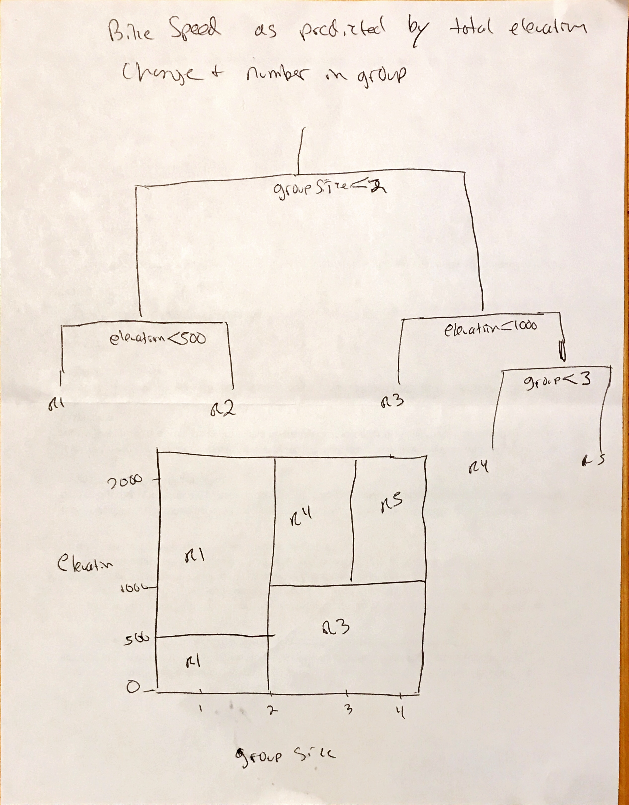

```{r setup, include=FALSE}
knitr::opts_chunk$set(echo = TRUE)
```

```{r}
library(tidyverse)
library(ISLR)
library(tree)
library(randomForest)
library(gbm)
```

5
7
8 d,e
10
11
12

## Q1

_Draw an example (of your own invention) of a partition of two- dimensional feature space that could result from recursive binary splitting. Your example should contain at least six regions. Draw a decision tree corresponding to this partition. Be sure to label all as- pects of your figures, including the regions R1, R2, . . ., the cutpoints t1,t2,..., and so forth.
Hint: Your result should look something like Figures 8.1 and 8.2._

Average ride speed based on elevation and number in group



## Q3

_3. Consider the Gini index, classification error, and entropy in a simple classification setting with two classes. Create a single plot that displays each of these quantities as a function of pˆm1. The x- axis should display pˆm1, ranging from 0 to 1, and the y-axis should display the value of the Gini index, classification error, and entropy._

_Hint: In a setting with two classes, pˆm1 = 1 − pˆm2. You could make this plot by hand, but it will be much easier to make in R._

```{r}
data3 <- tibble(
  pm1 = seq(0,1,by=.01), #proportion in region m that is class 1
  pm2 = 1-pm1            #proportion in region m that is class 2
)
```

```{r}
data3 <- data3 %>% 
  mutate(
    E=map2_dbl(pm1,pm2,max),
    G=2*pm1*pm2,
    Ent=map2_dbl(pm1,pm2, function(pm1,pm2) {
      -sum(pm1*log(pm2) , pm2*log(pm1))
    })
  )
```

```{r}
data3 %>% 
  gather(key="criteria",value="value",-pm1,-pm2) %>%
  ggplot(aes(x=pm1,y=value,color=criteria)) +
  geom_line(size=2)
```

## Q5

_Suppose we produce ten bootstrapped samples from a data set containing red and green classes. We then apply a classification tree to each bootstrapped sample and, for a specific value of X, produce 10 estimates of P(Class is Red|X):_
`0.1, 0.15, 0.2, 0.2, 0.55, 0.6, 0.6, 0.65, 0.7, and 0.75.`
_There are two common ways to combine these results together into a single class prediction. One is the majority vote approach discussed in this chapter. The second approach is to classify based on the average probability. In this example, what is the final classification under each of these two approaches?_

```{r}
prob <- c(0.1, 0.15, 0.2, 0.2, 0.55, 0.6, 0.6, 0.65, 0.7, 0.75)

# Majority Vote:
mean(prob>.5)
  # red

# Average:
mean(prob)
 # green
```

## Q7
_In the lab, we applied random forests to the Boston data using mtry=6 and using ntree=25 and ntree=500. Create a plot displaying the test error resulting from random forests on this data set for a more com- prehensive range of values for mtry and ntree. You can model your plot after Figure 8.10. Describe the results obtained._

```{r}
library(MASS)
data(Boston)
set.seed(1234)
train <- sample(1:nrow(Boston), nrow(Boston)/2)
boston.train <- Boston[train,]
boston.test <- Boston[-train,]
```

```{r}
mtry <- c(1,3,6,9,13)
ntree <- c(10,25,50,75,100,150)

get.mse <- function(mtry,ntree) {
  fit <- randomForest(medv ~ ., data=boston.train, mtry=mtry, ntree=ntree)
  predict <- predict(fit,newdata=boston.test)
  mse <- mean((boston.test$medv - predict) ^ 2)
  mse
}

mse <- expand.grid(mtry=mtry,ntree=ntree) %>% 
  mutate(mse = map2(mtry,ntree,get.mse) %>% unlist())

head(mse)
```

```{r}
mse %>% 
  ggplot(aes(x=ntree,y=mse,color=factor(mtry),shape=factor(mtry))) +
  geom_line() +
  geom_point()
```

We don't see a lot of improvement beyond 50 trees or so.

We 1 and 3 predictors, and possibly 13 underperform 6 and 9.


## Q8 (a,b,c)

_8. In the lab, a classification tree was applied to the Carseats data set after converting Sales into a qualitative response variable. Now we will seek to predict Sales using regression trees and related approaches, treating the response as a quantitative variable._

_(a) Split the data set into a training set and a test set._

```{r}
data("Carseats")
head(Carseats)
dim(Carseats)
set.seed(040518)
train <- sample(1:nrow(Carseats),size=250)
carseats.train <- Carseats[train,]
carseats.test <- Carseats[-train,]
```

_(b) Fit a regression tree to the training set. Plot the tree, and inter- pret the results. What test MSE do you obtain?_

```{r}
tree1 <- tree(Sales ~ . , data= carseats.train)
summary(tree1)
plot(tree1)
text(tree1, pretty = 0)
tree1.predict <- predict(tree1,newdata = carseats.test)
(MSE <- mean((tree1.predict-carseats.test$Sales)^2))
```

_(c) Use cross-validation in order to determine the optimal level of tree complexity. Does pruning the tree improve the test MSE?_

```{r}
tree1.cv <- cv.tree(tree1)
plot(tree1.cv)
tree1.cv
```

CV would suggest not pruning.  I guess we could prune to 16...

```{r}
tree1.prune <- prune.tree(tree1,best=16)
tree1.prune.predict <- predict(tree1.prune, newdata = carseats.test)
(MSE <- mean((tree1.prune.predict-carseats.test$Sales)^2))
```

slight reduction in MSE

_(d) Use the bagging approach in order to analyze this data. What test MSE do you obtain? Use the importance() function to determine which variables are most important._

```{r}
carseats.bag <- randomForest(Sales ~ ., mtry=ncol(carseats.train)-1, importance=TRUE, data=carseats.train)
carseats.bag
importance(carseats.bag)
carseats.bag.predict <- predict(carseats.bag, newdata = carseats.test)
(bag.mse <- mean((carseats.bag.predict-carseats.test$Sales)^2))
```

A substantial reduction in MSE

(e) Use random forests to analyze this data. What test MSE do you obtain? Use the importance() function to determine which variables are most important. Describe the effect of m, the number of variables considered at each split, on the error rate obtained.

```{r}
mtry <- c(2,3,5,7,9)

fits <- lapply(mtry,function(m) {
  randomForest(Sales ~ ., mtry=m, importance=TRUE, data=carseats.train)
})

names(fits) <- mtry

lapply(fits,importance)

sapply(fits, function(f) {
  mean( (predict(f,newdata=carseats.test)-carseats.test$Sales)^2)
}
)
```

Increasing the number of variables considered at each split improves the MSE when only a small number of variables are being used and then things level out.

## Q9

_9. This problem involves the OJ data set which is part of the ISLR package._

```{r}
data(OJ)
dim(OJ)
?OJ
head(OJ) 
```


_(a) Create a training set containing a random sample of 800 observations, and a test set containing the remaining observations._

```{r}
train <- sample(1:nrow(OJ), size = 800)
oj.train <- OJ[train,]
oj.test <- OJ[-train,]
```

_(b) Fit a tree to the training data, with Purchase as the response and the other variables as predictors. Use the summary() function to produce summary statistics about the tree, and describe the results obtained. What is the training error rate? How many terminal nodes does the tree have?_

```{r}
tree1 <- tree(Purchase ~ . , data=oj.train)
summary(tree1)
```

9 nodes with three predictors, good training prediction (0.1575)

_(c) Type in the name of the tree object in order to get a detailed text output. Pick one of the terminal nodes, and interpret the information displayed._

```{r}
tree1
```

For node 7, these are customers whose CH brand loyalty is > 0.76.  There are 265 such customers.  The deviance at this node is 97.72 (what does this mean) and 95% of the customers at this node bought CH.

_(d) Create a plot of the tree, and interpret the results._

```{r}
plot(tree1)
text(tree1,pretty=0)
```

Loyalty to CH brand is the biggest predictor.  

_(e) Predict the response on the test data, and produce a confusion matrix comparing the test labels to the predicted test labels. What is the test error rate?_

```{r}
oj.prediction <- predict(tree1,newdata = oj.test,type="class")
table(prediction=oj.prediction,observed=oj.test$Purchase)
```

```{r}
(tree1.accuracy <- mean(oj.prediction==oj.test$Purchase))
```

82% prediction accuracy

_(f) Apply the cv.tree() function to the training set in order to determine the optimal tree size._

```{r}
set.seed(1354)
tree1.cv <- cv.tree(tree1,FUN=prune.misclass)
tree1.cv
```

best size appears to be 7

_(g) Produce a plot with tree size on the x-axis and cross-validated classification error rate on the y-axis._

```{r}
plot(tree1.cv$size, tree1.cv$dev / nrow(oj.test),type="l")
```

_(h) Which tree size corresponds to the lowest cross-validated classi- fication error rate?_

7

_(i) Produce a pruned tree corresponding to the optimal tree size obtained using cross-validation. If cross-validation does not lead to selection of a pruned tree, then create a pruned tree with five terminal nodes._

```{r}
tree1.prune <- prune.misclass(tree1,best = 7)
```

_(j) Compare the training error rates between the pruned and un- pruned trees. Which is higher?_

```{r}
summary(tree1)
summary(tree1.prune)
```

The unpruned tree has slightly lowre error rate

_(k) Compare the test error rates between the pruned and unpruned trees. Which is higher?_

```{r}
prune.predict <- predict(tree1.prune,newdata = oj.test, type="class")
table(prediction=prune.predict,observed=oj.test$Purchase)
tree1.accuracy
(prune.accuracy <- mean(prune.predict==oj.test$Purchase))
```

Test accuracy is the same on either tree

## Q10

_We now use boosting to predict Salary in the Hitters data set._

_(a) Remove the observations for whom the salary information is unknown, and then log-transform the salaries._

```{r}
data("Hitters")

hitters <- Hitters %>% as_tibble() %>%
  filter(!is.na(Salary)) %>%
  mutate(Salary=log(Salary))
```


_(b) Create a training set consisting of the first 200 observations, and a test set consisting of the remaining observations._

```{r}
hitters.train <- hitters[1:200,]
hitters.test <- hitters[201:nrow(hitters),]
```

_(c) Perform boosting on the training set with 1,000 trees for a range of values of the shrinkage parameter λ. Produce a plot with different shrinkage values on the x-axis and the corresponding training set MSE on the y-axis._

```{r}
lambdas <- c(.2,.1,.01,.001,.0001)

hitters.gbm <- lapply(lambdas, function(l) { 
  gbm(Salary ~ ., distribution = "gaussian", n.trees=1000, shrinkage=l,data=hitters.train) #interaction.depth = 1
}
)

train.mse <- sapply(hitters.gbm,function(x) x$train.error[1000])

plot(lambdas,train.mse,type="b")
```

_(d) Produce a plot with different shrinkage values on the x-axis and the corresponding test set MSE on the y-axis._

```{r}
test.mse <- sapply(hitters.gbm, function(f) {
  mean( (predict(f,newdata=hitters.test,n.trees=1000)-hitters.test$Salary)^2)
}
)

plot(lambdas,test.mse,type="b")
```


_(e) Compare the test MSE of boosting to the test MSE that results from applying two of the regression approaches seen in Chapters 3 and 6._

_(f) Which variables appear to be the most important predictors in the boosted model?_

_(g) Now apply bagging to the training set. What is the test set MSE for this approach?_

