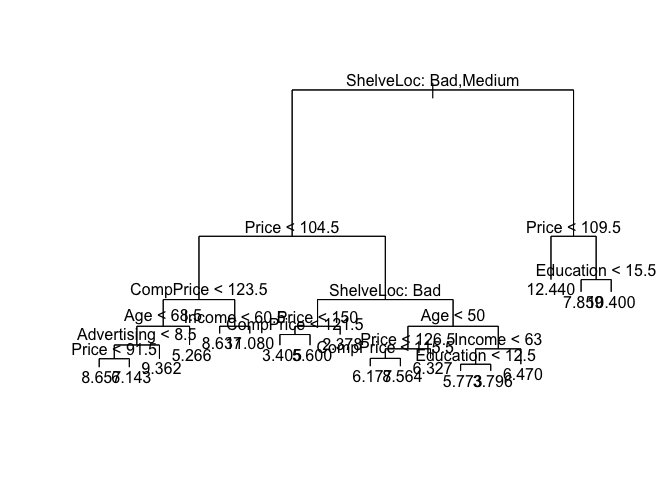
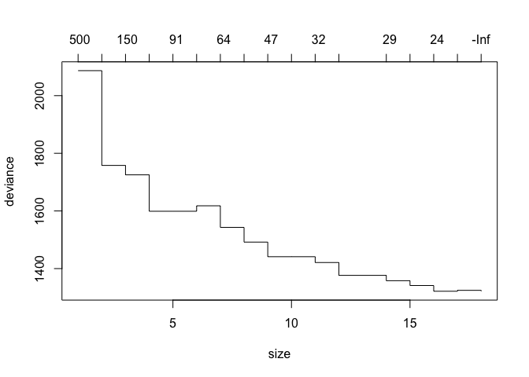
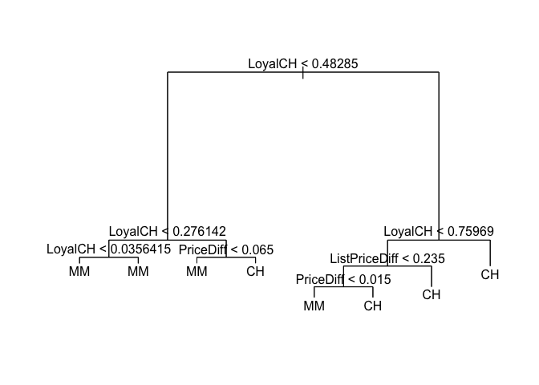
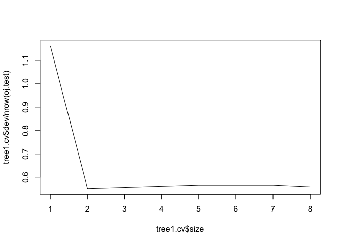

```r
library(tidyverse)
```

```
## ── Attaching packages ──────────────────────────────────────────────────────────────────────────────────────────────────────────────────── tidyverse 1.2.1 ──
```

```
## ✔ ggplot2 2.2.1     ✔ purrr   0.2.4
## ✔ tibble  1.4.2     ✔ dplyr   0.7.4
## ✔ tidyr   0.8.0     ✔ stringr 1.3.0
## ✔ readr   1.1.1     ✔ forcats 0.3.0
```

```
## ── Conflicts ─────────────────────────────────────────────────────────────────────────────────────────────────────────────────────── tidyverse_conflicts() ──
## ✖ dplyr::filter() masks stats::filter()
## ✖ dplyr::lag()    masks stats::lag()
```

```r
library(ISLR)
library(tree)
```

1
2
8 a,b,c
9

## Q1

_Draw an example (of your own invention) of a partition of two- dimensional feature space that could result from recursive binary splitting. Your example should contain at least six regions. Draw a decision tree corresponding to this partition. Be sure to label all as- pects of your figures, including the regions R1, R2, . . ., the cutpoints t1,t2,..., and so forth.
Hint: Your result should look something like Figures 8.1 and 8.2._

Average ride speed based on elevation and number in group


## Q3

_3. Consider the Gini index, classification error, and entropy in a simple classification setting with two classes. Create a single plot that displays each of these quantities as a function of pˆm1. The x- axis should display pˆm1, ranging from 0 to 1, and the y-axis should display the value of the Gini index, classification error, and entropy._

_Hint: In a setting with two classes, pˆm1 = 1 − pˆm2. You could make this plot by hand, but it will be much easier to make in R._


```r
data3 <- tibble(
  pm1 = seq(0,1,by=.01), #proportion in region m that is class 1
  pm2 = 1-pm1            #proportion in region m that is class 2
)
```


```r
data3 <- data3 %>% 
  mutate(
    E=map2_dbl(pm1,pm2,max),
    G=2*pm1*pm2,
    Ent=map2_dbl(pm1,pm2, function(pm1,pm2) {
      -sum(pm1*log(pm2) , pm2*log(pm1))
    })
  )
```


```r
data3 %>% 
  gather(key="criteria",value="value",-pm1,-pm2) %>%
  ggplot(aes(x=pm1,y=value,color=criteria)) +
  geom_line(size=2)
```

<!-- -->

## Q8 (a,b,c)

_8. In the lab, a classification tree was applied to the Carseats data set af- ter converting Sales into a qualitative response variable. Now we will seek to predict Sales using regression trees and related approaches, treating the response as a quantitative variable._

_(a) Split the data set into a training set and a test set._


```r
data("Carseats")
head(Carseats)
```

```
##   Sales CompPrice Income Advertising Population Price ShelveLoc Age
## 1  9.50       138     73          11        276   120       Bad  42
## 2 11.22       111     48          16        260    83      Good  65
## 3 10.06       113     35          10        269    80    Medium  59
## 4  7.40       117    100           4        466    97    Medium  55
## 5  4.15       141     64           3        340   128       Bad  38
## 6 10.81       124    113          13        501    72       Bad  78
##   Education Urban  US
## 1        17   Yes Yes
## 2        10   Yes Yes
## 3        12   Yes Yes
## 4        14   Yes Yes
## 5        13   Yes  No
## 6        16    No Yes
```

```r
dim(Carseats)
```

```
## [1] 400  11
```

```r
set.seed(040518)
train <- sample(1:nrow(Carseats),size=250)
carseats.train <- Carseats[train,]
carseats.test <- Carseats[-train,]
```

_(b) Fit a regression tree to the training set. Plot the tree, and inter- pret the results. What test MSE do you obtain?_


```r
tree1 <- tree(Sales ~ . , data= carseats.train)
summary(tree1)
```

```
## 
## Regression tree:
## tree(formula = Sales ~ ., data = carseats.train)
## Variables actually used in tree construction:
## [1] "ShelveLoc"   "Price"       "CompPrice"   "Age"         "Advertising"
## [6] "Income"      "Education"  
## Number of terminal nodes:  18 
## Residual mean deviance:  2.318 = 537.9 / 232 
## Distribution of residuals:
##     Min.  1st Qu.   Median     Mean  3rd Qu.     Max. 
## -3.79600 -1.02200 -0.09198  0.00000  0.93380  4.54000
```

```r
plot(tree1)
text(tree1, pretty = 0)
```

<!-- -->

```r
tree1.predict <- predict(tree1,newdata = carseats.test)
(MSE <- mean((tree1.predict-carseats.test$Sales)^2))
```

```
## [1] 4.972922
```

_(c) Use cross-validation in order to determine the optimal level of tree complexity. Does pruning the tree improve the test MSE?_


```r
tree1.cv <- cv.tree(tree1)
plot(tree1.cv)
```

<!-- -->

```r
tree1.cv
```

```
## $size
##  [1] 18 17 16 15 14 12 11 10  9  8  7  6  5  4  3  2  1
## 
## $dev
##  [1] 1321.321 1324.543 1321.404 1341.311 1357.982 1376.471 1421.077
##  [8] 1441.257 1441.236 1491.909 1543.009 1617.856 1598.927 1598.927
## [15] 1725.255 1757.929 2086.721
## 
## $k
##  [1]      -Inf  22.51503  24.47178  26.60338  28.75840  32.19059  32.47045
##  [8]  41.41291  46.89361  52.47458  63.71281  76.79418  90.85924  90.95556
## [15] 147.63294 215.70903 498.53629
## 
## $method
## [1] "deviance"
## 
## attr(,"class")
## [1] "prune"         "tree.sequence"
```

CV would suggest not pruning.  I guess we could prune to 16...


```r
tree1.prune <- prune.tree(tree1,best=16)
tree1.prune.predict <- predict(tree1.prune, newdata = carseats.test)
(MSE <- mean((tree1.prune.predict-carseats.test$Sales)^2))
```

```
## [1] 4.860422
```

slight reduction in MSE

## Q9

_9. This problem involves the OJ data set which is part of the ISLR package._


```r
data(OJ)
dim(OJ)
```

```
## [1] 1070   18
```

```r
?OJ
head(OJ) 
```

```
##   Purchase WeekofPurchase StoreID PriceCH PriceMM DiscCH DiscMM SpecialCH
## 1       CH            237       1    1.75    1.99   0.00    0.0         0
## 2       CH            239       1    1.75    1.99   0.00    0.3         0
## 3       CH            245       1    1.86    2.09   0.17    0.0         0
## 4       MM            227       1    1.69    1.69   0.00    0.0         0
## 5       CH            228       7    1.69    1.69   0.00    0.0         0
## 6       CH            230       7    1.69    1.99   0.00    0.0         0
##   SpecialMM  LoyalCH SalePriceMM SalePriceCH PriceDiff Store7 PctDiscMM
## 1         0 0.500000        1.99        1.75      0.24     No  0.000000
## 2         1 0.600000        1.69        1.75     -0.06     No  0.150754
## 3         0 0.680000        2.09        1.69      0.40     No  0.000000
## 4         0 0.400000        1.69        1.69      0.00     No  0.000000
## 5         0 0.956535        1.69        1.69      0.00    Yes  0.000000
## 6         1 0.965228        1.99        1.69      0.30    Yes  0.000000
##   PctDiscCH ListPriceDiff STORE
## 1  0.000000          0.24     1
## 2  0.000000          0.24     1
## 3  0.091398          0.23     1
## 4  0.000000          0.00     1
## 5  0.000000          0.00     0
## 6  0.000000          0.30     0
```


_(a) Create a training set containing a random sample of 800 observations, and a test set containing the remaining observations._


```r
train <- sample(1:nrow(OJ), size = 800)
oj.train <- OJ[train,]
oj.test <- OJ[-train,]
```

_(b) Fit a tree to the training data, with Purchase as the response and the other variables as predictors. Use the summary() function to produce summary statistics about the tree, and describe the results obtained. What is the training error rate? How many terminal nodes does the tree have?_


```r
tree1 <- tree(Purchase ~ . , data=oj.train)
summary(tree1)
```

```
## 
## Classification tree:
## tree(formula = Purchase ~ ., data = oj.train)
## Variables actually used in tree construction:
## [1] "LoyalCH"       "PriceDiff"     "ListPriceDiff"
## Number of terminal nodes:  8 
## Residual mean deviance:  0.7444 = 589.6 / 792 
## Misclassification error rate: 0.155 = 124 / 800
```

9 nodes with three predictors, good training prediction (0.1575)

_(c) Type in the name of the tree object in order to get a detailed text output. Pick one of the terminal nodes, and interpret the information displayed._


```r
tree1
```

```
## node), split, n, deviance, yval, (yprob)
##       * denotes terminal node
## 
##  1) root 800 1072.00 CH ( 0.60750 0.39250 )  
##    2) LoyalCH < 0.48285 308  330.20 MM ( 0.22727 0.77273 )  
##      4) LoyalCH < 0.276142 179  125.30 MM ( 0.11173 0.88827 )  
##        8) LoyalCH < 0.0356415 63   10.27 MM ( 0.01587 0.98413 ) *
##        9) LoyalCH > 0.0356415 116  103.50 MM ( 0.16379 0.83621 ) *
##      5) LoyalCH > 0.276142 129  172.30 MM ( 0.38760 0.61240 )  
##       10) PriceDiff < 0.065 57   61.21 MM ( 0.22807 0.77193 ) *
##       11) PriceDiff > 0.065 72   99.76 CH ( 0.51389 0.48611 ) *
##    3) LoyalCH > 0.48285 492  423.50 CH ( 0.84553 0.15447 )  
##      6) LoyalCH < 0.75969 239  277.70 CH ( 0.73222 0.26778 )  
##       12) ListPriceDiff < 0.235 97  134.40 CH ( 0.51546 0.48454 )  
##         24) PriceDiff < 0.015 52   64.19 MM ( 0.30769 0.69231 ) *
##         25) PriceDiff > 0.015 45   50.05 CH ( 0.75556 0.24444 ) *
##       13) ListPriceDiff > 0.235 142  104.00 CH ( 0.88028 0.11972 ) *
##      7) LoyalCH > 0.75969 253   96.59 CH ( 0.95257 0.04743 ) *
```

For node 7, these are customers whose CH brand loyalty is > 0.76.  There are 265 such customers.  The deviance at this node is 97.72 (what does this mean) and 95% of the customers at this node bought CH.

_(d) Create a plot of the tree, and interpret the results._


```r
plot(tree1)
text(tree1,pretty=0)
```

<!-- -->

Loyalty to CH brand is the biggest predictor.  

_(e) Predict the response on the test data, and produce a confusion matrix comparing the test labels to the predicted test labels. What is the test error rate?_


```r
oj.prediction <- predict(tree1,newdata = oj.test,type="class")
table(prediction=oj.prediction,observed=oj.test$Purchase)
```

```
##           observed
## prediction  CH  MM
##         CH 152  36
##         MM  15  67
```


```r
(tree1.accuracy <- mean(oj.prediction==oj.test$Purchase))
```

```
## [1] 0.8111111
```

82% prediction accuracy

_(f) Apply the cv.tree() function to the training set in order to determine the optimal tree size._


```r
set.seed(1354)
tree1.cv <- cv.tree(tree1,FUN=prune.misclass)
tree1.cv
```

```
## $size
## [1] 8 7 5 2 1
## 
## $dev
## [1] 151 153 153 149 314
## 
## $k
## [1]       -Inf   0.000000   1.000000   6.666667 168.000000
## 
## $method
## [1] "misclass"
## 
## attr(,"class")
## [1] "prune"         "tree.sequence"
```

best size appears to be 7

_(g) Produce a plot with tree size on the x-axis and cross-validated classification error rate on the y-axis._


```r
plot(tree1.cv$size, tree1.cv$dev / nrow(oj.test),type="l")
```

<!-- -->

_(h) Which tree size corresponds to the lowest cross-validated classi- fication error rate?_

7

_(i) Produce a pruned tree corresponding to the optimal tree size obtained using cross-validation. If cross-validation does not lead to selection of a pruned tree, then create a pruned tree with five terminal nodes._


```r
tree1.prune <- prune.misclass(tree1,best = 7)
```

_(j) Compare the training error rates between the pruned and un- pruned trees. Which is higher?_


```r
summary(tree1)
```

```
## 
## Classification tree:
## tree(formula = Purchase ~ ., data = oj.train)
## Variables actually used in tree construction:
## [1] "LoyalCH"       "PriceDiff"     "ListPriceDiff"
## Number of terminal nodes:  8 
## Residual mean deviance:  0.7444 = 589.6 / 792 
## Misclassification error rate: 0.155 = 124 / 800
```

```r
summary(tree1.prune)
```

```
## 
## Classification tree:
## snip.tree(tree = tree1, nodes = 4L)
## Variables actually used in tree construction:
## [1] "LoyalCH"       "PriceDiff"     "ListPriceDiff"
## Number of terminal nodes:  7 
## Residual mean deviance:  0.7581 = 601.2 / 793 
## Misclassification error rate: 0.155 = 124 / 800
```

The unpruned tree has slightly lowre error rate

_(k) Compare the test error rates between the pruned and unpruned trees. Which is higher?_


```r
prune.predict <- predict(tree1.prune,newdata = oj.test, type="class")
table(prediction=prune.predict,observed=oj.test$Purchase)
```

```
##           observed
## prediction  CH  MM
##         CH 152  36
##         MM  15  67
```

```r
tree1.accuracy
```

```
## [1] 0.8111111
```

```r
(prune.accuracy <- mean(prune.predict==oj.test$Purchase))
```

```
## [1] 0.8111111
```

Test accuracy is the same on either tree

