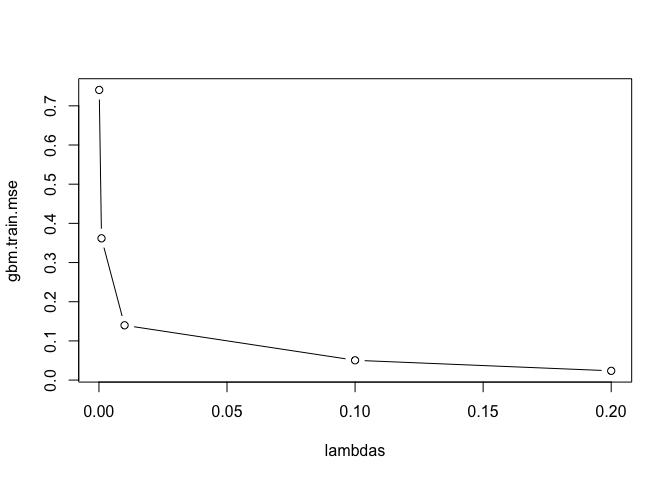
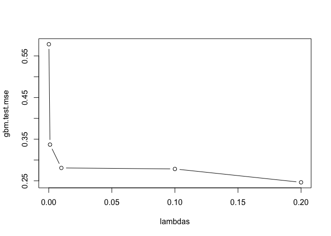

```r
library(tidyverse)
```

```
## ── Attaching packages ─────────────────────────────────────────── tidyverse 1.2.1 ──
```

```
## ✔ ggplot2 2.2.1     ✔ purrr   0.2.4
## ✔ tibble  1.4.2     ✔ dplyr   0.7.4
## ✔ tidyr   0.8.0     ✔ stringr 1.3.0
## ✔ readr   1.1.1     ✔ forcats 0.3.0
```

```
## ── Conflicts ────────────────────────────────────────────── tidyverse_conflicts() ──
## ✖ dplyr::filter() masks stats::filter()
## ✖ dplyr::lag()    masks stats::lag()
```

```r
library(ISLR)
library(tree)
library(randomForest)
```

```
## randomForest 4.6-14
```

```
## Type rfNews() to see new features/changes/bug fixes.
```

```
## 
## Attaching package: 'randomForest'
```

```
## The following object is masked from 'package:dplyr':
## 
##     combine
```

```
## The following object is masked from 'package:ggplot2':
## 
##     margin
```

```r
library(gbm)
```

```
## Loading required package: survival
```

```
## Loading required package: lattice
```

```
## Loading required package: splines
```

```
## Loading required package: parallel
```

```
## Loaded gbm 2.1.3
```

5
7
8 d,e
10
11
12

## Q1

_Draw an example (of your own invention) of a partition of two- dimensional feature space that could result from recursive binary splitting. Your example should contain at least six regions. Draw a decision tree corresponding to this partition. Be sure to label all as- pects of your figures, including the regions R1, R2, . . ., the cutpoints t1,t2,..., and so forth.
Hint: Your result should look something like Figures 8.1 and 8.2._

Average ride speed based on elevation and number in group


## Q3

_3. Consider the Gini index, classification error, and entropy in a simple classification setting with two classes. Create a single plot that displays each of these quantities as a function of pˆm1. The x- axis should display pˆm1, ranging from 0 to 1, and the y-axis should display the value of the Gini index, classification error, and entropy._

_Hint: In a setting with two classes, pˆm1 = 1 − pˆm2. You could make this plot by hand, but it will be much easier to make in R._


```r
data3 <- tibble(
  pm1 = seq(0,1,by=.01), #proportion in region m that is class 1
  pm2 = 1-pm1            #proportion in region m that is class 2
)
```


```r
data3 <- data3 %>% 
  mutate(
    E=map2_dbl(pm1,pm2,max),
    G=2*pm1*pm2,
    Ent=map2_dbl(pm1,pm2, function(pm1,pm2) {
      -sum(pm1*log(pm2) , pm2*log(pm1))
    })
  )
```


```r
data3 %>% 
  gather(key="criteria",value="value",-pm1,-pm2) %>%
  ggplot(aes(x=pm1,y=value,color=criteria)) +
  geom_line(size=2)
```

<!-- -->

## Q5

_Suppose we produce ten bootstrapped samples from a data set containing red and green classes. We then apply a classification tree to each bootstrapped sample and, for a specific value of X, produce 10 estimates of P(Class is Red|X):_
`0.1, 0.15, 0.2, 0.2, 0.55, 0.6, 0.6, 0.65, 0.7, and 0.75.`
_There are two common ways to combine these results together into a single class prediction. One is the majority vote approach discussed in this chapter. The second approach is to classify based on the average probability. In this example, what is the final classification under each of these two approaches?_


```r
prob <- c(0.1, 0.15, 0.2, 0.2, 0.55, 0.6, 0.6, 0.65, 0.7, 0.75)

# Majority Vote:
mean(prob>.5)
```

```
## [1] 0.6
```

```r
  # red

# Average:
mean(prob)
```

```
## [1] 0.45
```

```r
 # green
```

## Q7
_In the lab, we applied random forests to the Boston data using mtry=6 and using ntree=25 and ntree=500. Create a plot displaying the test error resulting from random forests on this data set for a more com- prehensive range of values for mtry and ntree. You can model your plot after Figure 8.10. Describe the results obtained._


```r
library(MASS)
```

```
## 
## Attaching package: 'MASS'
```

```
## The following object is masked from 'package:dplyr':
## 
##     select
```

```r
data(Boston)
set.seed(1234)
train <- sample(1:nrow(Boston), nrow(Boston)/2)
boston.train <- Boston[train,]
boston.test <- Boston[-train,]
```


```r
mtry <- c(1,3,6,9,13)
ntree <- c(10,25,50,75,100,150)

get.mse <- function(mtry,ntree) {
  fit <- randomForest(medv ~ ., data=boston.train, mtry=mtry, ntree=ntree)
  predict <- predict(fit,newdata=boston.test)
  mse <- mean((boston.test$medv - predict) ^ 2)
  mse
}

mse <- expand.grid(mtry=mtry,ntree=ntree) %>% 
  mutate(mse = map2(mtry,ntree,get.mse) %>% unlist())

head(mse)
```

```
##   mtry ntree      mse
## 1    1    10 30.25074
## 2    3    10 22.44489
## 3    6    10 20.01430
## 4    9    10 21.27604
## 5   13    10 19.34381
## 6    1    25 32.90058
```


```r
mse %>% 
  ggplot(aes(x=ntree,y=mse,color=factor(mtry),shape=factor(mtry))) +
  geom_line() +
  geom_point()
```

<!-- -->

We don't see a lot of improvement beyond 50 trees or so.

We 1 and 3 predictors, and possibly 13 underperform 6 and 9.


## Q8 (a,b,c)

_8. In the lab, a classification tree was applied to the Carseats data set after converting Sales into a qualitative response variable. Now we will seek to predict Sales using regression trees and related approaches, treating the response as a quantitative variable._

_(a) Split the data set into a training set and a test set._


```r
data("Carseats")
head(Carseats)
```

```
##   Sales CompPrice Income Advertising Population Price ShelveLoc Age
## 1  9.50       138     73          11        276   120       Bad  42
## 2 11.22       111     48          16        260    83      Good  65
## 3 10.06       113     35          10        269    80    Medium  59
## 4  7.40       117    100           4        466    97    Medium  55
## 5  4.15       141     64           3        340   128       Bad  38
## 6 10.81       124    113          13        501    72       Bad  78
##   Education Urban  US
## 1        17   Yes Yes
## 2        10   Yes Yes
## 3        12   Yes Yes
## 4        14   Yes Yes
## 5        13   Yes  No
## 6        16    No Yes
```

```r
dim(Carseats)
```

```
## [1] 400  11
```

```r
set.seed(040518)
train <- sample(1:nrow(Carseats),size=250)
carseats.train <- Carseats[train,]
carseats.test <- Carseats[-train,]
```

_(b) Fit a regression tree to the training set. Plot the tree, and inter- pret the results. What test MSE do you obtain?_


```r
tree1 <- tree(Sales ~ . , data= carseats.train)
summary(tree1)
```

```
## 
## Regression tree:
## tree(formula = Sales ~ ., data = carseats.train)
## Variables actually used in tree construction:
## [1] "ShelveLoc"   "Price"       "CompPrice"   "Age"         "Advertising"
## [6] "Income"      "Education"  
## Number of terminal nodes:  18 
## Residual mean deviance:  2.318 = 537.9 / 232 
## Distribution of residuals:
##     Min.  1st Qu.   Median     Mean  3rd Qu.     Max. 
## -3.79600 -1.02200 -0.09198  0.00000  0.93380  4.54000
```

```r
plot(tree1)
text(tree1, pretty = 0)
```

<!-- -->

```r
tree1.predict <- predict(tree1,newdata = carseats.test)
(MSE <- mean((tree1.predict-carseats.test$Sales)^2))
```

```
## [1] 4.972922
```

_(c) Use cross-validation in order to determine the optimal level of tree complexity. Does pruning the tree improve the test MSE?_


```r
tree1.cv <- cv.tree(tree1)
plot(tree1.cv)
```

<!-- -->

```r
tree1.cv
```

```
## $size
##  [1] 18 17 16 15 14 12 11 10  9  8  7  6  5  4  3  2  1
## 
## $dev
##  [1] 1321.321 1324.543 1321.404 1341.311 1357.982 1376.471 1421.077
##  [8] 1441.257 1441.236 1491.909 1543.009 1617.856 1598.927 1598.927
## [15] 1725.255 1757.929 2086.721
## 
## $k
##  [1]      -Inf  22.51503  24.47178  26.60338  28.75840  32.19059  32.47045
##  [8]  41.41291  46.89361  52.47458  63.71281  76.79418  90.85924  90.95556
## [15] 147.63294 215.70903 498.53629
## 
## $method
## [1] "deviance"
## 
## attr(,"class")
## [1] "prune"         "tree.sequence"
```

CV would suggest not pruning.  I guess we could prune to 16...


```r
tree1.prune <- prune.tree(tree1,best=16)
tree1.prune.predict <- predict(tree1.prune, newdata = carseats.test)
(MSE <- mean((tree1.prune.predict-carseats.test$Sales)^2))
```

```
## [1] 4.860422
```

slight reduction in MSE

_(d) Use the bagging approach in order to analyze this data. What test MSE do you obtain? Use the importance() function to determine which variables are most important._


```r
carseats.bag <- randomForest(Sales ~ ., mtry=ncol(carseats.train)-1, importance=TRUE, data=carseats.train)
carseats.bag
```

```
## 
## Call:
##  randomForest(formula = Sales ~ ., data = carseats.train, mtry = ncol(carseats.train) -      1, importance = TRUE) 
##                Type of random forest: regression
##                      Number of trees: 500
## No. of variables tried at each split: 10
## 
##           Mean of squared residuals: 2.571417
##                     % Var explained: 68.82
```

```r
importance(carseats.bag)
```

```
##                %IncMSE IncNodePurity
## CompPrice   30.3367177    221.063875
## Income      13.1142485    130.027024
## Advertising 15.0339375    121.373841
## Population  -2.8953994     66.727070
## Price       67.5646245    672.380894
## ShelveLoc   58.0665625    541.435544
## Age         19.7199999    194.791271
## Education    0.4794359     49.322006
## Urban       -1.7961440     10.170825
## US           0.5421650      5.867115
```

```r
carseats.bag.predict <- predict(carseats.bag, newdata = carseats.test)
(bag.mse <- mean((carseats.bag.predict-carseats.test$Sales)^2))
```

```
## [1] 2.540514
```

A substantial reduction in MSE

(e) Use random forests to analyze this data. What test MSE do you obtain? Use the importance() function to determine which variables are most important. Describe the effect of m, the number of variables considered at each split, on the error rate obtained.


```r
mtry <- c(2,3,5,7,9)

fits <- lapply(mtry,function(m) {
  randomForest(Sales ~ ., mtry=m, importance=TRUE, data=carseats.train)
})

names(fits) <- mtry

lapply(fits,importance)
```

```
## $`2`
##               %IncMSE IncNodePurity
## CompPrice    9.743809     169.77059
## Income       5.195792     170.94856
## Advertising 12.229973     177.32724
## Population  -1.964894     145.83512
## Price       35.571952     481.77187
## ShelveLoc   32.313092     371.03675
## Age         13.009792     216.58845
## Education    3.719462      94.03611
## Urban       -3.366824      23.63474
## US           4.347546      27.81436
## 
## $`3`
##                %IncMSE IncNodePurity
## CompPrice   11.7529331     173.06070
## Income       7.4433965     164.50349
## Advertising 13.8783876     175.89342
## Population  -1.9374691     122.51547
## Price       43.4591454     553.22470
## ShelveLoc   39.2189848     422.11251
## Age         15.6290515     233.96335
## Education    1.6994622      79.53712
## Urban        0.6658229      18.45452
## US           2.4858280      19.84302
## 
## $`5`
##                %IncMSE IncNodePurity
## CompPrice   20.4956597     192.45097
## Income      10.1993421     141.96134
## Advertising 14.7321105     152.29454
## Population  -1.7533424      91.47421
## Price       52.4903686     625.46840
## ShelveLoc   51.5993412     477.11855
## Age         18.6593249     231.95567
## Education   -0.7494469      62.92695
## Urban       -3.6838321      13.85700
## US           0.5833544      11.53222
## 
## $`7`
##                %IncMSE IncNodePurity
## CompPrice   25.3449424    206.403909
## Income      11.2122513    134.578323
## Advertising 15.3798320    138.649723
## Population  -3.3878912     77.345292
## Price       61.8946318    648.340117
## ShelveLoc   51.7773778    503.808323
## Age         20.5402134    211.864657
## Education   -0.4601599     52.235881
## Urban       -4.9269586     10.581121
## US           1.0248077      8.941671
## 
## $`9`
##                %IncMSE IncNodePurity
## CompPrice   29.0675746    225.847350
## Income      12.1520247    127.595582
## Advertising 16.4354121    120.504843
## Population  -2.3961686     67.253385
## Price       68.6323577    675.351024
## ShelveLoc   56.2862067    515.816616
## Age         20.0759373    202.023981
## Education    1.8218418     51.631022
## Urban       -2.5900915      9.666680
## US           0.6008354      6.469581
```

```r
sapply(fits, function(f) {
  mean( (predict(f,newdata=carseats.test)-carseats.test$Sales)^2)
}
)
```

```
##        2        3        5        7        9 
## 3.066124 2.732182 2.446714 2.510834 2.497168
```

Increasing the number of variables considered at each split improves the MSE when only a small number of variables are being used and then things level out.

## Q9

_9. This problem involves the OJ data set which is part of the ISLR package._


```r
data(OJ)
dim(OJ)
```

```
## [1] 1070   18
```

```r
?OJ
head(OJ) 
```

```
##   Purchase WeekofPurchase StoreID PriceCH PriceMM DiscCH DiscMM SpecialCH
## 1       CH            237       1    1.75    1.99   0.00    0.0         0
## 2       CH            239       1    1.75    1.99   0.00    0.3         0
## 3       CH            245       1    1.86    2.09   0.17    0.0         0
## 4       MM            227       1    1.69    1.69   0.00    0.0         0
## 5       CH            228       7    1.69    1.69   0.00    0.0         0
## 6       CH            230       7    1.69    1.99   0.00    0.0         0
##   SpecialMM  LoyalCH SalePriceMM SalePriceCH PriceDiff Store7 PctDiscMM
## 1         0 0.500000        1.99        1.75      0.24     No  0.000000
## 2         1 0.600000        1.69        1.75     -0.06     No  0.150754
## 3         0 0.680000        2.09        1.69      0.40     No  0.000000
## 4         0 0.400000        1.69        1.69      0.00     No  0.000000
## 5         0 0.956535        1.69        1.69      0.00    Yes  0.000000
## 6         1 0.965228        1.99        1.69      0.30    Yes  0.000000
##   PctDiscCH ListPriceDiff STORE
## 1  0.000000          0.24     1
## 2  0.000000          0.24     1
## 3  0.091398          0.23     1
## 4  0.000000          0.00     1
## 5  0.000000          0.00     0
## 6  0.000000          0.30     0
```


_(a) Create a training set containing a random sample of 800 observations, and a test set containing the remaining observations._


```r
train <- sample(1:nrow(OJ), size = 800)
oj.train <- OJ[train,]
oj.test <- OJ[-train,]
```

_(b) Fit a tree to the training data, with Purchase as the response and the other variables as predictors. Use the summary() function to produce summary statistics about the tree, and describe the results obtained. What is the training error rate? How many terminal nodes does the tree have?_


```r
tree1 <- tree(Purchase ~ . , data=oj.train)
summary(tree1)
```

```
## 
## Classification tree:
## tree(formula = Purchase ~ ., data = oj.train)
## Variables actually used in tree construction:
## [1] "LoyalCH"       "PriceDiff"     "ListPriceDiff"
## Number of terminal nodes:  8 
## Residual mean deviance:  0.7289 = 577.3 / 792 
## Misclassification error rate: 0.1512 = 121 / 800
```

9 nodes with three predictors, good training prediction (0.1575)

_(c) Type in the name of the tree object in order to get a detailed text output. Pick one of the terminal nodes, and interpret the information displayed._


```r
tree1
```

```
## node), split, n, deviance, yval, (yprob)
##       * denotes terminal node
## 
##  1) root 800 1063.000 CH ( 0.61875 0.38125 )  
##    2) LoyalCH < 0.461965 280  298.600 MM ( 0.22500 0.77500 )  
##      4) LoyalCH < 0.070051 66   10.360 MM ( 0.01515 0.98485 ) *
##      5) LoyalCH > 0.070051 214  257.600 MM ( 0.28972 0.71028 )  
##       10) PriceDiff < 0.31 161  166.000 MM ( 0.21118 0.78882 ) *
##       11) PriceDiff > 0.31 53   73.300 CH ( 0.52830 0.47170 ) *
##    3) LoyalCH > 0.461965 520  472.900 CH ( 0.83077 0.16923 )  
##      6) LoyalCH < 0.753545 248  307.300 CH ( 0.68952 0.31048 )  
##       12) PriceDiff < 0.015 83  112.300 MM ( 0.40964 0.59036 )  
##         24) ListPriceDiff < 0.235 57   65.700 MM ( 0.26316 0.73684 ) *
##         25) ListPriceDiff > 0.235 26   30.290 CH ( 0.73077 0.26923 ) *
##       13) PriceDiff > 0.015 165  150.300 CH ( 0.83030 0.16970 ) *
##      7) LoyalCH > 0.753545 272   92.120 CH ( 0.95956 0.04044 )  
##       14) PriceDiff < -0.39 7    9.561 CH ( 0.57143 0.42857 ) *
##       15) PriceDiff > -0.39 265   71.760 CH ( 0.96981 0.03019 ) *
```

For node 7, these are customers whose CH brand loyalty is > 0.76.  There are 265 such customers.  The deviance at this node is 97.72 (what does this mean) and 95% of the customers at this node bought CH.

_(d) Create a plot of the tree, and interpret the results._


```r
plot(tree1)
text(tree1,pretty=0)
```

<!-- -->

Loyalty to CH brand is the biggest predictor.  

_(e) Predict the response on the test data, and produce a confusion matrix comparing the test labels to the predicted test labels. What is the test error rate?_


```r
oj.prediction <- predict(tree1,newdata = oj.test,type="class")
table(prediction=oj.prediction,observed=oj.test$Purchase)
```

```
##           observed
## prediction  CH  MM
##         CH 129  30
##         MM  29  82
```


```r
(tree1.accuracy <- mean(oj.prediction==oj.test$Purchase))
```

```
## [1] 0.7814815
```

82% prediction accuracy

_(f) Apply the cv.tree() function to the training set in order to determine the optimal tree size._


```r
set.seed(1354)
tree1.cv <- cv.tree(tree1,FUN=prune.misclass)
tree1.cv
```

```
## $size
## [1] 8 7 5 2 1
## 
## $dev
## [1] 141 140 145 162 305
## 
## $k
## [1]  -Inf   0.0   1.5   9.0 154.0
## 
## $method
## [1] "misclass"
## 
## attr(,"class")
## [1] "prune"         "tree.sequence"
```

best size appears to be 7

_(g) Produce a plot with tree size on the x-axis and cross-validated classification error rate on the y-axis._


```r
plot(tree1.cv$size, tree1.cv$dev / nrow(oj.test),type="l")
```

<!-- -->

_(h) Which tree size corresponds to the lowest cross-validated classi- fication error rate?_

7

_(i) Produce a pruned tree corresponding to the optimal tree size obtained using cross-validation. If cross-validation does not lead to selection of a pruned tree, then create a pruned tree with five terminal nodes._


```r
tree1.prune <- prune.misclass(tree1,best = 7)
```

_(j) Compare the training error rates between the pruned and un- pruned trees. Which is higher?_


```r
summary(tree1)
```

```
## 
## Classification tree:
## tree(formula = Purchase ~ ., data = oj.train)
## Variables actually used in tree construction:
## [1] "LoyalCH"       "PriceDiff"     "ListPriceDiff"
## Number of terminal nodes:  8 
## Residual mean deviance:  0.7289 = 577.3 / 792 
## Misclassification error rate: 0.1512 = 121 / 800
```

```r
summary(tree1.prune)
```

```
## 
## Classification tree:
## snip.tree(tree = tree1, nodes = 7L)
## Variables actually used in tree construction:
## [1] "LoyalCH"       "PriceDiff"     "ListPriceDiff"
## Number of terminal nodes:  7 
## Residual mean deviance:  0.7416 = 588.1 / 793 
## Misclassification error rate: 0.1512 = 121 / 800
```

The unpruned tree has slightly lowre error rate

_(k) Compare the test error rates between the pruned and unpruned trees. Which is higher?_


```r
prune.predict <- predict(tree1.prune,newdata = oj.test, type="class")
table(prediction=prune.predict,observed=oj.test$Purchase)
```

```
##           observed
## prediction  CH  MM
##         CH 129  30
##         MM  29  82
```

```r
tree1.accuracy
```

```
## [1] 0.7814815
```

```r
(prune.accuracy <- mean(prune.predict==oj.test$Purchase))
```

```
## [1] 0.7814815
```

Test accuracy is the same on either tree

## Q10

_We now use boosting to predict Salary in the Hitters data set._

_(a) Remove the observations for whom the salary information is unknown, and then log-transform the salaries._


```r
data("Hitters")

hitters <- Hitters %>% as_tibble() %>%
  filter(!is.na(Salary)) %>%
  mutate(Salary=log(Salary))
```


_(b) Create a training set consisting of the first 200 observations, and a test set consisting of the remaining observations._


```r
hitters.train <- hitters[1:200,]
hitters.test <- hitters[201:nrow(hitters),]
```

_(c) Perform boosting on the training set with 1,000 trees for a range of values of the shrinkage parameter λ. Produce a plot with different shrinkage values on the x-axis and the corresponding training set MSE on the y-axis._


```r
lambdas <- c(.2,.1,.01,.001,.0001)

hitters.gbm <- lapply(lambdas, function(l) { 
  gbm(Salary ~ ., distribution = "gaussian", n.trees=1000, shrinkage=l,data=hitters.train) #interaction.depth = 1
}
)

train.mse <- sapply(hitters.gbm,function(x) x$train.error[1000])

plot(lambdas,train.mse,type="b")
```

<!-- -->

_(d) Produce a plot with different shrinkage values on the x-axis and the corresponding test set MSE on the y-axis._


```r
test.mse <- sapply(hitters.gbm, function(f) {
  mean( (predict(f,newdata=hitters.test,n.trees=1000)-hitters.test$Salary)^2)
}
)

plot(lambdas,test.mse,type="b")
```

<!-- -->


_(e) Compare the test MSE of boosting to the test MSE that results from applying two of the regression approaches seen in Chapters 3 and 6._

_(f) Which variables appear to be the most important predictors in the boosted model?_

_(g) Now apply bagging to the training set. What is the test set MSE for this approach?_

